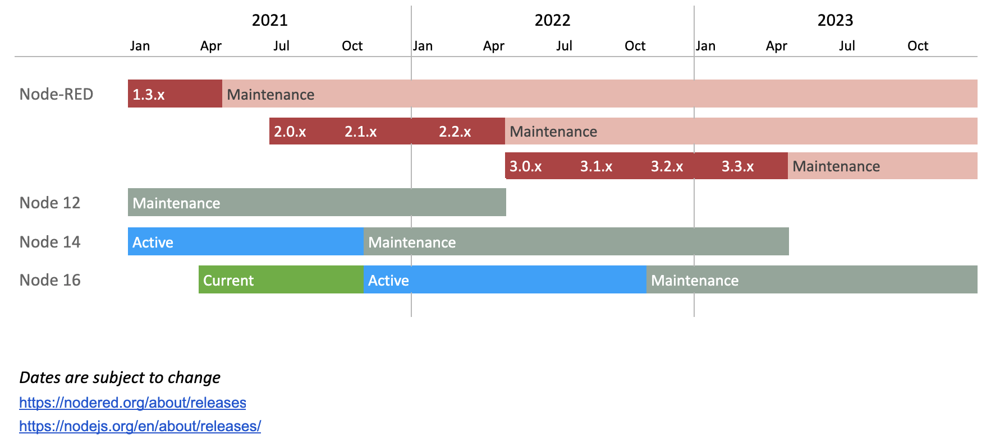

_Updated: 2022-08-04_

This plan is a guide for how the project plans to schedule upcoming releases, taking
into account the release schedule of the underlying Node.js runtime.

The active Node-RED stream (3.x) will get a new minor version release (for example, 3.1 ->  3.2)
every three months. Maintenance releases (for example 3.1.0 -> 3.1.1) will continue
to happen as and when they are needed.

At the end of April 2023, when Node 14.x reaches its end-of-life, we will publish
Node-RED 4.x that will *drop* support for Node 14.

The 3.x stream will then enter maintenance mode. It will only receive bug fixes
and security updates. New features could get back-ported from 4.x if there was
a very good reason to do so as well as people available to do the work.

The 4.x stream will continue in active development with a minor release every
three months or so for a year, when the next major release is made.

This proposal means:

 - We have a regular cycle of releases - getting new features into the hands of users.
 - We have a schedule to help us prioritise and plan backlog items.
 - We can provide longer-term stable releases with a well-known end of life.
 - We have a plan that enables us to make potentially breaking changes once a year.

Release | Initial         | Maintenance Start    | End-of-life
--------|-----------------|----------------------|-----------------
1.x     | 2019-09-30      | 2021-04-30           | 2022-06-30
2.x     | 2021-07-22      | 2022-07-14           | 2023-06-30
3.x     | 2022-07-14      | *2023-04-30* *       | 2024-06-30
4.x     | *2023-04-30* *  | *2024-04-30* *       | 2025-06-30

_* Dates are subject to change_

References:
 - [Blog post: Going beyond Node-RED 1.x](https://nodered.org/blog/2020/07/01/release-plans)
 - [Node-RED Release Plan source](https://docs.google.com/spreadsheets/d/1swMH5DXVposBIdnm6Q3BvIplMjAZSZVnU_cRS0jAPjY/edit)
 - [Node.js Releases](https://nodejs.org/en/about/releases/)
