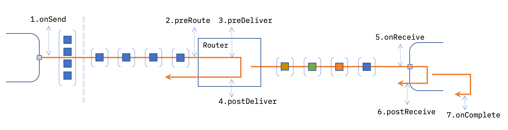

The Messaging Hooks allow custom code to be added to the messaging path between
nodes.

The following diagram shows the set of hooks available in the messaging path.



- Hooks
  1. [onSend](#onsend) - a node has called `send` with one or more messages.
  2. [preRoute](#preroute) - a message is about to be routed to its destination.
  3. [preDeliver](#predeliver) - a message is about to be delivered
  4. [postDeliver](#postdeliver) - a message has been dispatched to its destination
  5. [onReceive](#onreceive) - a message is about to be received by a node
  6. [postReceive](#postreceive) - a message has been received by a node
  7. [onComplete](#oncomplete) - a node has completed with a message or logged an error for it
- Event Objects
  - [SendEvent](#sendevent-object)
  - [ReceiveEvent](#receiveevent-object)
  - [CompleteEvent](#completeevent-object)


### Hooks

#### `onSend`

A node has called `node.send()` with one or more messages.

The hook is passed an array of `SendEvent` objects. The messages inside these objects
are exactly what the node has passed to `node.send` - meaning there could be
duplicate references to the same message object.

This hook should complete synchronously in order to avoid unexpected behaviour.

If it needs to do asynchronously work, it *must* clone and replace the message
object in the event it receives. It *must* also set the `cloneMessage`
property to `false` to ensure no subsequent cloning happens on the message.

If the hook returns `false`, the messages will not proceed any further.

```javascript
// Example synchronous onSend hook
RED.hooks.add("onSend", (sendEvents) => {
    console.log(`Sending ${sendEvents.length} messages`);
});
```

#### `preRoute`

A message is about to be routed to its destination.

The hook is passed a single `SendEvent`.

This hook should complete synchronously in order to avoid unexpected behaviour.

If it needs to do asynchronously work, it *must* clone and replace the message
object in the event it receives. It *must* also set the `cloneMessage`
property to `false` to ensure no subsequent cloning happens on the message.

If the hook returns `false`, the message will not proceed any further.

```javascript
// Example async preRoute hook
RED.hooks.add("preRoute", (sendEvent, done) => {
    // As this hook needs to do async work, clone the message if needed
    if (sendEvent.cloneMessage) {
        sendEvent.msg = RED.util.cloneMessage(sendEvent.msg);
        sendEvent.cloneMessage = false;
    }
    someAsyncAPI(sendEvent).then(() => {
        done()
    }).catch(err => {
        // An error means stop processing this message
        done(err);
    })
});
```

#### `preDeliver`

A message is about to be delivered

The hook is passed a single `SendEvent`. At this point, the local router has
identified the node it is going to send to and set the `destination.node` property
of the `SendEvent`.

The message will have been cloned if needed.

If the hook returns `false`, the messages will not proceed any further.

```javascript
// Example preDeliver hook
RED.hooks.add("preDeliver", (sendEvent) => {
    console.log(`About to deliver to ${sendEvent.destination.id}`);
});
```

#### `postDeliver`

A message has been dispatched to its destination.

The hook is passed a single `SendEvent`. The message is delivered asynchronously
to the hooks execution.

```javascript
// Example preDeliver hook
RED.hooks.add("preDeliver", (sendEvent) => {
    console.log(`Message dispatched to ${sendEvent.destination.id}`);
});
```

#### `onReceive`

A message is about to be received by a node.

The hook is passed a `ReceiveEvent`.

If the hook returns `false`, the messages will not proceed any further.

```javascript
// Example onReceive hook
RED.hooks.add("onReceive", (receiveEvent) => {
    console.log(`Message about to be passed to node: ${receiveEvent.destination.id}`);
});
```

#### `postReceive`

A message has been received by a node.

The hook is passed `ReceiveEvent` when the message has been given to the
node's `input` handler.


```javascript
// Example postReceive hook
RED.hooks.add("postReceive", (receiveEvent) => {
    console.log(`Message received: ${receiveEvent.msg.payload}`);
});
```

#### `onComplete`

A node has completed with a message or logged an error for it.

The hook is passed a `CompleteEvent`.

```javascript
// Example onComplete hook
RED.hooks.add("onComplete", (completeEvent) => {
    if (completeEvent.error) {
        console.log(`Message completed with error: ${completeEvent.error}`);
    }
});
```

### Event Objects

#### `SendEvent` object

```json
{
    "msg": "<message object>",
    "source": {
        "id": "<node-id>",
        "node": "<node-object>",
        "port": "<index of port being sent on>",
    },
    "destination": {
        "id": "<node-id>",
        "node": undefined,
    },
    "cloneMessage": "true|false"
}
```
#### `ReceiveEvent` object

```json
{
    "msg": "<message object>",
    "destination": {
        "id": "<node-id>",
        "node": "<node-object>",
    }
}
```

#### `CompleteEvent` object

```json
{
    "msg": "<message object>",
    "node": {
        "id": "<node-id>",
        "node": "<node-object>"
    },
    "error": "<error passed to done, otherwise, undefined>"
}
```
