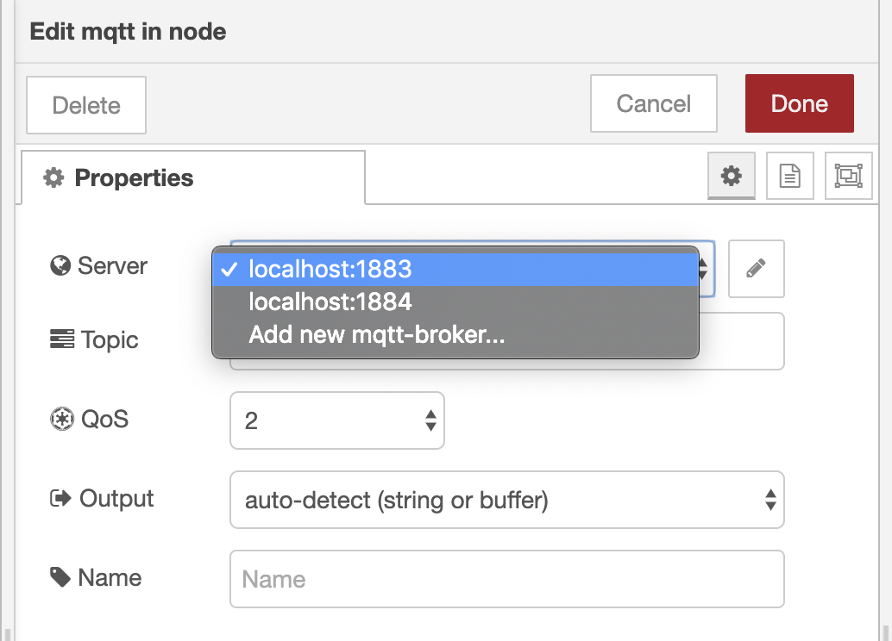

Some nodes need to share configuration. For example, the MQTT In and MQTT Out
nodes share the configuration of the MQTT broker, allowing them to pool the
connection. Configuration nodes are scoped globally by default, this means
the state will be shared between flows.

### Defining a config node

A configuration node is defined in the same way as other nodes. There are two
key differences:

1. its `category` property is set to `config`
2. the edit template `<input>` elements have ids of `node-config-input-<propertyname>`

#### remote-server.html





#### remote-server.js


module.exports = function(RED) {
    function RemoteServerNode(n) {
        RED.nodes.createNode(this,n);
        this.host = n.host;
        this.port = n.port;
    }
    RED.nodes.registerType("remote-server",RemoteServerNode);
}


In this example, the node acts as a simple container for the configuration - it
has no actual runtime behaviour.

A common use of config nodes is to represent a shared connection to a remote
system. In that instance, the config node may also be responsible for creating
the connection and making it available to the nodes that use the config node. In
such cases, the config node should also handle the [`close` event](node-js#closing-the-node)
to disconnect when the node is stopped.

### Using a config node

Nodes register their use of config nodes by adding a property to the `defaults`
array with the `type` attribute set to the type of the config node.


defaults: {
   server: {value:"", type:"remote-server"},
},


As with other properties, the editor looks for an `<input>` in the edit template
with an id of `node-input-<propertyname>`. Unlike other properties, the editor
replaces this `<input>` element with a `<select>` element populated with the
available instances of the config node, along with a button to open the config
node edit dialog.

    

The node can then use this property to access the config node within the runtime.


module.exports = function(RED) {
    function MyNode(config) {
        RED.nodes.createNode(this,config);

        // Retrieve the config node
        this.server = RED.nodes.getNode(config.server);

        if (this.server) {
            // Do something with:
            //  this.server.host
            //  this.server.post
        } else {
            // No config node configured
        }
    }
    RED.nodes.registerType("my-node",MyNode);
}

