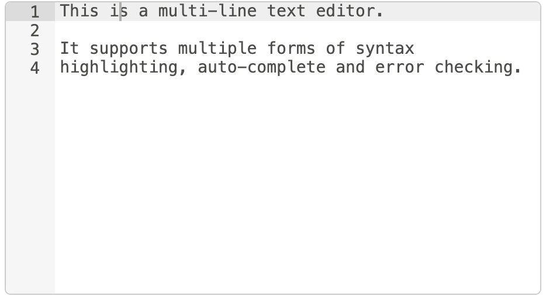

<script src="js/jquery-ui.min.js"></script>
<script>
    var RED = {};
    RED.settings = {};
    RED.editor = { editJSON: function(){}}
</script>
<script src="js/utils.js"></script>
<script src="js/typedInput.js"></script>
<script src="js/popover.js"></script>
<link rel="stylesheet" href="/css/editor-style.min.css">

The edit dialog for a node is the main way a user can configure the node to
do what they want.

The dialog should be intuitive to use and be consistent in its design and appearance
when compared to other nodes.

The edit dialog is provided in the [node's HTML file](node-html), inside a
`<script>` tag:

```html
<script type="text/html" data-template-name="node-type">
    <!-- edit dialog content  -->
</script>
```

 - The `<script>` tag should have a `type` of `text/html` - this will help most
   text editors to provide proper syntax highlighting. It also prevents the browser
   from treating it like normal HTML content when the node is loaded into the editor.
 - The tag should have its `data-template-name` set to the type of the node its
   the edit dialog for. This is how the editor knows what content to show when
   editing a particular node.

The edit dialog will typically be made up from a series of rows - each containing
a label and input for a different property

```html
<div class="form-row">
    <label for="node-input-name"><i class="fa fa-tag"></i> Name</label>
    <input type="text" id="node-input-name" placeholder="Name">
</div>
```

- Each row is created by a `<div>` with class `form-row`
- A typical row will have a `<label>` that contains an icon and the name of the
  property followed by an `<input>`. The icon is created using an `<i>` element
  with a class taken from those available from [Font Awesome 4.7](https://fontawesome.com/v4.7.0/icons/).
- The form element containing the property must have and id of `node-input-<propertyname>`. In the case of Configuration nodes, the id must be `node-config-input-<property-name>`.
- The `<input>` type can be either `text` for string/number properties, or
`checkbox` for boolean properties. Alternatively, a `<select>` element can be
used if there is a restricted set of choices.


Node-RED provides some standard UI widgets that can be used by nodes to create a
richer and more consistent user experience.

### Buttons

To add a button to the edit dialog, use the standard `<button>` HTML element and
give it the class `red-ui-button`.

<table class="ui-examples">
<tr>
<td>
    <h5>Plain button</h5>
    <button type="button" class="red-ui-button">Button</button>
</td>
<td>
<pre>&lt;button type="button" class="red-ui-button"&gt;Button&lt;/button&gt;</pre>
</td>
</tr>
<tr>
<td>
    <h5>Small button</h5>
    <button type="button" class="red-ui-button red-ui-button-small">Button</button>
</td>
<td>
<pre>&lt;button type="button" class="red-ui-button red-ui-button-small"&gt;Button&lt;/button&gt;</pre>
</td>
</tr>
<tr>
<td>
<h5>Toggle button group</h5>
<span class="button-group">
<button type="button" class="red-ui-button toggle my-button-group selected">b1</button><button type="button" class="red-ui-button toggle my-button-group">b2</button><button type="button" class="red-ui-button toggle my-button-group">b3</button>
</span>
</td>
<td>
<div class="figure">
<pre>&lt;span class="button-group"&gt;
&lt;button type="button" class="red-ui-button toggle selected my-button-group"&gt;b1&lt;/button&gt;&lt;button type="button" class="red-ui-button toggle my-button-group"&gt;b2&lt;/button&gt;&lt;button type="button" class="red-ui-button toggle my-button-group"&gt;b3&lt;/button&gt;
&lt;/span&gt;
</pre>
<p class="caption">HTML</p>
</div>
<div class="figure">
<pre>$(".my-button-group").on("click", function() {
    $(".my-button-group").removeClass("selected");
    $(this).addClass("selected");
})</pre>
<p class="caption">oneditprepare</p>
</div>
<p>To toggle the <code>selected</code> class on the active button, you will need to add code to
the <code>oneditprepare</code> function to handle the events.</p>
<p><i>Note:</i> avoid whitespace between the <code>&lt;button&gt;</code> elements as the <code>button-group</code> span does not currently collapse whitespace properly. This will be addressed in the future.</p>
</td>
</tr>


</table>


### Inputs

For simple text entry, the standard `<input>` element can be used.

For some cases, Node-RED provides the `TypedInput` widget as an alternative.
It allows the user a way to specify the type of the property as well as its value.

For example, if a property could be a String, number or boolean. Or if the property
is being used to identify message, flow or global context property.

It is a jQuery widget that requires code to be added to the node's `oneditprepare` function
in order to add it to the page.

Full API documentation for the `TypedInput` widget, including a list of the available
built-in types is available [here](/docs/api/ui/typedInput/).

<i>Note we are aware the drop-down menus included with the `TypedInput` are
not embedding well on this page - they cause the page to jump around when being clicked.
That will get fixed. </i>


<table class="ui-examples">
<tr>
    <td>
        <h5>Plain HTML Input</h5>
        <span class="red-ui-editor"><input type="text" id="node-input-name"></span>
    </td>
    <td>
    <pre>&lt;input type="text" id="node-input-name"&gt;</pre>
    </td>
</tr>
<tr>
    <td>
        <h5>TypedInput<br>String/Number/Boolean</h5>
        <span class="red-ui-editor"><input type="text" id="node-input-example1"></span>
    </td>
    <td>
        <div class="figure">
            <pre>&lt;input type="text" id="node-input-example1"&gt;
&lt;input type="hidden" id="node-input-example1-type"&gt;
</pre>
            <p class="caption">HTML</p>
        </div>
        <div class="figure">
            <pre>$("#node-input-example1").typedInput({
    type:"str",
    types:["str","num","bool"],
    typeField: "#node-input-example1-type"
})</pre>
            <p class="caption">oneditprepare</p>

            When the TypedInput can be set to multiple types, an extra node
            property is required to store information about the type. This
            is added to the edit dialog as a hidden <code>&lt;input&gt;</code>.
         </div>
    </td>
</tr>

<tr>
    <td>
        <h5>TypedInput<br>JSON</h5>
        <span class="red-ui-editor"><input type="text" id="node-input-example2" value="{&quot;a&quot;: 123}"></span>
    </td>
    <td>
        <div class="figure">
            <pre>&lt;input type="text" id="node-input-example2"&gt;</pre>
            <p class="caption">HTML</p>
        </div>
        <div class="figure">
            <pre>$("#node-input-example2").typedInput({
    type:"json",
    types:["json"]
})</pre>
            <p class="caption">oneditprepare</p>
        The JSON type includes a button that will open up a dedicated JSON Edit
        Dialog (disabled in this demo).
         </div>
    </td>
</tr>
<tr>
    <td>
        <h5>TypedInput<br>msg/flow/global</h5>
        <span class="red-ui-editor"><input type="text" id="node-input-example3" value="payload"></span>
    </td>
    <td>
        <div class="figure">
            <pre>&lt;input type="text" id="node-input-example3"&gt;
&lt;input type="hidden" id="node-input-example3-type"&gt;</pre>
            <p class="caption">HTML</p>
        </div>
        <div class="figure">
            <pre>$("#node-input-example3").typedInput({
    type:"msg",
    types:["msg", "flow","global"],
    typeField: "#node-input-example3-type"
})</pre>
            <p class="caption">oneditprepare</p>
         </div>
    </td>
</tr>
</table>
<script>
$(function() {
    $("#node-input-example1").typedInput({type:'str',types:['str','num','bool']})
    $("#node-input-example2").typedInput({type:'json',types:['json']})
    $("#node-input-example3").typedInput({type:"msg", types:["msg", "flow","global"]})

    $(".my-button-group").on("click", function() {
        $(".my-button-group").removeClass("selected");
        $(this).addClass("selected");
    })
})
</script>

### Multi-line Text Editor

Node-RED includes a multi-line text editor based on the [Ace code editor](https://ace.c9.io/).

<div style="width: 467px" class="figure align-centre">
  
  <p class="caption">Multi-line Text Editor</p>
</div>

In the following example, the node property that we will edit is called `exampleText`.

In your HTML, add a `<div>` placeholder for the editor. This must have the css class
`node-text-editor`. You will also need to set a `height` on the element.

```html
<div style="height: 250px; min-height:150px;" class="node-text-editor" id="node-input-example-editor"></div>
```

In the node's `oneditprepare` function, the text editor is initialised using the `RED.editor.createEditor`
function:

```javascript
this.editor = RED.editor.createEditor({
   id: 'node-input-example-editor',
   mode: 'ace/mode/text',
   value: this.exampleText
});
```

The `oneditsave` and `oneditcancel` functions are also needed to get the value
back from the editor when the dialog is closed, and ensure the editor is properly
removed from the page.

```javascript
oneditsave: function() {
    this.exampleText = this.editor.getValue();
    this.editor.destroy();
    delete this.editor;
},
oneditcancel: function() {
    this.editor.destroy();
    delete this.editor;
},
```


<style>
 table.ui-examples h5 { margin: 3px 0 15px }
 table.ui-examples td:first-child {
     vertical-align: top;
 }
 table.ui-examples td:last-child {
     padding-top: 35px;

 }
 </style>