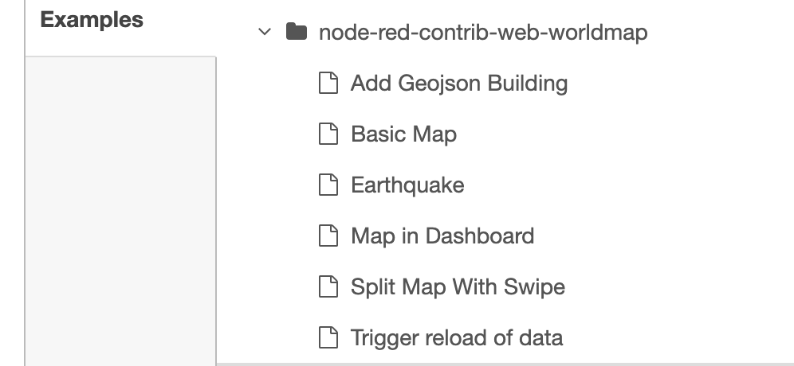

A packaged node can provide simple example flows that demonstrate how it can be used.

They will appear under the <code>Menu - Import</code> dialogue, in the <code>Examples</code>
section.

    

 

Ideally they should be short, have a comment node to describe the functionality, and not use
any other 3rd party nodes that need to be installed.

To create examples, add flow files to an <code>examples</code> directory under your node. See [Packaging](packaging) for more details.

The name of the flow file will be the menu entry displayed in the menu list.
