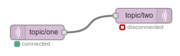

Whilst running, a node is able to share status information with the editor UI.
For example, the MQTT nodes can indicate if they are currently connected or not.

    

To set its current status, a node uses the `status` function. For example, the
following two calls are used by the MQTT node to set the statuses seen in the
image above:


this.status({fill:"red",shape:"ring",text:"disconnected"});

this.status({fill:"green",shape:"dot",text:"connected"});


*By default, the node status information is displayed in the editor. It can
be disabled and re-enabled by selecting the* Display Node Status *option in the drop-down menu.*

### Status object

A status object consists of three properties: `fill`, `shape` and `text`.

The first two define the appearance of the status icon and the third is an
optional short piece of text (under <20 characters) to display alongside the
icon.

The `shape` property can be: `ring` or `dot`.

The `fill` property can be: `red`, `green`, `yellow`, `blue` or `grey`

This allows for the following icons to be used:

    <svg width="100" height="40">
       <rect x="5"  y="5" width="9" height="9" rx="2" ry="2" stroke-width="3" fill="#fff" stroke="#cc0000"/>
       <rect x="25" y="5" width="9" height="9" rx="2" ry="2" stroke-width="3" fill="#fff" stroke="#55aa88"/>
       <rect x="45" y="5" width="9" height="9" rx="2" ry="2" stroke-width="3" fill="#fff" stroke="#F9DF31"/>
       <rect x="65" y="5" width="9" height="9" rx="2" ry="2" stroke-width="3" fill="#fff" stroke="#53A3F3"/>
       <rect x="85" y="5" width="9" height="9" rx="2" ry="2" stroke-width="3" fill="#fff" stroke="#d3d3d3"/>
       <rect x="5"  y="25" width="9" height="9" rx="2" ry="2" stroke-width="3" fill="#cc0000" stroke="#cc0000"/>
       <rect x="25" y="25" width="9" height="9" rx="2" ry="2" stroke-width="3" fill="#55aa88" stroke="#55aa88"/>
       <rect x="45" y="25" width="9" height="9" rx="2" ry="2" stroke-width="3" fill="#F9DF31" stroke="#F9DF31"/>
       <rect x="65" y="25" width="9" height="9" rx="2" ry="2" stroke-width="3" fill="#53A3F3" stroke="#53A3F3"/>
       <rect x="85" y="25" width="9" height="9" rx="2" ry="2" stroke-width="3" fill="#d3d3d3" stroke="#d3d3d3"/>
    </svg>

If the status object is an empty object, `{}`, then the status entry is cleared from the
node.

### Note : Status Node

From Node-RED v0.12.x the Status node can be used to catch any node status
updates, for example connect and disconnect messages, in order to trigger other
flows.
