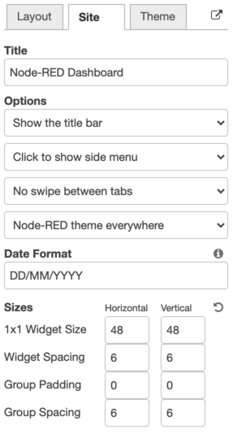
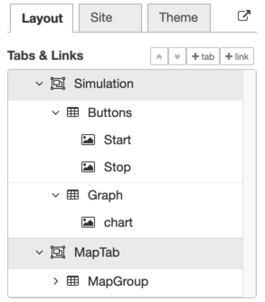
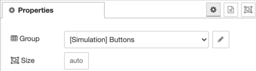
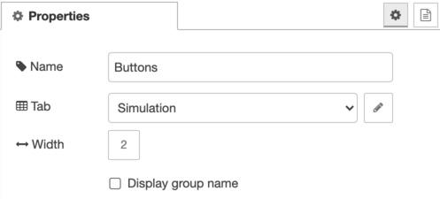
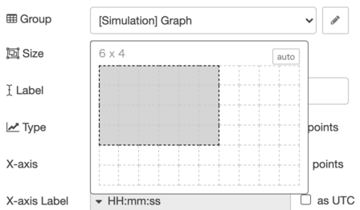
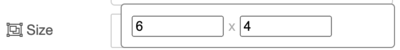
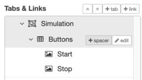
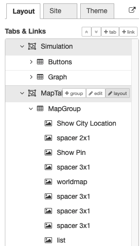
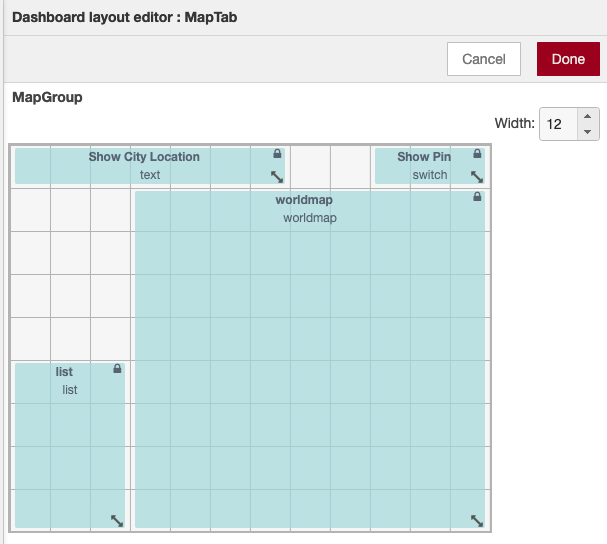

<!-- This document contains original Japanese description in comments -->

### Basic UI Elements of Dashboard

<!-- ### Dashboard画面の基本部品 -->

<!--　Node-RED Dashboardは`Widget`、`Group`、および、`Tab`から構成されます。WidgetはButton、ChartなどGUI部品です。TabはWebブラウザ上に表示するダッシュボード画面全体を表します。Tabは複数定義でき、サイドメニューからの選択、もしくは、ui_controlノードで切り替えて一つのタブを表示できます。Groupは複数のWidgetを配置する領域を定義するために使用します。GroupおよびTabはConfigノードです。-->

  The Node-RED Dashboard consists of `Widget`,`Group`, and `Tab`.  Widget is a GUI element such as button or chart.  Tab represents the entire dashboard screen displayed on the Web browser.  Multiple Tabs can be defined, and one tab can be displayed by selecting from the side menu or switched with the `ui_control node`.  Group is used to define the area where multiple widgets will be placed.  Group and Tab are defined as configuration nodes.

### Layouting Dashboard Elements

<!-- ### 画面要素のレイアウト -->

<!--　ダッシュボードは一定の大きさのグリッドを基本要素とし、Widgetは高さと幅、Groupは幅をグリッド数を単位として定義します。グリッドの単位要素の大きさはdashboardサイドバーのSiteタブで設定できます。-->

  The dashboard layout is defined using a grid with fixed size element.  The widget has the height and width, and the group has the width in units of the number of grid elements. The size in pixels of the grid's unit element can be set by '*1x1 Widget Size*' of the `Site` tab of the dashboard sidebar.

<!-- SIteタブでは、Widget間の間隔およびおよびグループ間の間隔と余白も設定できます。 -->

On the `Site` tab, spacing between widgets and the spacing and paddings between groups can also be specified.

 

<!--　WidgetはGroup内に、GroupはTab内に、それぞれの幅に収まるよう配置を調整します。これら要素の階層関係は、dashboardサイドバーのLayoutタブで確認できます。-->

  The widgets are arranged in the group and the group in the tab so that they fit within their respective widths.  The hierarchical relationship of these elements can be managed in the `Layout` tab of the dashboard sidebar.

<!--　Dashboardのレイアウト処理では、次のように画面のレイアウトを行います。

1. 各グループのWidgetについて、上から下、左から右にGroupに配置する。

2. 各グループについて、上から下、左から右にTabに配置する。-->

While layouting the dashboard screen, placements of screen elements are determined as follows:

1. place widgets in each group from top to bottom and left to right,

2. place groups in each tab from top to bottom and left to right.

<!--　GroupへのWidgetの配置、および、TabへのGroupの配置は、上から下、左から右に配置可能な空き領域を探し、最初に見つかった領域に配置します。Dashboardの表示を行うブラウザのサイズを変更すると、TabへのGroupの配置が自動的に調整されます。

　GroupへのWidgetの配置、および、TabへのGroupの配置は、上から下、左から右に配置可能な空き領域を探し、最初に見つかった領域に配置します。Dashboardの表示を行うブラウザのサイズを変更すると、TabへのGroupの配置が自動的に調整されます。

　Layoutタブ上のUI部品の順序と所属関係はdrag&dropで変更可能です。-->

  To place the widgets on the belonging group and the groups on the belonging tab,  free space that can place the element is searched from top to bottom and from left to right, and the first found area is used to place it.  If the browser that is displaying the dashboard is resized, the placement of the goups within the displayed tab will be adjusted automatically.

  The order and belonging relation of UI elements on the `Layout` tab can be changed by drag & drop of an element.

 

### Adding a Widget to Dashboard

<!-- ### DashboardへのWidgetの追加 -->

<!-- Widgetに対応するUIノードの*Properties*の*Group*項目にwidgetを配置するgroupを設定します。*Size*項目はwidgetのサイズの設定です。-->

  The group to place a widget can be set by the *Group* item of *Properties* of the UI node corresponding to the widget.  The *Size* item is used for setting the widget size.

<!-- Group設定では、同様に配置先のtabとgroupの幅を指定します。-->

  The *Group* setting specify the belonging tab and the width of the group in the same way.

<!-- dashboardサイドバーのLayoutタブの *+tab* ボタンから新規tab、tab上にマウスオーバを行うと表示される *+group* ボタンから新規groupの追加を行うことも可能です。-->

  A new tab can be added by pressing the `+tab` button on the `Layout` tab of the dashboard sidebar, and a new group can be added by pressing the `+group` button that appears while mouse over the group element.

 

### Setting UI Element Size

<!-- ### UI部品サイズの指定 -->

<!--　Widgetおよびtabのサイズは、*Size*項目により設定します。Size項目を選択すると、サイズ洗濯のためのポップアップインターフェイスが表示されます。サイズをグリッド領域で指定します。-->

  The size of widget and tab is set by the *Size* item.  Selecting the *Size* item will display a popup interface for specifying UI element size.  The size of the UI elemt can be specified by the grid area of this popup UI.

<!--　autoボタンを押すと、widgetのサイズを自動設定します。その動作はノードによりますが、一般的に、auto設定ではwidgetの幅は所属するgroupの幅と同じ、widget毎に高さは適切な大きさが選択されます。-->

  Pressing the `auto` button indicate to set the widget size automatically.  Its behaviour depends on implementation of each UI widgets.  Typically, the width of the widget is set to the same  width of the belonging group, and the height is set to appropriate value.

 

<!--　ポップアップ上部の*W x H*をクリックすると、以下の数値入力ポップアップに変化します。大きな固定数値のサイズを指定する場合はこちらが便利です。-->

  Clicking *W xH* at the top of the UI will display the following interface for changing the widget size using digits input.  This UI is useful to specify the size for large widget.

### Adjusting Layout using Spacer

<!-- ### Spacerによるレイアウト調整 -->

<!--　Group内のwidgetの細かな配置調整のためにSpacerノードを利用できます。Spacerノードは指定したサイズの領域の穴埋めをするためのwidgetです。

　GroupへのSpacerの追加は、Layoutタブのグループ上のマウスオーバで表示される+spacerボタンで行います。-->

The `Spacer` node can be used for fine-tuning the placement of widgets in a group.  The Spacer node is a special widget for filling in the area with the specified size.

  To add a `Spacer` to a group, use the `+spacer` button displayed while mouse over the group on the `Layout` tab.

 

### Layout Editor

<!--　複雑なダッシュボード画面を構成する場合、Layout Editorを用いることで、GUIによってWidgetの配置を行うことができます。Layout EditorはLayoutタブのTab上のマウス    オーバで表示される*layout*ボタンを押すことで起動します。-->

  While layouting a complicated dashboard screen, GUI-based `Layout Editor` can be used.  The layout editor can be opened by pressing the `layout` button displayed while mouse over on a tab on the `Layout` tab.

 

<!--　Layout Editorでは、Tabを構成するグループのグリッドレイアウトが表示されます。

　各グループの幅は右上のWidth項目によって変更できます。-->

  The `Layout Editor` displays the grid layout of the groups that make up the specified tab.

  The width of each group can be changed by the *Width* item displayed on the top right.

<!--　グループ内のWidgetについて、drag&dropによってgroup内の配置を変更できます。Widget右上の鍵マークはWidgetのサイズがautoか否かを表します。鍵のロックが外れている場合は、右下の矢印をdragすることでサイズを変更できます。

　Layout Editorでレイアウトを行うと、必要な位置にSpacerノードを自動的に挿入します。-->

  The placement of widgets in a group can be changed by drag & dropping a widget.  The lock mark on the upper right of the widget indicates whether the widget size is *auto* or not.  If the key is unlocked, the widget size can be changed by dragging the arrow at the bottom right.

  After finishing layout with the `Layout Editor`, `Spacer` nodes are automatically inserted at appropriate positions.

 

### Link to Web Page

<!--　Layoutタブでは+linkボタンによりWebページへのリンクをサイドメニューに設定することができます。指定したリンクは、サイドメニューもしくはui_controlノードにより選択肢し、ブラウザの別ページや、iframeでdashboardに埋め込むことができます。-->

A link to a web page instead of tab can be added to side menu using `+Link` button of the `Layout` tab.  The specified link can be selected from the side menu of dashboard or the `ui_control` node and can redirect to the page or can embed  it in the dashboard using iframe.

### Configuring Group Title

<!-- ### グループタイトルの設定 -->

<!--　Dashboard上でgroupの上部にはグループ名がデフォルトで表示されます。グループ設定パネルの'Display group name'チェックボックスを選択しないと表示しないように変更可能です。-->

  The group name is displayed at the top of the group on the dashboard by default.  It can be disabled by unselecting the'*Display group name*' check box of the group settings panel.

### Configuring Title Bar & Side Menu

<!-- ### タイトルバーとサイドメニューの設定 -->

<!-- ダッシュボード画面の上部に、サイドメニューなどを表示するタイトルバーがデフォルトで表示されます。これは、`Site`メニューの設定で非表示に変更できます。また、サイドメニューも`Site`メニューの設定で常時表示、もしくは、アイコンのみ表示とすることができます。-->

At the top of the dashboard screen, a title bar that displays side menus etc. is shown by default. This can be hidden by the `Site` tab settings.  Also, the side menu can be configured to be always shown or shown in icon only from the `Site` tab settings.

<!-- 各タブの設定から、タブの名称とアイコン、メニューへのタブの表示するか否かを設定できます。-->

Title and icons of each tab and whether to display the tab on the side menu can be set from the settings paneg of each tab.

<!-- タブのアイコンとしてMaterial Design icon(e.g. 'check', 'close'), Font Awesome icon(e.g. 'fa-fire'), Weather Icon(e.g. 'wi-wu-sunny'), Google Material Icon(e.g. 'mi-videogame_asset')を指定できます。-->

 [Material Design icon](https://klarsys.github.io/angular-material-icons/) *(e.g. 'check', 'close')*, a [Font Awesome icon](https://fontawesome.com/v4.7.0/icons/) *(e.g. 'fa-fire')*, a [Weather icon](https://github.com/Paul-Reed/weather-icons-lite/blob/master/css_mappings.md) *(e.g. 'wi-wu-sunny')*, or a [Google material icon](https://fonts.google.com/icons) *(e.g. 'mi-videogame_asset')* can be used as an icon for a tab.
