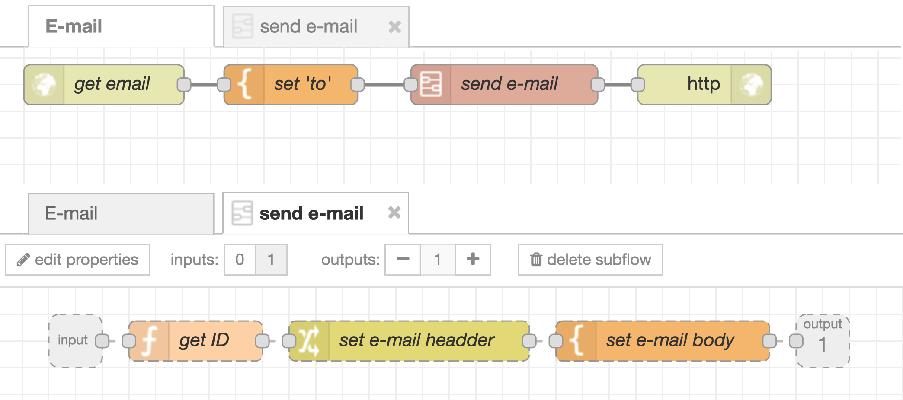
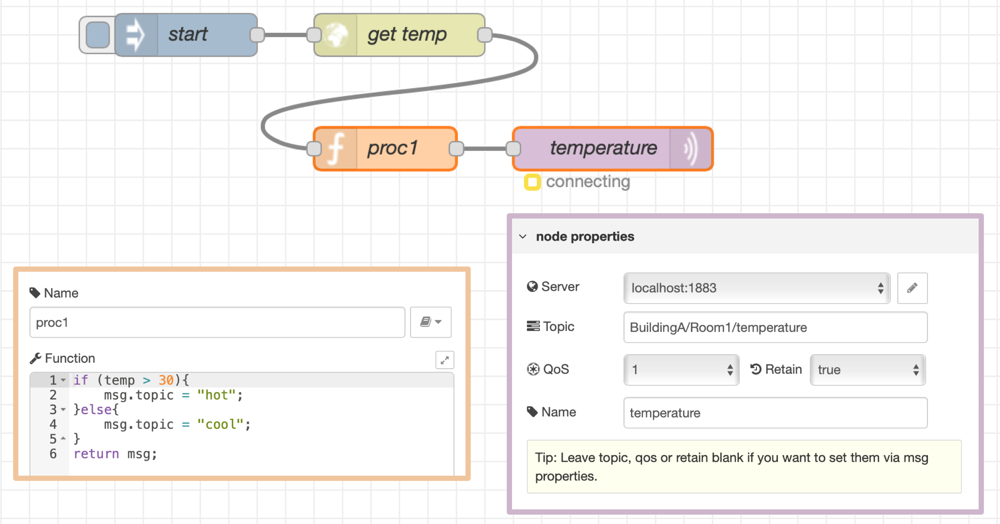
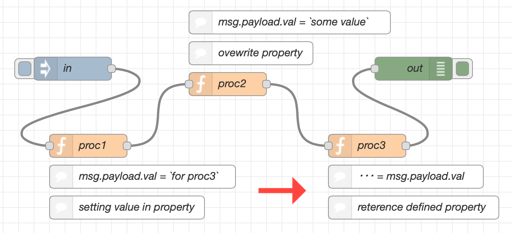
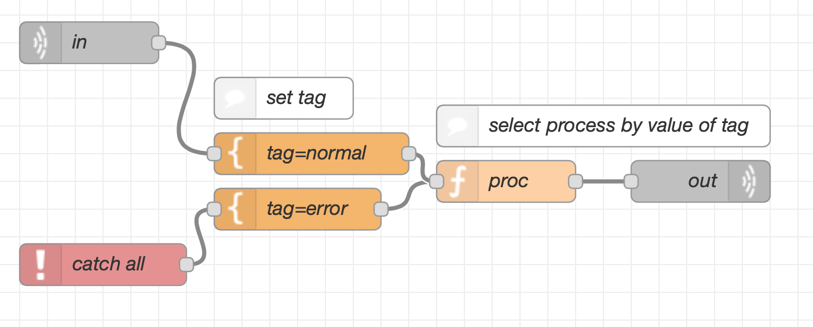
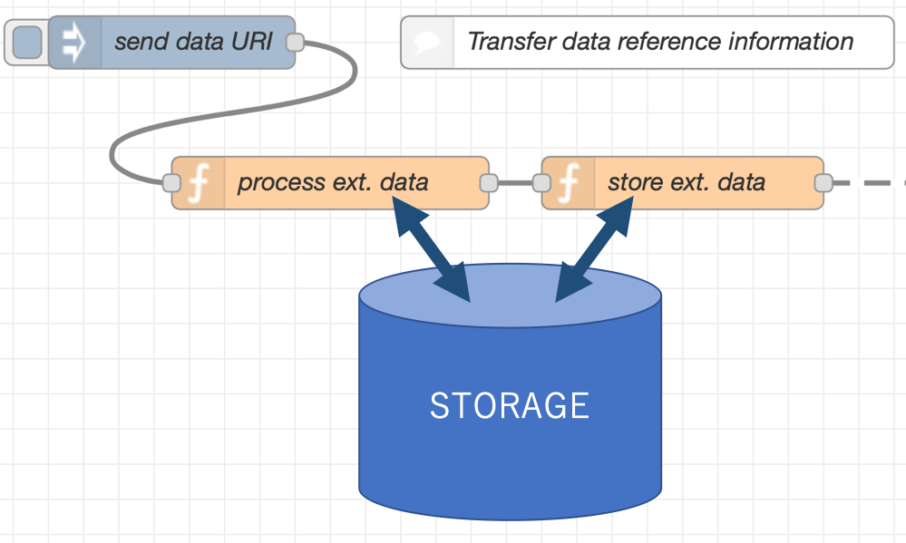

***This content is under review and may not form part of the final flow developer guide***

### Development steps  

If a project needs complicated logic, it is better to design flow before starting development. After that, you create flows based on the flow design. In this subsection, we show an overview of whole recommended steps of design and development.  

* Design  
   - Flow structure  
   - Message  
* Implementation  

### Designing flow structure  


*As the size of flows in a tab gets larger, it can be difficult to recognize a function of each flow within a tab. To improve reusability of flows, it would be better to decide the responsibility of flows within each tab and the scale of one tab. To do this, it is helpful to sort out what kind of things, people, work, rules are in the target domain of the application, and relationship of them.*  


#### Designing flow within a tab

There is a case that one application is constructed by multiple function. For example, if you are developing an application that detects temperature and humidity with a sensor and sounds an alert on an external device, you should complete each function within one flow because it is likely that a mix of function logic, such as sensor, threshold identification, and access to the device, will be complicated.

If processes related to a function is divided into several flows, you need to find and modify all processes when there is a change in the logic. It may make you difficult to respond to change. You should put together processes of each function on one flow and make easy to check which you need to modify it.

In addition, to complete one application, you should review the interfaces between flows, since multiple flows are linked. It is recommended to define the input message to the flow and include the definition in the comment on the flow.

#### Organizing tabs based on their roles

You can create flows across multiple tabs as one application because the flows can integrate with ones in other tabs. When you create flows across tabs, it is important to decide appropriate size and responsibility of each flow.

One of good approaches is dividing flows based on type of persons who is interested in the application. For example, users of the application may want to look at only flows that is for operating the application. Domain experts and developers of the application may want to look at and develop only flows that describe the process of domain logic. This approach can reduce the risk of malfunctions or unexpected errors by improper operations and modifications of users.

In this case `HTTP` node is convenient to integrate flows in multiple flows. `HTTP` node can be called up from other flows or external systems.

If you are developing with multiple developers, it is better to design flows for each function they will create. When one flow is modified by more than one developers, a collision error can occur. Because renewal of the amendment consist of a flow-tab unit, it is important for each developer to avoid a tab outside of jurisdiction.

#### Subflow

If the same processing needs to be repeated, creating the same nodes sequence several times will not only reduce readability, but will also require changing all applicable nodes, even when they need to be modified.
You can solve these problems by turning nodes into subflow, and changing icons.

<div style="text-align: center">
    
</div>

For example, if the process of sending e-mail is written as a sub-flow, it can be reused to create a flow in which other processes send e-mail.

### Designing messages  

There are risks that multiple nodes have dependencies by messages passing through nodes. For other developers to reuse flows, it is important to design messages so that dependencies get to be relaxed.


This chapter proposes a guide about designing message.  


Messages that travel the flow are in the form of a JavaScript object with the object name typically referred as `msg`.
Although these messages are partially affected by the restrictions of Node-RED and Node.js and the execution model, the ability to give the message object any attributes and assign it values of any data type makes it highly flexible.
That is, you can modify any properties in a `msg` object and even add new properties.

Subproperty of `msg.` (e.g. `msg.xxx` , `msg.abcd` ) except for `msg.payload` should not be changed because it should be maintained through the flow.

The following properties are frequently used in existing nodes, and the value of the property is often changed. If you need to use these nodes, changing these properties are not restricted.

* `msg.topic`
* `msg.url`

Messages cause dependencies between the node that generates the message and the node that uses the message.
For example, if a node expects the `msg.payload` property of the input message to contain temperature information, a preceding node need to place the temperature information into `msg.payload`.
In a large-scale flow, messages will traverse a large number of nodes. Failing to make these dependencies clear can seriously impair the reusability and versatility of the flow.

Therefore, like the flow structure, appropriate message design is an important factor in the reusability and versatility of the flow.

Note that it is possible for the design of the message to influence the system design.
You better to design the messages before implementing a flow.


*We have already written actual contents on [here](https://github.com/node-red/node-red.github.io/wiki/Flow-Guideline-Contents).*  


#### Designing key-value structure of `msg`  


*`msg` is a JavaScript object that contains a key-value structure like JSON. While a `msg` transits across multiple nodes, the nodes use some keys and values of the `msg`. If two or more nodes of them use the same key for different their own purposes, preparing `msg` for input of the nodes is so difficult.*  

*Therefore, strategy of key-value structure are needed and this subsection describes it as followings,*   


There are no naming restrictions that apply to the property names of `msg` objects. Consequently, there is a risk that multiple nodes will unintentionally use the same property.
To mitigate this issue, a design strategy is preferably in place whereby the parameters in which data is stored in the `msg` object are predetermined for each type of data.

Messages are divided into two types: data that is processed by nodes, and parameters that control the node functionality.
You better to set the former in the `msg.payload` property. This is beacuse the nodes provided by Node-RED use properties immediately under `msg.` for the latter.
For example, the `MQTT out` node references the `topic` property (```msg.topic```) of the received message, and sets its value as the topic name of a message to be sent to the MQTT broker.

The following figure shows an example of a bug that occurs when the `msg.topic` property in `Function` node proc1 is used to store the data to be processed by the node.
Although the topic name is set to "Building/Room1/temperature" in the `MQTT in` node, the message is sent with an unintended value ("hot" or "cold") as the topic name.

<div style="text-align: center">
    
</div>

You should be particularly cautious with nodes like `MQTT` nodes whose function can be controlled from the node settings in the sidebar and by settings in the `msg` object.
With such nodes, the setting in the `msg` object has priority over the settings in the sidebar.
This is why you should clearly separate the parameters used to store these two pieces of information in the `msg` object.

Even in designs that follow this policy, a node might process so many pieces of data that a property name conflict eventually occurs.
Because there is no way to automatically check the dependencies of properties between nodes, users need to have a clear understanding of the properties accessed by each node.
The following figure shows an example of a problem that occurs when multiple nodes use the same property name in different processes.

<div style="text-align: center">
    
</div>

To mitigate this problem, design the flow structure such that nodes with dependencies do not exceed the bounds of a single tab.
Also, it is recommended that make the flow in each tab as small as possible.
This makes it much easier to understand the dependencies.

In addition, the first node of the flow verifies that the message received as input has the expected property structure.
Properties other than those expected can be used freely in the flow.
This verification process also expresses the boundaries of dependencies between flows.


* *Top-level keys of `msg` are used to control the functionality of node*  
* *`msg.payload` is used as input parameters of a process of a node*  


#### Keeping properties  

In the case of using `Function` node, you can prepare output messages by creating new `msg` objects. However, the output messages may not have some properties that the input message has. This means that properties that should be kept in your flow has lost. Since this can be a cause of serious bugs, preparing output messages based on an input message is better, instead of creating new `msg`.  

#### Add tag into `msg` to distinguish a node that sent the `msg`  


*[Tips] If it is needed that a (latter) node executes a different process depending on a (former) node that send `msg`, former node adds tags describing the former node itself. With the tag, the latter node decide the process to execute.*  


Nodes can have multiple output ports, but only one input port. Messages moving through the flow include messages that control nodes and messages that provide data to be processed. When there is a need to distinguish among different types of input messages on each path of a flow, you should do so using properties in the message.

Specifically, you assign a tag that identifies the execution path as a message property, and assign different tag values to each input path. In node processing, the node selects the processing for each message by checking the tag value. You can use a `Change` node to set this tag.

<div style="text-align: center">
    
</div>

#### Using persistent storage outside of Node-RED  

If you handle the large amount of data, it is **not** recommended to set the data into `msg` since `msg` can exhaust available memory.


Instead, you had better put the data on a persistent storage that is outside of Node-RED and use reference to the data for handling the data.*  


Because messages are held in memory, sending messages that contain large amounts of data significantly impacts processing time and memory usage.
The processing of Node-RED will come to a standstill when memory is exhausted.

One way to avoid problems of this nature is to store the actual data in persistent storage outside Node-RED, and store a reference to the data in the message itself.
Configure the nodes in the flow to receive the reference and process the data in persistent storage.

<div style="text-align: center">
    
</div>

Because only references to data are passed along the flow, you cannot use nodes that expect actual data.
Particularly, you might be unable to use the standard nodes provided by Node-RED or to re-use nodes and flows created by others for other purposes.
In this case, you need to devise a way to input the data into Node-RED, such as splitting the referenced data into small chunks and placing each of those chunks in a `msg.payload` object.
Please take these tradeoffs into account when considering the application of this guideline.

By following this guideline, nodes are able to validate input messages to ensure their content is as expected.
You can also make the debugging process easier by adding error handling processing triggered by an unexpected message.


#### Processing messages in order of their arrival  

Since Node-RED (JavaScript) processes asynchronously, a node cannot assume that it executes process for arrival `msgs` by the order of arrival.    

You should design the flow so that processing does not depend on the order in which messages arrive.
That is, your flow should produce the correct result even if messages arrive in an unexpected order.  

If you want to design the flow depending on messages in order, you should use `Sort` node. You can check how to use `Sort` node at **Sequential guarantee** of [Non-functional requirements](non-functional).


If you want to assume processes by the order of arrival, try this code.

```javascript  
// Accumulation of messages  
var msgs = context.get('messages') || [];  
msgs.push(msg);  
if(msgs.length === ...) {  
  ... // Process messages  
}  
context.set('messages', msgs);  

```  
