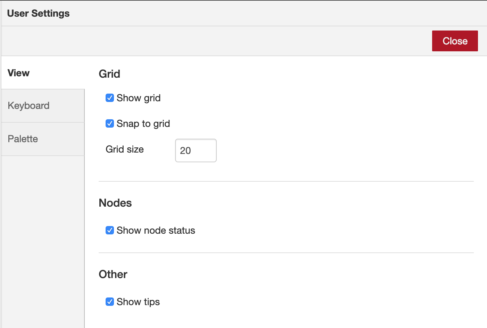
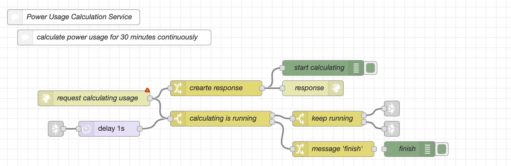
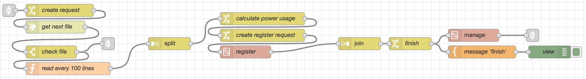
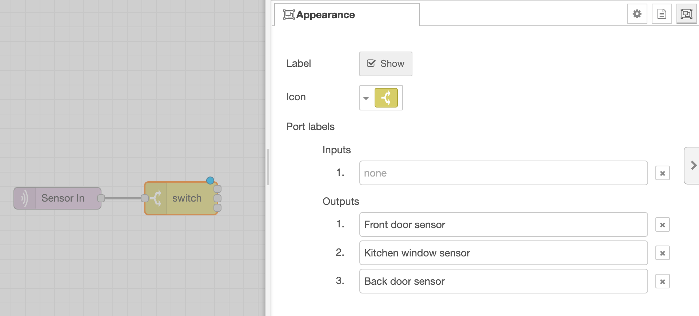
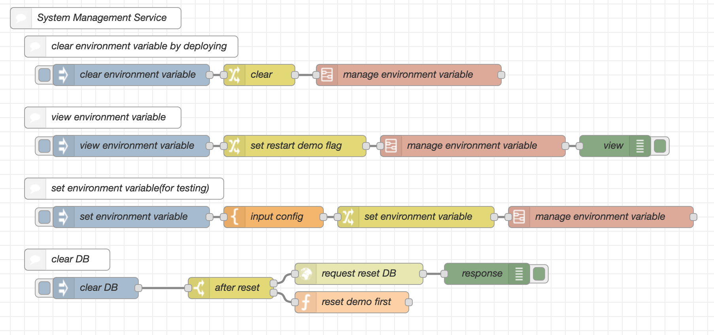
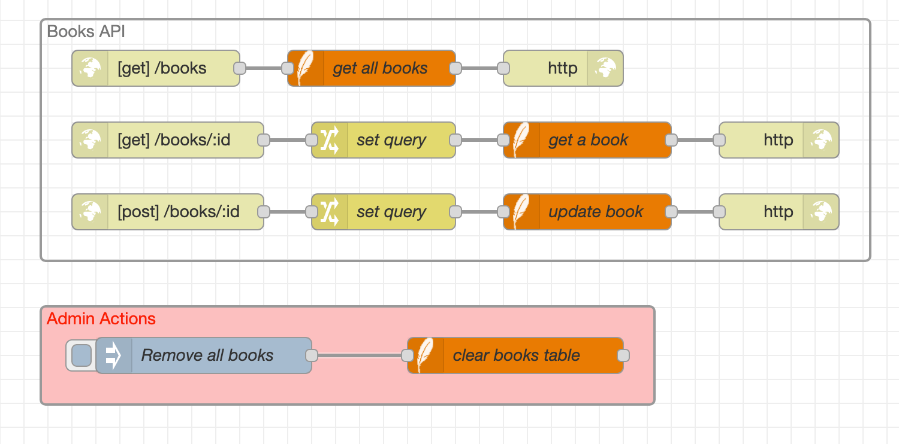

In any programming language, a vital part of creating easy-to-maintain code is to ensure it is also well documented.

Good documentation serves a number of purposes:

1. Whilst everything may seem obvious as you are building a flow, your future self will thank you for providing some description of the details when you come back to it later.
2. If you are sharing a flow with others, it will help them understand what it is doing and how it works.
3. If a flow provides an external API you will want to document how that API should be used - what properties or parameters are expected.
4. When you write documentation, the act of writing out the behaviour could well help you identify parts that could be improved.

In a visual programming environment like Node-RED, the documentation can take a number of forms.

- The flows can be read in the workspace to see the logical flow of events. You should make sure the purpose of each node is easily identified and that they are well laid out to minimise how much wires cross each other.
- Groups can be used to identify discrete sections of the flows.
- Moving commonly used parts into subflows can help reduce the visual complexity of the flow.
- More complete documentation can be added at the node, group or tab level

### Laying out flows

The [flow structure](flow-structure) section of this guide looked at how to arrange the logical components of your flows. This section considers the visual appearance of the flow layout.

The goal is to make it easy to follow the flow without having to jump around the workspace or have to follow multiple wires that cross each other and appear tangled.

The approach that gives the greatest legibility is to keep each unit of processing on a single horizontal line wherever possible. The editor's default behaviour of snapping nodes to a grid on the tab helps keep them aligned.

    
    
Aligning flows in horizontal rows

If there is a node that has more than one output port, aligning the branched flow vertically makes it easy to compare and contrast the flows.

  
  
Aligning branched flows

When a flow gets too long, arranging some nodes vertically can be used to good effect. In the following figure, some of the nodes are arranged vertically to imply a relationship between them. It is easier to understand the nature of the overall flow if it is visually obvious what smaller sections it is comprised of and how they relate to each other.

    
    
Vertically aligning logical segements of a long flow

In some cases, these smaller sections may be candidates for moving to subflows that will reduce the visual complexity of the flow. That is particular true if that smaller section could be reused elsewhere in the flows.

### Naming nodes

Most nodes have a `name` property that can be used to customise the label they display in the workspace. This should be used to properly label the key points of a flow.

For example, if a Change node has a single rule that sets `msg.payload` to the current time, its default label will be `set msg.payload`. That helps somewhat, but it doesn't reveal the full purpose of the node. A name of `Get current time` would be much clearer.

There is a balance to be considered here. The longer the label, the more space it needs in the flow. The shorter the label, the less information it can share.

For some nodes, it might be appropriate to hide the label altogether to minimise the horizontal space it uses in the flow - giving more room to other nodes.

Along with the label, nodes can also have a custom icon. For example, if you have a number of MQTT In nodes for different types of device, customising the icon to match the type of device could be helpful. This should be used with care as the icon is one of the main ways of identifying the type of a particular node

Choosing good names for things applies just as much to the tabs and subflows used.

It also very important for Link nodes. Without a name set, you have to use the Link node's internal ID when creating links between different tabs. That makes it hard to identify the right target node and mistakes can happen. If you consider the Link nodes as providing APIs between the different tabs, then a good choice of naming scheme will be needed. The names should clearly identify the start and end point of each flow.

### Adding port labels

If a node has multiple outputs it can be hard to follow the logic if it is not clear on what condition a message may be sent from a particular output.

This is where adding port labels can help document the intended logic.

For example, the Switch node provides default labels for its outputs that are shown when the mouse hovers over them. They can help quickly identify the purpose of each branch in the flow.

Whilst the default labels may be sufficient in the context of the flow itself, it is also possible to customise labels to provide more detailed information.

  
  
Custom output labels on the Switch node's Appearance tab

### Inline Comments

The Comment node can be used to add inline comments to the flow - both the node's label, but also its description that will show in the Information sidebar when selected.

By indenting the flows on the page, you can indicate an implied grouping of the different components.

  
  
Documenting flows with the Comment node

### Grouping nodes

A more explicit arrangement of the flows can be achieved by grouping related nodes together.

The background colour of each group can also be used to highlight different types of group.

  
  
 Grouping nodes

### Adding longer documentation

All of the techniques discussed so far relate to the visual appearance of the flows. In order to add more in depth documentation, something more is needed.

Every node, group and tab can have longer-form documentation added under the [Description tab in their edit dialog](/docs/user-guide/editor/workspace/nodes#editing-node-properties). This help can be formatted using Markdown and including lists, tables and links. This documentation is then displayed in the [Information sidebar](/docs/user-guide/editor/sidebar/info) when the item is selected.

This longer format of documentation is useful where more explanation is needed of a flow's purpose, or some more complex logic needs to be described.

It is also useful where a flow provides an external API of some sort - providing as much detail as it needed for other developers to use the API.