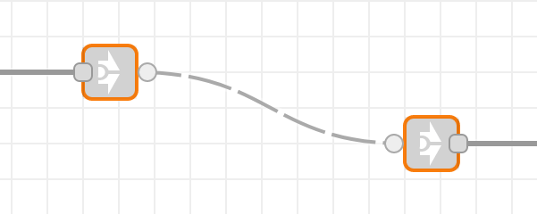
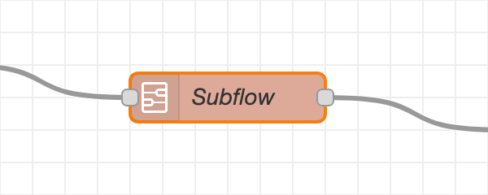
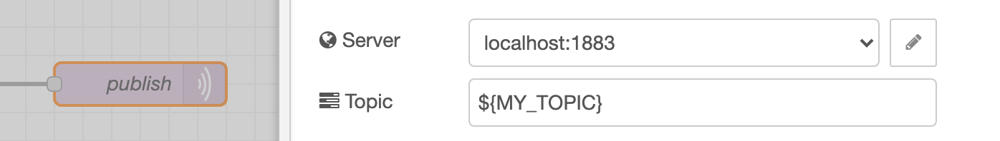
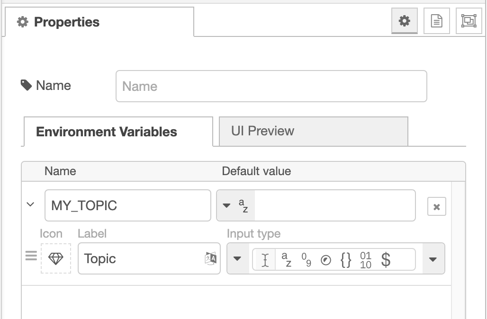
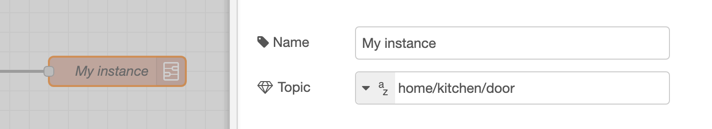

When you first start using Node-RED, you probably start adding all of your nodes to the same tab in the editor. You may import some example flows others have shared, or build prototype flows to test different things out.

Over time, that can lead to a mess of nodes and wires that make it hard to find particular parts of the flow.

Putting some thought into how to structure your flows at the start of any development project can help keep them organised and make them easier to maintain.

The main method of organising flows in Node-RED is by separating them across multiple tabs within the editor. There are a few different strategies that can be used to do that.

If you can identify separate logical components of your application, consider putting them on separate tabs.

For a home-automation application, you could put the flow logic for each room on a separate tab to reflect the physical space. Or you may want to separate the flows based on function - so all lighting-related flows go on one tab and heating on another.

If you are building an HTTP API backend, each tab could represent a separate type of resource the API accesses.

The goal should be to make it easy to “read” an individual flow from start to finish. Keeping it on a single tab can help do that.

Another consideration is whether you are working alongside other developers on the same Node-RED application. It is much easier to manage the merging of changes if they are on separate tabs. If you have developers with different roles or specialisations, consider how that may affect how your flows are organised.

### Making reusable flows

As you build your flows, you may find some common parts that you want to reuse in multiple places. You should avoid having multiple copies of those common parts spread across your flows as they become harder to maintain - you end up with multiple places to apply fixes and could easily overlook one.

Node-RED provides two different ways of creating reusable flows - Links nodes and Subflows.

  
  
Link nodes

**Link nodes** let you create a flow that can jump between tabs in the editor - they add a virtual wire from the end of one flow to the start of another.

  
  
Subflows

**Subflows** let you create a new node in the palette whose internal implementation is described as a flow. You can then add new instances of the subflow wherever you would a normal node.

There are some important differences between the two approaches. Link nodes cannot be used in the middle of a flow, where messages are passed over the link and then return when the other flow completes. They can only be used to start or end a flow. They can also be connected to more than one other link node. This lets you pass messages out to multiple other flows, or have multiple flows pass messages into a single flow. They can be used within a single tab to help flows wrap across the workspace without having lots of wires crossing from right to left.

Subflows appear as regular nodes so can be used at any point in a flow. However each instance of the subflow is independent of the others. Any flow context inside the subflow will be scoped to the individual instances. If the subflow creates a connection to a remote system, each instance will create its own connection.

### Customising subflows

When creating subflows, you may want to be able to customise their behaviour in some way. For example, changing what MQTT topic it publishes to.

One pattern for doing that is by setting `msg.topic` on every message passed to the subflow. But that requires adding a Change node ange node in front of every subflow instance in order to set the desired value.

An easier way for doing this is by using Subflow properties. These are properties that can be set on the subflow instance and appear as environment variables inside the subflow.

In the MQTT example, you could first configure the node to publish to `${MY_TOPIC}`.

  
  
MQTT topic set by environment variables

  
  
Adding a subflow property

Then add `MY_TOPIC` as a subflow property.

When a user edits an individual instance they can then provide a custom value for `MY_TOPIC` for that instance.

  
  
Customising a subflow instance property

This pattern can be applied to any node configuration field that lets you enter the value directly. It doesn’t currently work for fields that are exposed as checkboxes or other custom UI elements.

### Managing state information

Another consideration is how to manage any state information in your flows. For example, keeping a count of how many messages pass through a flow, or the current state of an external sensor.

Node-RED provides the Context system for managing state within the runtime. The context can be scoped to the same tab, subflow or made available globally.

If a piece of state information is only needed by nodes on a particular tab, you should use flow-scoped rather than global. You should also choose context variable names with care - make sure they are descriptive and easy to identify.

Another option is to manage the state outside of Node-RED - such as using retained MQTT messages, or a database of some sort. Those options do add an external dependency to manage and aren’t as conveniently integrated as Context, but they can also be used alongside context and not as a complete replacement. For example, where you want to share the state information across multiple Node-RED instances, or in the case of MQTT, be able to trigger a flow whenever a value changes.

### Customising flows for different platforms

Environment variables can be used more widely within Node-RED to create flows that can be customised for different platforms without having to make manual changes.

For example, you may have a flow that you plan to run on multiple devices, but each device should subscribe to its own unique MQTT topic.

As with the subflow example above, you could configure the MQTT node to publish to ${MY_TOPIC} and then set that as an environment variable before running Node-RED. That allows those device-specific customisations to be maintained separately to the flows that should be common to all devices.

The same approach can be used when the flows might run on different operating systems - where the path to a file used by the flows may be different depending on the OS.

The Inject and Change nodes are able to access environment variables using either the "env" option in their TypedInput. The Function node can use the `env.get()` function.

### Error handling

Node-RED provides the Catch and Status nodes as ways of building flows that can respond to errors. For more information about how they can be used, refer to the [user guide](/docs/user-guide/handling-errors).

As there is no direct visual association between a Catch node and the nodes it targets, you should consider how to position them in order to keep the flows readable.

Placing them close to the parts of the flow they correspond to can help, but you should take care not cause your flows to become overcrowded.

Another approach is to group all of the error handling flows below the main flow - making the 'good' path clearly distinct from the error paths.

Giving your Catch nodes a clear name is also very important to help easily identify the scenarios they are intended to handle.

Which ever approach you choose, try to be consistent across your different flows.

