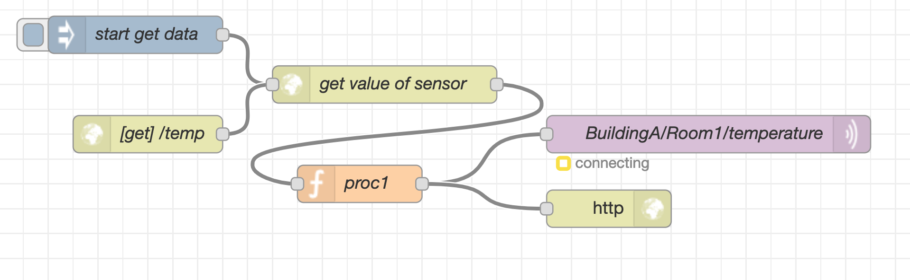
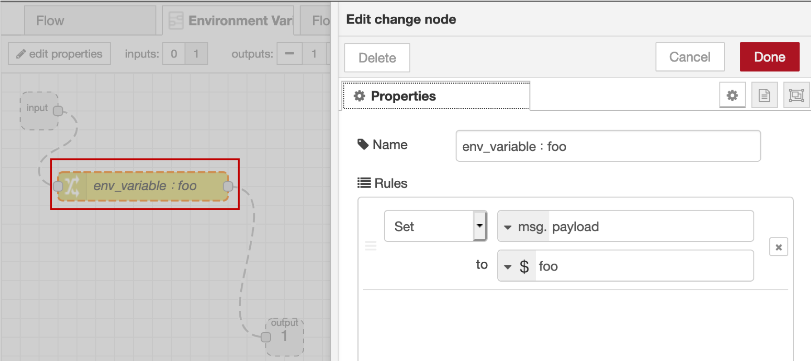
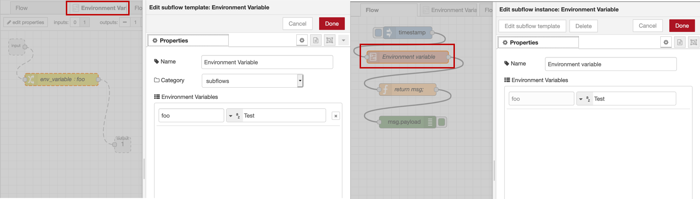
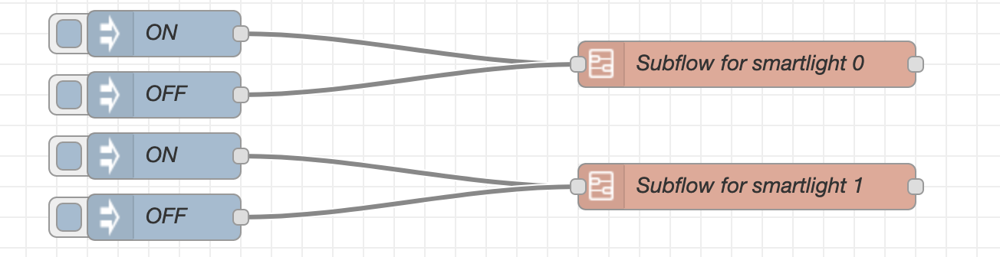
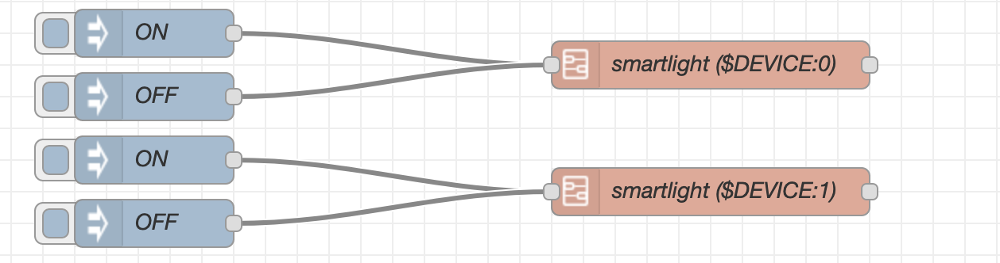
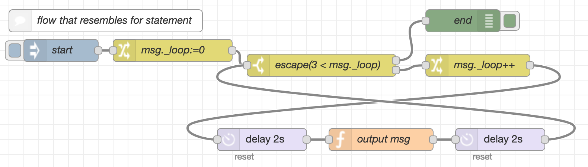
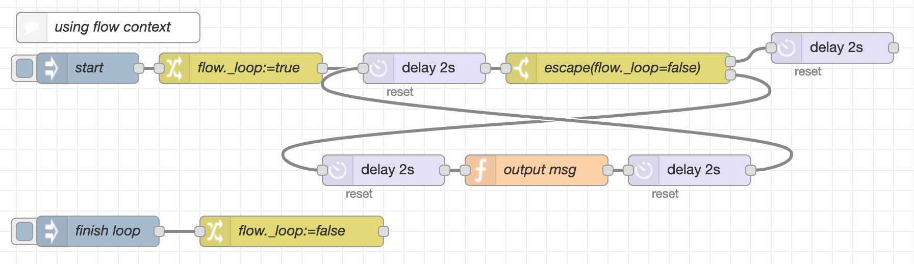
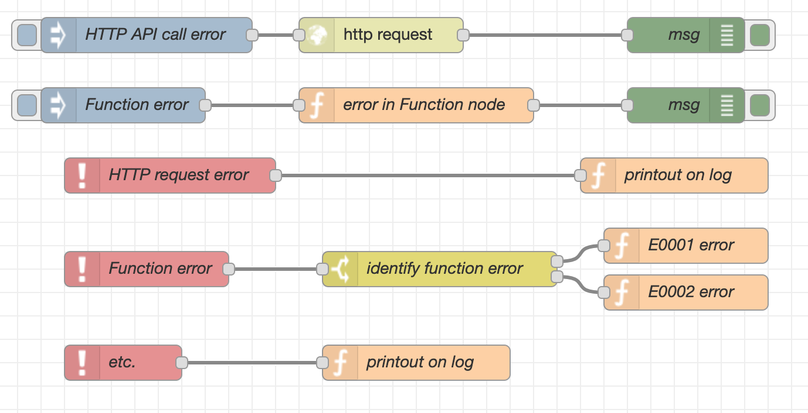
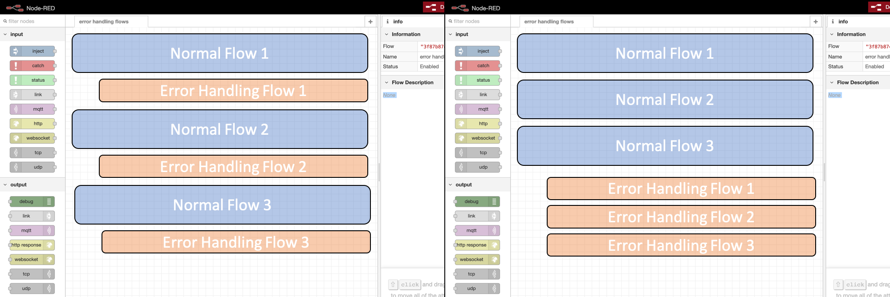

***This content is under review and may not form part of the final flow developer guide***


### Cooperation between flows  

One application may be constructed by integration of small flows that provide small functions. Since each small flow may be created by a different team, deciding how to integrate the small flows is important for smooth collaborative development.    

`Http in/response/request` nodes are useful for the integration. (See below figure)You can create flows that work like services by using an HTTP request receiving node as the first node in the flow, and a response sending node as the last. The resulting flow has greater reusability and by linking with an integrity monitoring system, any abnormal processing in the flow can be detected.

<div style="text-align: center">
    
</div>

However, if you do not want to expose endpoints of small flows, you can make subflows from the small flows and create an additional flow to integrate subflows.  

Another approach is to use `Link` nodes as the interface between flows on different tabs.
`Link` nodes and `HTTP` nodes each have their advantages and disadvantages. Use the node type that is appropriate for your situation.

|             | Advantages                                                            | Disadvantages
|:------------|:----------------------------------------------------------------------|:--------------
|**`Link`**|You can click the Link node to see the connections between flows.      | If there are pairs of Link nodes within the tab, it is difficult to tell which serve as the tab interface and which are there to simplify the flow.
|**`HTTP`**|You can connect with systems other than Node-RED, such as test systems.| Processing is unnecessarily exposed to outside entities.

### Managing flow parameter  

  
*Global context can be used as a parameter of flow execution. However, if you use the global context in various nodes, identifying dependencies between nodes becomes a hard work, and it can lead to bugs. To minimize the dependence on the global context, it is necessary to make it easier to see where the global context is used.*    


You should consider some situations that you need to change the output value according to environment variables.
For example, you might want to change the OS that process application to Windows and Linux.
In addition, you may be necessary to get proxy information to link it to other websites.

You can get environment variables in the following ways:
* by setting property 'Change' node, 'Switch' node, and 'Trigger' node
* by typing 'env.get()' in 'Function' node

<div style="text-align: center">
    
</div>

In addition, the subflow can set the environment variables that are valid only in the subflow.
There are two types of subflow environment variables.
* Environment variables common to all nodes in a subflow
* Environment variables of each node in the subflow

There is the form in the edit window of subflow, and you can edit environment variable that valid within the subflow by pushing the button add.

Edited parameters are displayed on the edit window of a subflow node. You can modify the value, and also return to default with the button displayed on the right side.

<div style="text-align: center">
    
</div>

These example explain advantage of using environment variables within subflow which the situation in which two smart light are operated in Node-RED.

The figure below is a bad example without reusability. If different logic to operate smart light is created as different subflow, you need to make a new subflow when a third smart light is added later.

<div style="text-align: center">
    
</div>

This example is more reusable than the above.
This flow is constructed with a subflow to operate the same kind of smart light and the nodes to enter the identifier of the mart light in the input message.
However, although there are actually several smart light, it is difficult for others to understand the process because the Node-RED workspace seem to have only one smart light.
In addition, the flow will be longer than necessary, because the nodes that define the lights to operate need to be inserted.

<div style="text-align: center">
    
</div>

If you use environment variables within subflow, you can convert objects to be manipulated simply by copying the subflow and modifying the identifiers of smart lights on the node property.
Therefore, smart light and nodes respond one-on-one, increasing the readability the of the flow.

<div style="text-align: center">
    
</div>

### Flows that can have adverse effects  

With Node-RED, even non-programmers can easily enjoy coding. However, Node-RED (as of 0.19.5) does not place strict restrictions on creating flows and does not provide debugging tools such as a lint. Thus, you can easily create dangerous flows that can cause bugs. In particular, it is also possible to lead to resource exhaust of Node-RED engine.      

This chapter shows certain cautions and principles preventing from creating such dangerous flows.    

### Loop design

As shown in the following figure, you can create a loop by connecting wires. A message will flow continuously forming an infinite loop, and the only way to stop it is to stop the execution engine.
To avoid this situation, you should provide means for the message to exit the loop.

<div style="text-align: center">
    
</div>

There are a number of ways to exit a loop.
The following figure shows one example, in which the loop is exited using a flow that resembles a for statement.

<div style="text-align: center">
    
</div>

Alternatively, in the following flow, the user can specify when the message exits the loop by using a flow context.
The Exit(flow._loop=false) node references the `_loop` property of the flow context, and exits the loop if the value is false.
The value is true at the point when the message enters the loop. When the user clicks the "Exit Loop" node, the processing of the `flow._loop:=false` node is initiated and the value of ```flow._loop``` is changed to false. This results in the message exiting the loop.

<div style="text-align: center">
    
</div>

### Error Handling  

To create reliable flows, error handling is essential. This chapter explains its implementation method and arrangement of error handling flow to easily distinct between nominal flow and anomaly flow.  

Error handling refers to measures put in place to deal with error conditions that occur in software.
For example, the system might behave unpredictably if it encounters a runtime error, such as being unable to access a specified file or input data not being in the expected format. This can cause the system to malfunction or lead to data loss.

An application should include processing that captures error events and executes the appropriate processing to handle the error.
Error handling might consist of processing such as outputting error details as log data, switching to alternate processing, prompting a human for a decision, or shutting down the system safely.

Error handling is also required in Node-RED.
Like other normal processing, error handling is implemented as a flow.
The following explains how to implement error handling in Node-RED, and where to place flows that perform error handling.

#### Implementing error handling

In Node-RED, you can implement error handling by using `Catch` nodes to catch errors that occur during processing of a node.

Let's place the `Catch` node as the first node in the flow, with the rest of the flow coding the error handling processing.
A `Catch` node can catch errors that occur during processing of any node, and errors intentionally coded in a `Function` node by the developer in the form `node.error("error-details", msg)`.

The following figure shows a flow that implements error handling for an error that occurs when a (higher level) `HTTP Request` node cannot access its destination, and an error that occurs in a (lower level) `Function` node.

<div style="text-align: center">
    
</div>

"Error in Function node" is realized by the following code:

```javascript
process_success_done = false;
if (process_success_done){
    node.status({fill:"green",shape:"dot",text:"success"});
}else{
    node.status({fill:"red",shape:"ring",text:"fail"});
    node.error('[E0001] Error in Function', msg);  // Intentionally produces an exception
}
```

A `Catch` node captures errors from nodes in the same tab.
If there is no `Catch` node in a subflow for errors occurring in that subflow, the error event will propagate to flows that use the subflow.
This is a similar concept to the behavior in Java (`throws`) where method errors propagate to the caller.
Flow developers should understand and utilize this behavior in order to design flows that handle errors seamlessly.

First, look into whether errors that are likely to occur should be processed within the subflow or handled by the caller, and consider whether to place the `Catch` node for the error in the subflow.

For example, for an error generated by an invalid input `msg` to the subflow, design the flow to propagate the error to the caller instead of placing a `Catch` node for the error in the subflow.

#### Location of error handling flows

Because an error handling flow is not normal processing, it typically does not contain any business processing.
If normal flows that implement business processing intermingle with flows that do not, legibility suffers for viewers of the flow.
Thus, flows that implement business processing and those that do not are preferably positioned in such a way that one type cannot be mistaken for the other.

Another thing to consider is that when a normal flow and the flow that implements error handling for that flow are far away from each other, it is difficult to see at a glance how they relate. This makes the developer more likely to assume incorrect relationships.

Without being too strict in this regard, we propose the following two approaches to flow arrangement:

<div style="text-align: center">
    
</div>

* Place the error-handling flow directly beneath the normal flow to which it relates (left side of the figure).
* Place all normal flows in the upper part of the tab, and all error-handling flows in the lower part in the same order (right side of the figure).