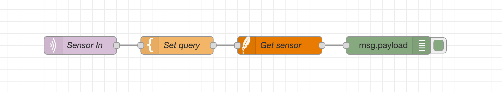
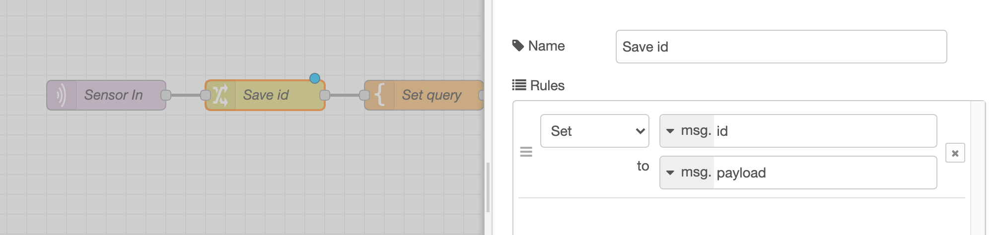
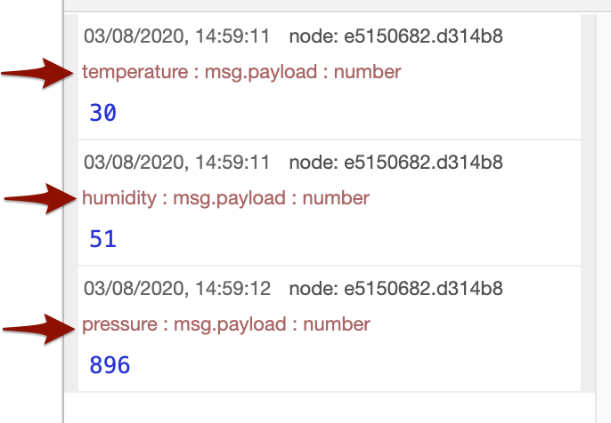

The messages that pass through a flow are plain JavaScript objects that can have
properties set on them.

They usually have a `payload` property - this is the default property that most nodes
will work with.

For more information about messages in Node-RED you should read the [Working with messages](/docs/user-guide/messages)
section of the user guide.

This section looks at some of the choices you need to make when deciding how to
stucture the messages in your flows.

### Working with `msg.payload`

When creating flows, the choice of properties used on a message will largely
be determined by what the nodes in the flow require.

Most nodes will expect to work with `msg.payload` and that will guide most of the choices you make.

For example, consider a flow that receives an id in the payload of an MQTT message. It then uses that id to query a database to find a matching record.

<div class="figure">
  
  <p class="caption">MQTT to database query</p>
</div>

The database node will put its result in the payload of the message it sends - overwritting the original id value. If the flow needs to be able to reference that id value later on, it can use a Change node to copy the value to another property that will not get overwritten.

<div class="figure">
  
  <p class="caption">Using a Change node to copy the payload to <code>msg.id</code></p>
</div>


This highlights an important principle: nodes should not modify or remove properties on messages that are not related to their functionality.

For example, in most cases, a Function node should send on the same message object it received rather than create a new message object.


### Using `msg.topic`

<div style="width: 343px" class="figure align-right">
  
  <p class="caption"><code>msg.topic</code> shown in debug sidebar message</p>
</div>

A number of nodes also treat `msg.topic` as having special meaning. It might be used to identify the source of the message, or to identify different 'streams' of messages on the same flows. It also gets displayed in the Debug sidebar with every message.

For example, the MQTT In node will set `msg.topic` to topic the message was received on. The Delay node can then be configured to rate limit messages according to their topic.

Whilst your flow may not use nodes that depend on `msg.topic` directly, it can be used to give extra contextual information about a message. But you should take care if you later introduce nodes to the flow that do depend on its value.


### Designing message properties

When designing a node or subflow for reuse, the message properties it works with and the properties it sets are all part of the API it exposes. As with all APIs, it needs to be designed with care and attention. This applies to flows as well.

One approach is to put everything under the payload. For example:

```json
{
    "payload": {
        "temperature": 123,
        "humidity": 50,
        "pressure": 900
    }
}
```

This may be convenient to keep the data together, but it can also lead to a lot of moving properties around as later nodes expect to operate on `msg.payload` and not a property underneath it.

A different approach, as seen by the Twitter node, is to put the most 'interesting' information into the payload, in this case the text of a tweet, and put the complete metadata the API also provides into a separate `msg.tweet` property.

There is not a single right answer to how to structure the message, but it should focus on how the node or flow is going to be used in the most common cases.

As with programming in general, the choice of good property names is also important. They should be self-describing to help with later debugging and understanding of the flow. For example, `msg.temperature` is much more understandable than `msg.t`.

They should also avoid commonly used properties such as `reset` and `parts` that have special meaning with some nodes.
