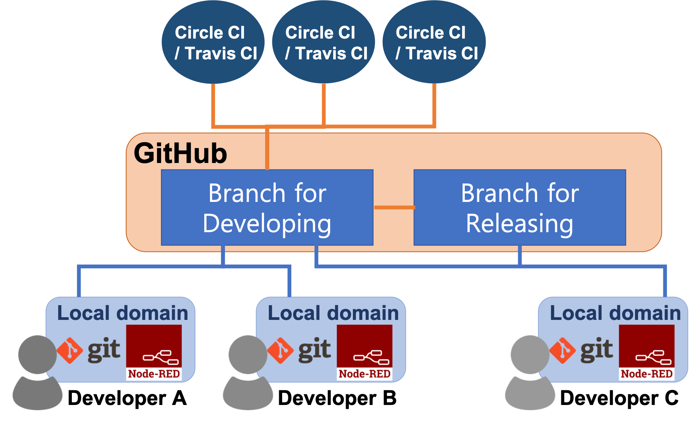
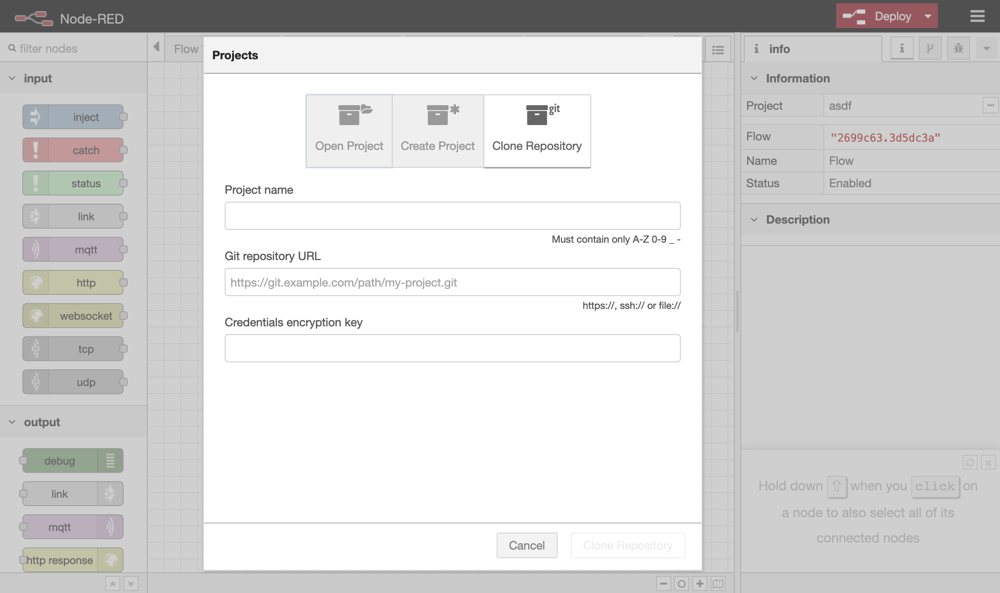
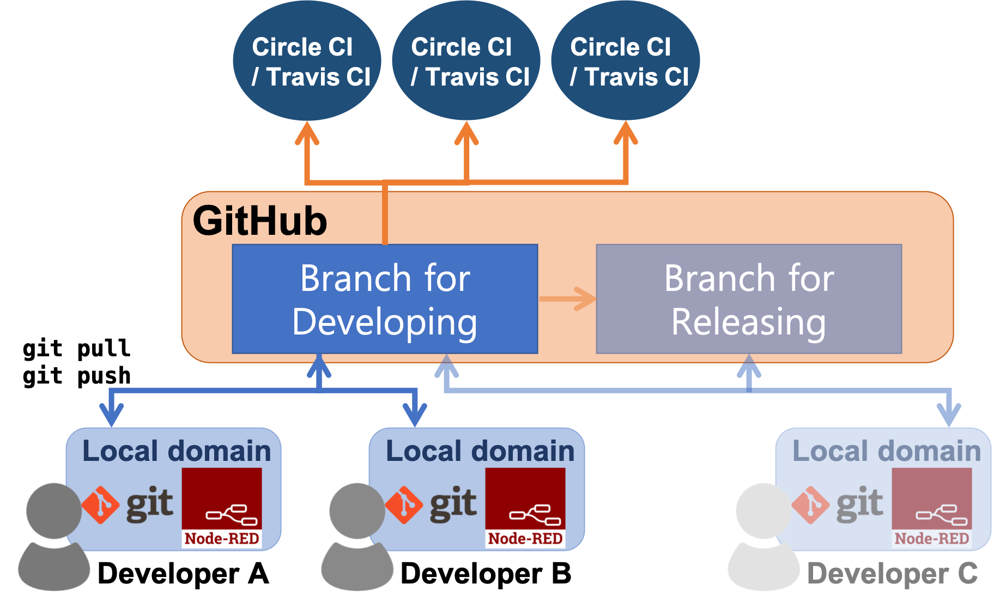
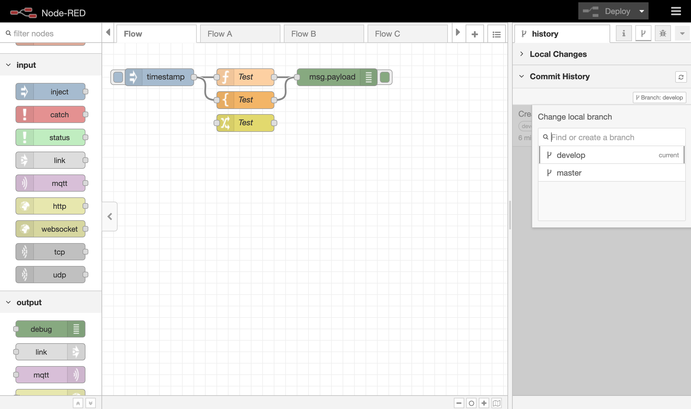
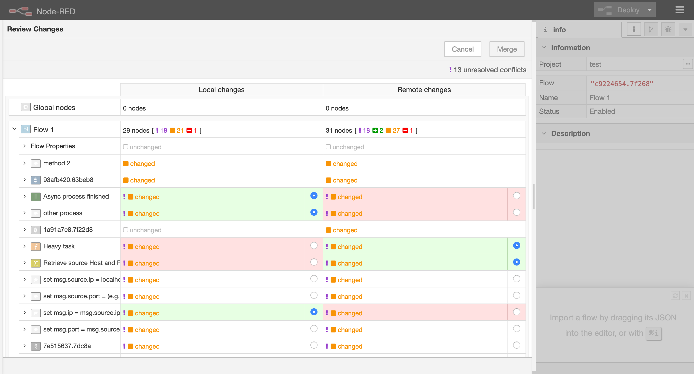
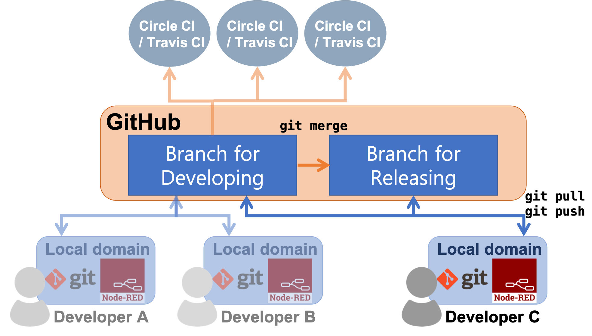
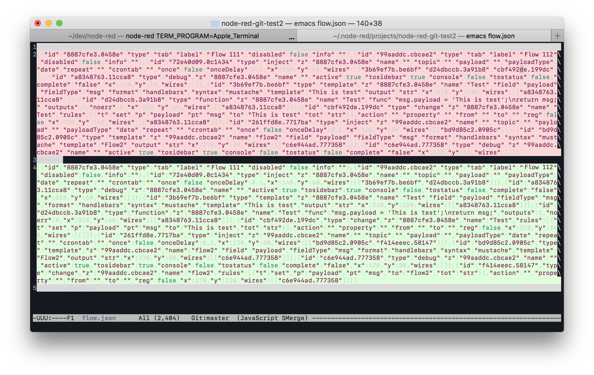


When multiple developers join the development, you may need development standards and environments that can facilitate collaborative development. This chapter describes about them.  


### System and development environment  


*The project feature of Node-RED can be linked with Git and you can manage the version of flows. It is recommended to use Git remote repository such as GitLab or GitBucket for sharing flows and projects among members. This chapter describes the development environment using Git.*  
 
*In detail, we plan to describe followings.*  
 
* *Configuration of development environment*  
* *Procedure of developing*  
* *Steps of release*  
 

The development of medium-scale and large-scale multiple flows integrating a large number of business domains involves multiple developers working for an extended period of time. This kind of environment requires a clearly defined project structure.
This section summarizes the procedure for creating a project structure, and the development environment you need to put in place.

#### Structure of the development environment

The following figure shows an example of a development environment.
The premise of this example is that the flow is developed collaboratively by Developer A and Developer B, and that Developer C merges flows developed as a Git Develop Branch into a Release Branch.

    

Node-RED has a feature that lets you work on more than one flow project in a single Node-RED engine by saving one project and switching to another.
This is called the Projects feature.
This feature can integrate with Git, allowing version control of all flows.
For this reason, it is recommended that you use a Git remote repository such as GitHub to share code among project team members.
You can also automate testing and other tasks by using a CI tool such as Circle CI and Travis CI.

The rest of this explanation assumes that GitHub is used as the Git remote repository and Circle CI/Travis CI as the CI tool.

Install Node-RED and Git in the local environment of each developer.
Make sure that the same versions of Node-RED and Git are installed in the local environments of all developers.
When installing Node-RED, select the latest version and enable the Projects feature. ([Click here for details.](https://nodered.org/docs/user-guide/projects/))
Use Git version 2.0 or later. This is because the Projects feature of Node-RED will not work correctly with earlier versions.

Set two branches for a project: a Develop Branch and a Release Branch.
Developers A and B perform development activity on the flow managed as the Develop Branch.
When development has reached a specific milestone, developer C merges the flow into the Release Branch.

#### General development procedure

When starting a project, the first step is to create an empty project in GitHub.
Any developer can then use the Projects feature in Node-RED to place the project in their local environment.
In Projects, open a new project window and select "Clone Repository", and in the "Git repository URL" field, enter the git clone URL of the project you created in GitHub.
The following figure shows the window of the Projects feature in which you clone the GitHub project:

    

When the project has been cloned to the local environment, create a Develop Branch in the local environment and push it to GitHub.
The procedure for creating a branch and pushing it to GitHub can be performed by using the Node-RED Projects feature.
The developers can now start working on the project.

The following figure shows how the development environment is used from the start of development until a specific milestone is reached:

    

Developer A and Developer B use the Projects feature to pull the project from GitHub to the local environment.
If you are unable to pull all branches to the local environment, run the command `git pull --all` in a console.
The developers can then switch to the Develop Branch and begin flow development.
The following figure shows the user interface as it appears when you switch between branches in Node-RED:

    

When Developer A and Developer B have finished developing the flow, the next step is to perform a `pull` operation to do not occur conflict error between contents that edited by other developer.
Use the Projects feature of Node-RED to perform this operation. Do not use the git command in the console.
If another developer has made changes to the flow and pushed them to GitHub, the `git pull` operation will cause a conflict.
Node-RED will automatically resolve the conflict as long as no conflicting changes have been made to the same node.
If changes have been made to the same node, the developers will have to resolve the conflict manually.
In this situation, a window can be opened in Node-RED in which the conflicts can be resolved manually by selecting one of the two conflicting updates to apply.
As shown in the following figure, the window provides radio buttons at the locations of conflicts. These radio buttons can be used to select the update to be applied.

    

#### General release procedure

The following figure shows how the development environment is used to release a flow whose development has reached a specific milestone:

    

Developer C runs the command `git pull` in a terminal to pull the Release Branch and the Develop Branch, and then runs the command `git merge` to merge the contents of the Develop Branch into the Release Branch.
These prodecure means when Developer C pull the Develop Branch, Developer C's local repository is updated works of Developer A and Developer B. 
When Developer C merge branches on local repository, works of the other developers are reflected to Release Branch on local repository of Developer C. 
Pushing means reflecting Developer C's Release Branch to remote repository of GitHub.
Unless Developer A and Developer B have both directly run `git push` to the Release Branch, there will be no conflicts at this point. 

### Management of flow with git  

It is recommended that you use Git for version management and for sharing flows between developers.
This is because Git is integrated into Node-RED via the Projects feature.
Flow management is recommended that it is always be performed by using the Projects feature of Node-RED. 
Unless it is necessary to use, developers should avoid using Git commands in a console.
This is because developed flows are saved as single-line JSON files, and merging these files in the console requires one of the conflicting flows to be deleted in its entirety.

The following figure shows the information representing the location of a conflict that is automatically added by Git to the flow file when you perform a merge operation by using a Git command.
Git looks for conflicts line by line. Because a flow file consists only of one line, a comparison between points of conflict equates to a comparison of the entire flow.
This means that you cannot specify only the specific location of the conflict in the flow and resolve the conflict in a localized way.

    

By using the Projects feature in Node-RED, the developer can detect conflicts related to flow changes in the Node-RED window, and resolve them directly.
In Node-RED, flows are inspected for conflicts at the node level. This enables developers to identify the locations of conflicts in the flow and then resolve the conflicts.

Note that the Node-RED Projects feature does not support all Git functionality.
For example, in Node-RED 0.18, the Projects feature does not have a function equivalent to Revert.
For Git operations that are not supported by the Projects feature, you need to use Git commands in a console.
To perform a Revert operation, use the Git commit IDs in the flow revision history, which is accessible in Node-RED as an argument of the `git revert` command.

In describing our development strategy, it was explained the need to make the flow legible by limiting the processing on a tab to a specific domain. Of further benefit is to structure the project so that each developer works on a separate tab, making it less likely for conflicts to occur and allowing you to take full advantage of Node-RED's automatic conflict resolution.
Where possible, the development strategy that sets the standards for the project should avoid situations where multiple developers make changes to the same tab, so that conflicts will not need to be resolved manually.