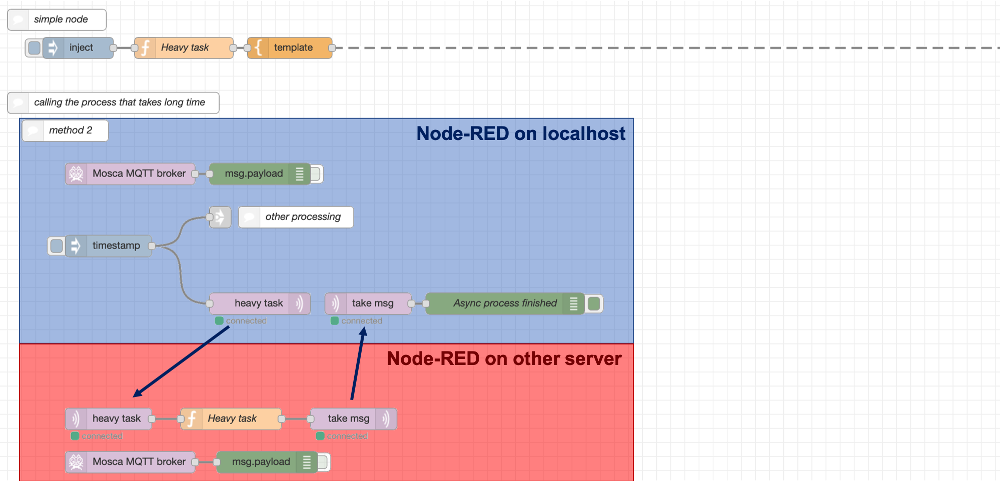
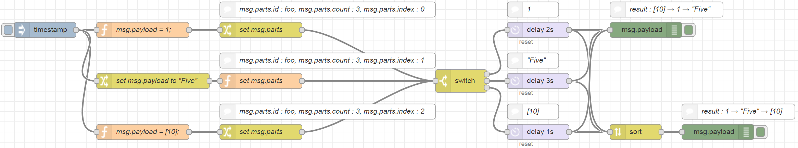
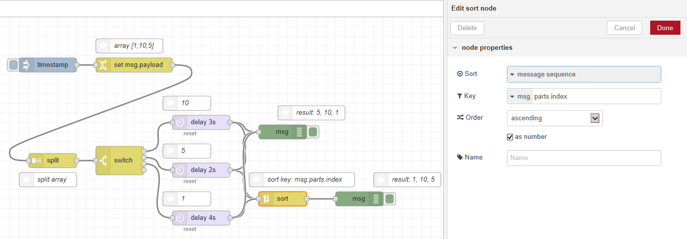


*Node-RED does not strongly focus on applications with non-functional requirements.*    
*However, there are cases that it is necessary to satisfy high level non-functional requirements.*    
*This chapter explains techniques and others to satisfy non-functional requirements.*  


### Precautions due to single thread  


*If a node takes long time for execution, the process of the entire Node-RED instance stops.*  
*Therefore, it is advisable to outsource the processing with running other services.*  


Because Node.js uses a single-thread execution model, execution of the entire Node-RED instance will stall if the execution of a node takes a long time. This causes the instance to hang.
Nodes whose processing is time-consuming should be executed in a different environment from Node-RED and called asynchronously.
This allows you to work around the issue in which Node-RED hangs.

There are 2 methods to resolve. One way to call asynchronously is to use the `HTTP`node.
Place processing that requires a long time on another server, and place the `HTTP in/out` nodes before and after that processing. You can call in this way, but if it takes too long, there is a possibility that the processing will time out.

    

The second way is to use the `mqtt` node. However, due to the function of the `mqtt` node, it is necessary to install the `MQTT broker` node. You can install it by searching `node-red-contrib-mqtt-broker` at Manage pallete menu.

You should enter the port number and the required details in the `MQTT broker` node. And each `mqtt in` node is connected to `mqtt out` node that has same `topic` and `port`. It means you need to type the `topic` and `port` not only localhost but also other server, but you can freely control which nodes will send and receive messages. 

    

If processing is taking a long time because it is waiting for a condition to be met, we recommend that you use asynchronous programming in Node.js.

### Guaranteeing the order of messages


*Node - RED does not guarantee the arrival order of messages. Therefore, it is better to design related messages in a format expressing the order relation of messages. (Separated message format)*  


In some cases, it may be necessary to have an orderly relationship with multiple messages, such as transaction data, sorted records, etc. However, because the order of arrival of messages to the node in Node-RED is not guaranteed, it is not possible to express the relationship between messages by the order of arrival of the messages.

Node-RED has inherited asynchronous nature of Node.js with which Node-RED is developed.
Therefore, in Node-RED, the processing of each node is asynchronously executed after the node receives a message.

This means that when two or more messages arrive at a flow, the processing of the flow does not always finish in the order of arrival of the messages. By this feature, flow can handle more messages at the same time because it does not have to wait for the processing of any other message to end. 

#### `Sort` node

To ensure the order of processes, a `Sort` node can be used.
You can choose sorting target of `Sort` node as `msg` or `message sequence`.
By setting `msg.payload`, the contents of the message are sorted alphabetically. 
If you set the `message sequence`, you can use `Sort` node as feature that guarantee the order of messages arrival.

`Sort` node expects that `msg.parts` property is contained in its `msg` that is input.
`msg.parts` is added when `msg` is divided into multiple parts by `Split` node. 
Instead of `Split` node, you can add `msg.parts` to `msg` with other node such as `Change` node and `Function` node. In this case, you have to set following properties to each message that you want to sort.

|Property          |  |Description                               
|:-----------------|:-|:-----------------------------------------
|`msg.parts.id`    |  | An identifier for the group of messages  
|`msg.parts.index` |  | The position of messages after be sorted 
|`msg.parts.count` |  | The total number of messages to be sorted

    

`Sort` node waits to output messages until all messages in the group arrive. After all messages arrive at `Sort` node, `Sort` node sorts the messages according to the sort key that is specified in the setting of the `Sort` node.
If you set Sort to `message sequence` and set the Key to `msg.parts.index` in the setting of `Sort` node, `Sort` node sends messages to the next node in order of key of message. This setting enables to sort messages according to order of splitted by `Split` node.
However, `Sort` node only send output when the value of `msg.part.count` matches number of messages entered.

    

Because order of messages is ensured by this approach, the next node of `Sort` node can be started to process in order you expect.

In addition, nodes that can manipulate the order exist as follows:

||Divide a group into multiple groups|
||Divide the data into groups|
||Convert to one data from group|
||Group the entered messages|
||Group CSV records|

  
This content was included in this wiki. However, we have determined that it is better to add this section to the other document existing. We will discuss it next time.   
 
## Managing state  
 
You need to manage the execution status of the program for following cases:  
 
* Calculation processing targeting multiple messages  
* Sharing information among multiple nodes  
* Process depending on Node-RED External state  
* Recovery processing at error occurrence  
 
This section describes the policy of state management about following points.  
 
* Type of state  
* Maintaining flow state  
* Maintaining node state  
