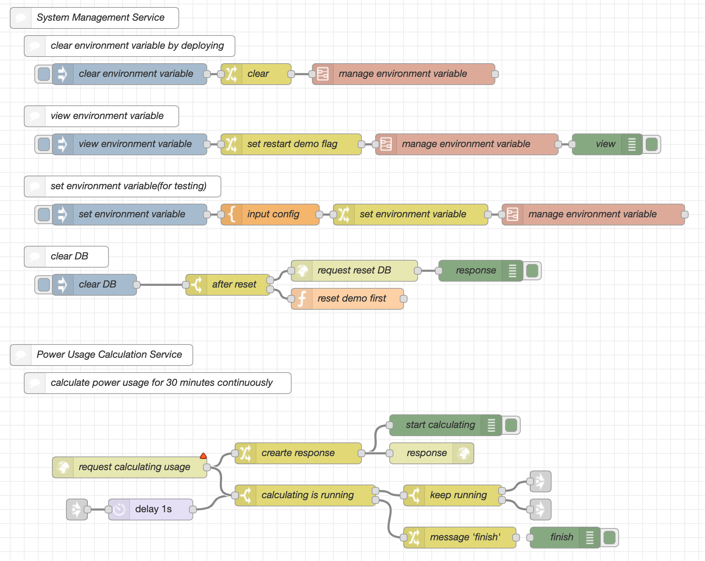
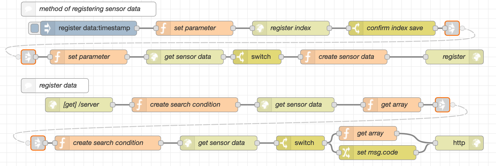
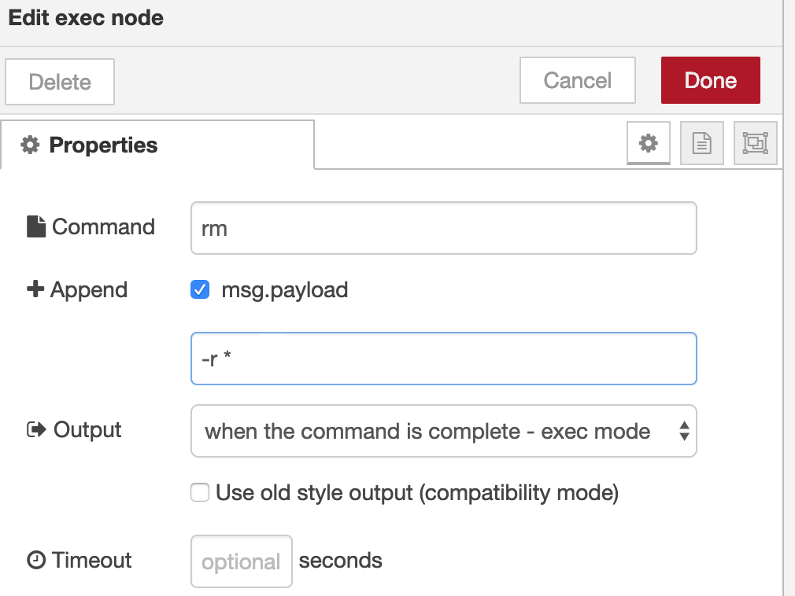
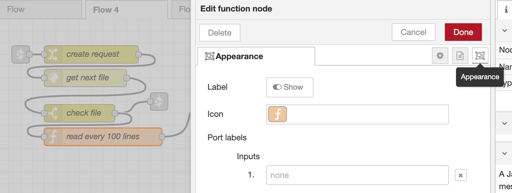
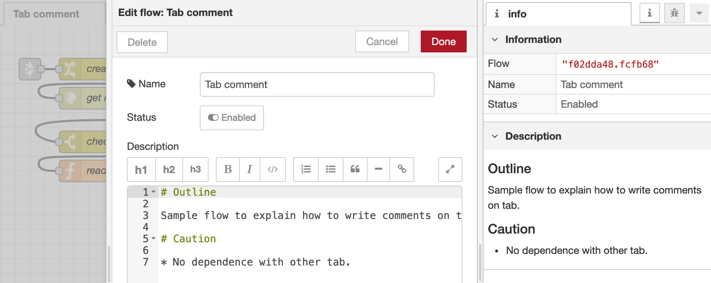
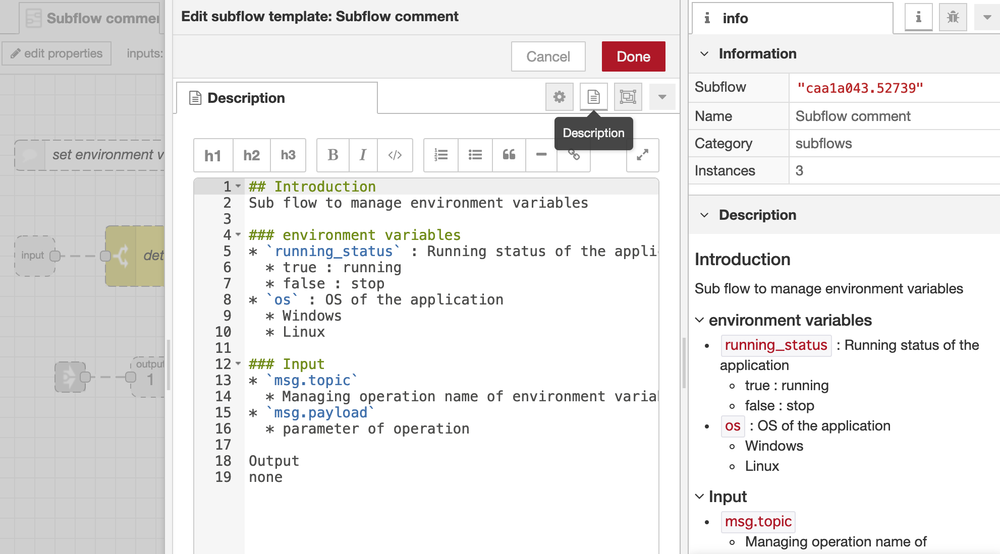

### Align nodes  


*As the size of the application increases, the process of flow will become complicated, which decreases readability and understandability. One of the key points to improve readability and understandability is a proper node alignment such that flows of one function are adjacent to each other. This chapter shows effective node alignment.*  


A key feature of Node-RED is the ability to create applications without programming ability, provided the application is small and its processing is easy to follow.
However, as application size increases, visual programming could suffers an effect similar to the "spaghetti code" of general programming.

This issue can be mitigated, to an extent, by exercising a certain amount of care during the development phase.
The following explains ways of minimizing the visual equivalent of spaghetti code that offer the best results relative to their difficulty.

In conventional programming languages, tabs and spaces are used to make the structure of the code easy to follow. It is recommended a careful arrangement of nodes in Node-RED to achieve a similar outcome.
By taking a considered approach to node arrangement, you can convey intent in relation to the processing of the node.

    

Node-RED provides a grid function that helps you arrange nodes neatly.
By enabling this function, you can automatically achieve a basic level of uniformity in node arrangement.
Click the settings button at the top right of the Node-RED window, and select the Show grid and Snap to grid check boxes.
When you apply the settings, a grid appears in the editor and any nodes you place in the editor will now snap to a gridline.

    

Another way to make the processing easier to interpret is positioning the flows simply.
The following figure shows an example in which a flow contains multiple processes.
A `Comment` nodes are added to each process and groups of that, and the description of each process is shifted a step to the right with the flow itself.
This arrangement makes it clear that there are two process groups, and helps other developers understand that processing in each process group independently of the other.

    

The approach that gives the greatest legibility is to keep each unit of processing on a single horizontal line wherever possible.
If there is node that has more than one output port, aligning the branched flow vertically makes it easy to compare and contrast the flows.

When a processing is too long, arranging nodes vertically could be advantageous.
In the following figure, some of the nodes are arranged vertically.
This vertical arrangement implies a relationship between these nodes in the flow, which in this case was the intention of the designer.
It is easier to understand the nature of a major process if it is obvious to the viewer which minor processes make up the major process and how they relate to each other.
As in the following figure, when a long flow contains groups of processes, arranging the nodes of each group vertically can make the nature of those groups more clear.

    

 
### Naming rule  
 
Name of nodes, tabs and subflow is important for readability and reusability of flows. This chapter presents some effective naming rules of them.  

#### Node naming conventions

The name you assigned to a node appears on the workspace.
Giving each node a name that connotes the processing it performs improves the readability of the flow.

Although a node represents the smallest unit of processing, the nodes in a processing of business application can not only play a large part but also merely process data.

Naming nodes according to their roles and relationship to other nodes makes it easier to understand the processing of the entire flow.

It is suggested the following naming conventions:

* For nodes in high-level flows (business process level)
    - A node name that makes its business processing easy to identify
* For nodes in low-level flows (process implementation level)
    - "Verb + Object", "Verb + Object + Adverb"

The reason that it is recommended that different naming conventions for different process levels is each user who views and uses the flow has a different perspective.
The nodes in high-level flows are of interest to users who want a concise overview of the application.
Low-level flows are likely to be viewed and modified by engineers.
Therefore, the names of nodes in high-level flows should make obvious the business process to which it relates, and in low-level flows, node names should reflect the specific processing the node performs.

To nodes in high-level flows, assign names that are sufficient to identify the business process to which the node relates.
Because high-level flows tend not to be too large in scale, node names can be relatively long. It is recommended that they not exceed 5~6 words.
Supplementary information about the business process can be input on the Description.

To nodes in low-level flows, you should assign names that are concise and consistent and that give the user an intuitive sense of its purpose.
A widely used convention in naming functions is to use names in the format "Verb + Object" or "Verb + Object + Adverb". For consistency, it is recommended that you assign node names in this same format.
When using a different format for node names, the format preferably remains consistent among node names.

#### Tab naming conventions

You can also assign names to tabs.
It is suggested the following naming conventions:

* "Noun"
* A compound noun is also acceptable
* No longer than 15 characters

The purpose of tabs is to gather multiple flows together in units that are meaningful in the context of the application.
The name of a tab should unambiguously identify its function and the business processing it performs.
It is recommended that you use the format "Noun" for flow names.

Flow names can also consist of compound nouns.
However, depending on the display size, names longer than 15 characters might be cut off in the browser window.
It is recommended that you use flow names of 15 or fewer characters.
 
### Using proper nodes  
 

*Each node can be used flexibly. For example, a function node can cover the same function of Change node, Switch node and so on. However, using a proper specialized node for your objective contributes improving understandability of your flows. This chapter introduces the roles and usage of core nodes such as **Change, Switch, Template, Link, HTTP**.*  

*The **Function** node and **Exec** node are useful for JavaScript and other language developers because they can write JavaScript codes and commands directly. However, heavy use of them makes understanding of flow difficult for other developers. This chapter describes a caution of these nodes and shows examples of alternative methods against Function node and Exec node.*  


Each type of node has an expected role.
For example, a `Change` node is expected to perform processing that changes the value of a variable.

However, some processing can be performed by more than one node.
For example, a `Template` node could be used to generate a value instead of a `Change` node.

However, if you use a node in a way other than originally intended, a user who is unfamiliar with the flow might have trouble interpreting it and make incorrect assumptions.
For this reason, you should use nodes according to their original purpose.

For reference, the following explains the original purpose of nodes used in the majority of use cases:

||Generates properties within a message or context, and changes, deletes, and moves values|
||Conditional branching of flows based on message properties and context values|
||Generates data by combining input data with a template defined in advance|
||(in/out) Connects flows to each other with virtual wires|
||(in) Sets HTTP endpoints, (out) Sends HTTP requests|

#### Link node

You can divide the flows when it become too long by using `Link in` node and `Link out`. And it allows you to create flows accroding to the size of the display and makes the layout clean.  

    

#### Function node

Users can create a `Function` node that performs any processing they wish by writing JavaScript code in the `Function` node setting window.
By using a `Function` node, you can perform any processing you can write in JavaScript, subject to the restrictions imposed by the Node-RED framework.

    

Users who are accustomed to JavaScript might be tempted to code all processing using `Function` nodes.
However, it is not recommended the overuse of `Function` nodes because it will make it difficult to tell at a glance what processing the flow performs.
Another reason is that Node-RED is also used by users who are unfamiliar with JavaScript. For such users, a flow that uses a large number of `Function` nodes will have limited reusability.
Also, if you use a global context or flow context in a `Function` node and there is a bug in a node that depends on the context, it will take longer to track down the bug.

A typical example of unnecessary use of a `Function` node is its use to assign or change the value of a variable.
When a variable has significant bearing on a business process in the domain, it is particularly important to use a `Change` node rather than coding the processing into a `Function` node. Use of a `Change` node makes it clear to anyone viewing the flow that a value is being assigned to a variable at that node.
A single `Change` node can assign multiple values to variables, and allows the use of scripts that interact with JSON by means of JSONata expressions. This means that you do not need a `Function` node in order to assign and change variable values in a flexible way.

However, when processing that is relatively insignificant in terms of domain logic is coded using means other than a `Function` node, the resulting flow might be larger than necessary.
Cluttering the flow with processing that does not need to be legible defeats the purpose of avoiding `Function` nodes, making the overall flow harder to understand.
In these circumstances, using `Function` nodes makes for a more legible flow.

One exception is processing that is frequently changed, in which case processing that is relatively insignificant in terms of domain logic is better implemented by means other than a `Function` node.
This applies, for example, to processing that is likely to be changed whenever another developer re-uses the flow, or processing that is edited on an ongoing basis as business processes are updated.
If you know in advance that processing is likely to be amended, it is better to use a node that makes its role in the processing flow clear instead of a `Function` node. This lets the user easily identify where changes need to be made.

You can use an approach in which `Function` nodes perform processing that is of such low importance in the domain that no other user would see it, and that is unlikely to need changing.

|Advantages|Disadvantages|
|:-|:-|
|- Processing can be implemented freely without the constraints of a node or flow - Flows can be kept small in scale|- The user cannot tell what processing the flow performs just by looking at it - The processing is obscure to people unfamiliar with JavaScript|

#### Exec node

An `Exec` node can execute commands on the server where Node-RED is running.
You can use an `Exec` node to perform any processing you wish, by placing a program on the server and having the `Exec` node execute that program.
This allows the flow developer to implement and test processing using his or her preferred programming language.

However, it is recommended that you do not use `Exec` nodes in this way.
As with `Function` nodes, another user will find it difficult to understand at a glance what the flow is doing.
It also makes it difficult to re-use the flow, because the node requires the presence of a specific program in a specific server environment.

Use of an `Exec` node is appropriate only in the following circumstances:

* When saving files to or acquiring files from the execution platform (server)
* When executing processing that depends on the execution platform

For example, the only way to temporarily save log data on the server or delete it from the server is to run commands in an `Exec` node.
However, use of the rm command or communication commands presents a risk of damage to the Node-RED environment or a security breach.
Use `Exec` nodes as little as possible, and keep these concerns in mind when doing so.

    

|Advantages|Disadvantages|
|:-|:-|
|- Processing can be executed that depends on the execution platform (server). - You can run any type of program you wish.|- You cannot tell what the flow is doing just by looking at it. - Use of rm and communication commands presents risks in terms of security and the integrity of the environment.|

### Changing icon  
 
When the same kind nodes are in the flow (e.g. a case that managing a large number of devices with `MQTT` nodes), it is difficult to distinguish nodes. But, it can be solved by designating different icons for each node. 


This chapter introduces the procedure for changing the icon and some Use Cases.  


Something to keep in mind is that overusing the icon changing function can in fact make it more difficult to identify nodes on sight. 
You need to take care to maintain a balance.

    

### Comment  

Developers must make every effort to create flows that are easily understood by others.
Writing comments is a crucial step in fulfilling this requirement. Developers must leave comments that appropriately describe the role of each flow and provide cautionary notes relevant to its use.
This section provides guidance on how to write comments.

In Node-RED, you can leave the following types of comment:

* Comment on tab  
* Comment on flow (`Comment` node)  
* Comment on subflow  

Each comment is written in a different way and with different intentions. Therefore, each type is described separately.

#### Comment on tab

When you click an area in Flow Editor where there are no nodes or wires, a comment about the tab appears in the Description field of the info tab.
A flow developer can edit this comment however they wish.

To edit the comment, you double-click the tab and then write a description of the tab in Markdown format in the description box. The Description you set then appears in the Description area.

    

For tab comments, a brief summary of the flow on the tab will suffice.
This is because the developer should have set up the flow in such a way that its function is apparent from its appearance.
Because an advantage of Node-RED is the ease with which a developer can edit a flow, describing the flow in the tab comment presents a risk of the comment no longer reflecting the flow implementation in the future. This can add expense to the development process.

However, if a flow in the tab has prerequisites, dependencies with other tabs, or interfaces, description about those elements could be provided in the tab comment for the benefit of other developers.

#### Comment on flow (`Comment` node)

`Comment` node can provide supplementary information about each processing.
If the flow is intended for use by an end user, you can use `Comment` nodes to provide instructions.

The node name of the `Comment` node should concisely express the nature of the processing performed by the flow, using standard programming terminology such as function and method names.
If there are specific requirements for the input `msg` of the flow, explain those requirements in the body of a `Comment` node.
This corresponds to a documentation comment in ordinary programming.

However, it does not recommend that you leave comments indiscriminately.
This is because a flow with too many `Comment` nodes means more development costs associated with maintaining correspondence between comments and actual processing.

### Comment on subflow

You should make comments relatively detailed on the assumption that sub-flows will be re-used proactively by other flow developers.

Of particular importance is clarifying the `msg` attributes whose value is deleted or modified in the sub-flow.
Without this clarification, when a flow developer re-uses the sub-flow, unintended changes might be made to values in the `msg` object. This presents a significant bug risk.
Therefore, when developing a sub-flow, provide a test flow that checks whether the message input to the sub-flow contains the expected attributes.
The developer must also provide a test flow that checks whether attributes set or changed at output have been processed correctly.
In a sub-flow comment, explain which information in the input and output messages is tested (or the test title).

    

For processing performed within a sub-flow, the developer should proactively comment any information that might be useful to a developer who re-uses the sub-flow.
This might include, for example, any changes it makes to `global` and `flow` contexts, the expected processing time of time-consuming flows, and the contents of error `msg` objects of potential errors.

### Refactoring  

 
*It is better to check and refactor the developed flows before presenting it to other developers. This section shows refactoring points such as followings,*  
 
1. *Coding Style*  
2. *Flow implementation*  
3. *Readability and reusability*  


We recommend that flow developers perform refactoring of the flows they develop to improve legibility.
While we expect developers to have followed these guidelines in all aspects of development, this section provides a list of key areas to focus on when refactoring flows.

We hope that developers will review this checklist before presenting their flows to others or using them as the basis for a template, making sure that all guidelines have been followed.

**1. Coding style**
   1. There is a flow (a business process level flow) that reflects the flow of tasks in the business process, giving a clear idea of system processing as a whole.
   2. Data to be processed by nodes is stored in the `msg.payload` object of the message.
   3. No unnecessary changes are made to the values of other attributes under the `msg.` object (other than `msg.payload`).
   4. The nodes in the business process level have names that make their part in the business process easily understood.
   5. Flows at the processing level are named in the format "Verb + Object" or "Verb + Object + Adverb".
   6. `Function` nodes are not overused.
   7. Flows are arranged separately according to the processing they perform.  

**2. Flow implementation**
   1. Flows that are frequently re-used in business flows are implemented as sub-flows to function like libraries.
   2. Flows that do not receive processing requests from outside the system (flows used only from the same Node-RED flow engine) are connected to other flows by `Link` nodes.
   3. The assignment of values to the Global context takes place only within a given sub-flow.
   4. If the flow contains loops, means for exiting the loop are provided.  

**3. Legibility and reusability**
   1. Comments are assigned to flows and sub-flows, which summarize the processing and explain the contents of input and output `msg` objects.
   2. A single flow has one or two `Comment` nodes at most, and there are no comments on detailed aspects of the processing.
   3. Log data is recorded that indicates the operating status of the flow and any errors that occur.
   4. Appropriate error handling flows are in place.
   5. Error handling flows are implemented in the flow where the error should be handled.
   6. Context data is stored persistently so that the flow can be resumed if it ends abnormally.
   7. Measures are in place to ensure that, after recovering from an error, the flow does not repeatedly encounter the same error.