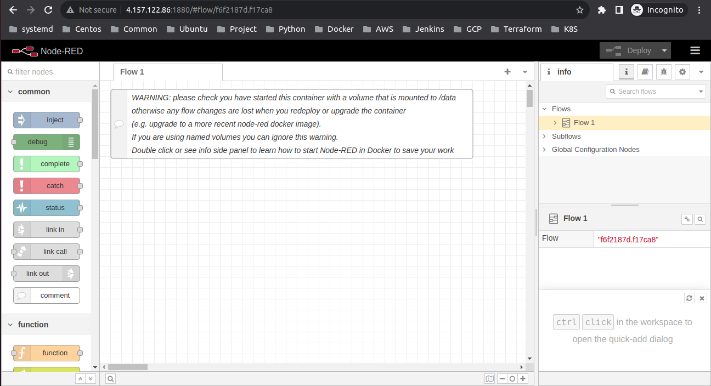
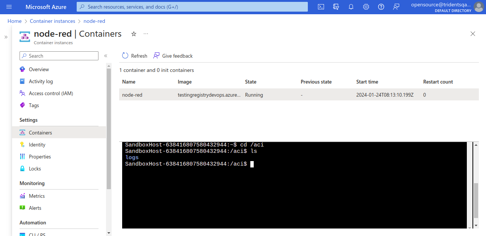

This guide takes you through the steps to get Node-RED running on an Microsoft Azure
environment.

There are two approaches:

1. Running on the Azure Virtual Machine instance (VM)
2. Running on Azure Container instance (ACI)

#### Prerequisites
- Before starting, ensure that you have an Azure account with an active subscription
- Log in to the [Azure console](https://portal.azure.com/)

*Note:* As of Node-RED 1.0, the repository on **Docker Hub** was renamed to `nodered/node-red`.

## Running on Azure Virtual Machine instance

#### Create the base image

1. Log in to the [Azure console](https://portal.azure.com/)

2. Click to add a New ... Virtual Machine

3. In the list of Virtual Machines, select **Ubuntu Server**, then click 'Create'

4. Give your machine a name, the username you want to use and the authentication
   details you want to use to access the instance

5. Choose the Size of your instance. Remember that node.js is single-threaded so
   there's no benefit to picking a size with multiple cores for a simple node-red
   instance. `A1 Basic` is a good starting point

6. On the 'Settings' step, click on the 'Network security group' option. Add a
   new 'Inbound rule' with the options set as:
     - Name: node-red-editor
     - Priority: 1010
     - Protocol: TCP
     - Destination port range: 1880

7. Click 'Ok' on the Settings page, check the Summary then click 'Ok' to deploy
   the new instance

After a couple of minutes your instance will be running. In the console
you can find your instance's IP address

#### Setup Node-RED

The next task is to log into the instance then install node.js and Node-RED.

Log into your instance using the authentication details you specified in the
previous stage.

Once logged in you need to install node.js and Node-RED

       curl -sL https://deb.nodesource.com/setup_12.x | sudo -E bash -
       sudo apt-get install -y nodejs build-essential
       sudo npm install -g --unsafe-perm node-red


At this point you can test your instance by running `node-red`. *Note*: you may
get some errors regarding the Serial node - that's to be expected and can be
ignored.

Once started, you can access the editor at `http://<your-instance-ip>:1880/`.

To get Node-RED to start automatically whenever your instance is restarted, you
can use pm2:

       sudo npm install -g --unsafe-perm pm2
       pm2 start `which node-red` -- -v
       pm2 save
       pm2 startup

*Note:* this final command will prompt you to run a further command - make sure you do as it says.

## Running on Azure Container Instance

#### Create Azure Container Registry
1. Create a [Container Registry](https://learn.microsoft.com/en-us/azure/container-registry/container-registry-get-started-portal?tabs=azure-cli) and store the Node-RED image in the container registry


2. Log in to a registry using Azure CLI

```
   az login
   az acr login --name myregistry
   docker login myregistry.azurecr.io
```

#### Create an Azure file share
 Run the following script to create a storage account to host the file share, and the share itself. The storage account name must be globally unique, so the script adds a random value to the base string.

```
## Change these parameters as needed
   RESOURCE_GROUP=myResourceGroup
   STORAGE_ACCOUNT_NAME=storageaccount$RANDOM
   LOCATION=eastus
   FILE_SHARE_NAME=node-red-share
   IMAGE=myregistry.azurecr.io/node-red:latest
   ACI_NAME=node-red

## Create the storage account with the parameters
   az storage account create \
      --resource-group $RESOURCE_GROUP \
      --name $STORAGE_ACCOUNT_NAME \
      --location $LOCATION \
      --sku Standard_LRS

## Create the file share
   az storage share create \
      --name $FILE_SHARE_NAME \
      --account-name $STORAGE_ACCOUNT_NAME
```

#### Get storage credentials
To mount an Azure file share as a volume in Azure Container Instances, you need three values: the storage account name, the share name, and the storage access key.

- **Storage account name** - If you used the preceding script, the storage account name was stored in the `$STORAGE_ACCOUNT_NAME` variable. To see the account name, type

```
echo $STORAGE_ACCOUNT_NAME
```

- **Share name** - This value is already known (defined as node-red-share in the preceding script). To see the file share name
```
echo $FILE_SHARE_NAME
```
- **Storage account key** - This value can be found using the following command

```
STORAGE_KEY=$(az storage account keys list --resource-group $RESOURCE_GROUP --account-name $STORAGE_ACCOUNT_NAME --query "[0].value" --output tsv)

echo $STORAGE_KEY
```

#### Deploy Node-Red on container instance and mount volume - CLI
To mount an Azure file share as a volume in a container by using the Azure CLI, specify the share and volume mount point when you create the container with az container create. If you followed the previous steps, you can mount the share you created earlier by using the following command to create a container

```
az container create \
        --resource-group $RESOURCE_GROUP \
        --name $ACI_NAME \
        --image $IMAGE \
        --dns-name-label unique-acidemo-label \
        --ports 1880 \
        --azure-file-volume-account-name $STORAGE_ACCOUNT_NAME \
        --azure-file-volume-account-key $STORAGE_KEY \
        --azure-file-volume-share-name $FILE_SHARE_NAME \
        --azure-file-volume-mount-path /aci/logs/

```
The `--dns-name-label` value must be unique within the Azure region where you create the container instance

#### Using Bash
You can combine the aforementioned commands and execute the bash script to create an Azure Container Instance for Node-RED.
Here is the bash script for Node-RED

```
#!/usr/bin/env bash

RESOURCE_GROUP=myResourceGroup
STORAGE_ACCOUNT_NAME=storageaccount$RANDOM
LOCATION=eastus
FILE_SHARE_NAME=node-red-share
IMAGE=myregistry.azurecr.io/node-red:latest
ACI_NAME=node-red

# Azure Login
az login

# ACR Login
az acr login --name myregistry.azurecr.io

# Check if Resource Group exists
if az group show --name $RESOURCE_GROUP &>/dev/null; then
    echo "Resource group '$RESOURCE_GROUP' already exists."
else
    # Creating Resource Group
    az group create --name $RESOURCE_GROUP --location $LOCATION
    echo "Resource group '$RESOURCE_GROUP' created."
fi

# Check if Storage Account exists
if az storage account show --name $STORAGE_ACCOUNT_NAME --resource-group $RESOURCE_GROUP &>/dev/null; then
    echo "Storage account '$STORAGE_ACCOUNT_NAME' already exists."
else
    # Creating Storage Account
    az storage account create \
        --resource-group $RESOURCE_GROUP \
        --name $STORAGE_ACCOUNT_NAME \
        --location $LOCATION \
        --sku Standard_LRS
    echo "Storage account '$STORAGE_ACCOUNT_NAME' created."
fi

# Creating File Share
az storage share create \
    --name $FILE_SHARE_NAME \
    --account-name $STORAGE_ACCOUNT_NAME

echo "File share '$FILE_SHARE_NAME' created."

echo $STORAGE_ACCOUNT_NAME

STORAGE_KEY=$(az storage account keys list --resource-group $RESOURCE_GROUP --account-name $STORAGE_ACCOUNT_NAME --query "[0].value" --output tsv)
echo $STORAGE_KEY

# Creating Azure Container Instance for Node-Red
if az container show --resource-group $RESOURCE_GROUP --name $ACI_NAME &>/dev/null; then
    echo "Azure Container Instance '$ACI_NAME' already exists."
else
    # Creating Azure Container Instance for Node-Red
    az container create \
        --resource-group $RESOURCE_GROUP \
        --name $ACI_NAME \
        --image $IMAGE \
        --dns-name-label unique-acidemo-label \
        --ports 1880 \
        --azure-file-volume-account-name $STORAGE_ACCOUNT_NAME \
        --azure-file-volume-account-key $STORAGE_KEY \
        --azure-file-volume-share-name $FILE_SHARE_NAME \
        --azure-file-volume-mount-path /aci/logs/

    echo "Azure Container Instance '$ACI_NAME' created."
fi
```
After executing the file, you can make the application accessible by using the `public IP` or `Fully Qualified Domain Name (FQDN)` of the Azure Container Instance.



Additionally, you can verify whether the file share is properly mounted using Azure Container Instances (ACI)

