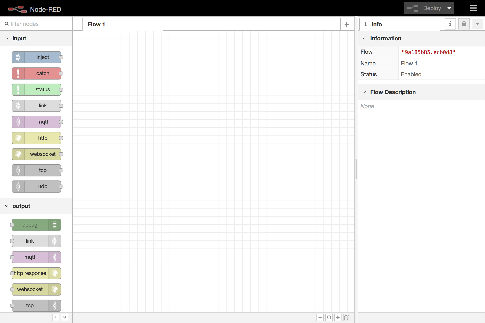
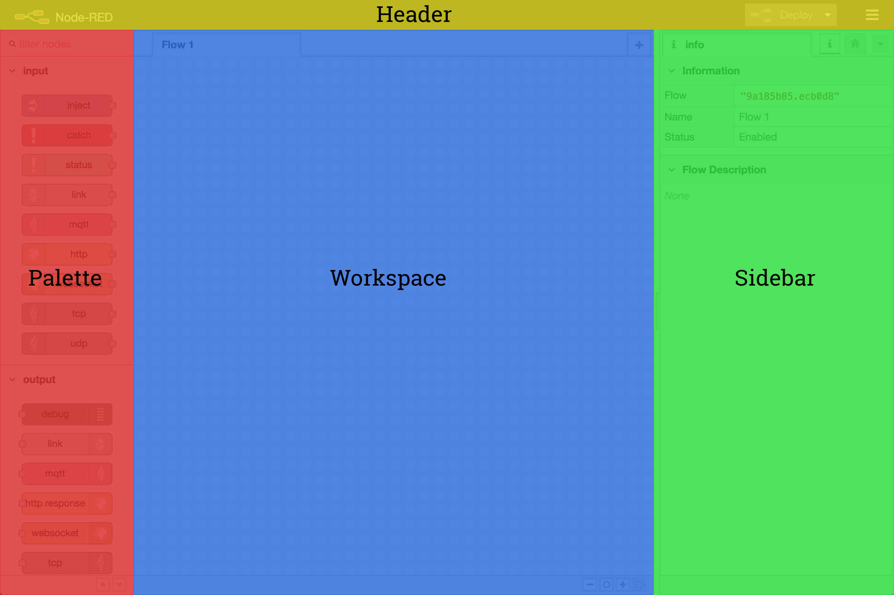

  
  
Editor window

  
  
Editor components

The editor window consists of four components:

 - The header at the top, containing the [deploy button](deploy-button),
   [user menu](user-menu) and [main menu](main-menu).
 - The [palette](palette) on the left, containing the nodes available to use.
 - The main [workspace](workspace) in the middle, where flows are created.
 - The [sidebar](sidebar) on the right.
