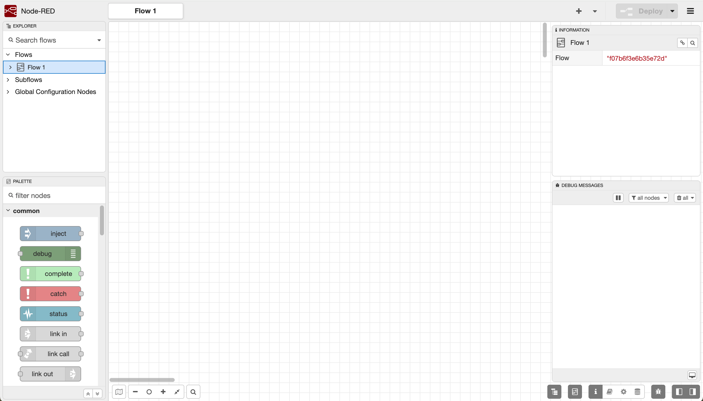

  

    
    
Editor window

  

Welcome to the Node-RED editor - the place where you'll build, wire together, and run your flows. If you're just getting started, this guide will help you find your way around.

Everything happens inside the editor window, which is organised into three main areas:

 - The header, running along the top, holds the deploy button and main menu - and the user menu too, if authentication is enabled.
 - The [workspace](workspace) in the middle is where the work happens: this is where you build your flows.
 - The [sidebars](sidebar) sit on either side of the workspace. They hold a set of panels - tools and information to support you as you work - and you can move any panel between the left and right sides to arrange the editor the way that suits you best.

One panel worth knowing from the start is the [palette](palette), which lists all the nodes you have available to drag onto your canvas. It's where most flows begin. By default it lives in the left sidebar, but like any panel you can move it to wherever feels right.

Follow the links above to dig into any of these in more detail. There's no need to read everything at once - feel free to explore the editor as you go.

### Node-RED Essentials on YouTube

We also have a series of videos to help get you started. They haven't been updated for Node-RED 5 yet, but they still cover everything you need for working with Node-RED.

<iframe width="560" height="315" src="https://www.youtube.com/embed/videoseries?list=PLyNBB9VCLmo1hyO-4fIZ08gqFcXBkHy-6" frameborder="0" allow="autoplay; encrypted-media" allowfullscreen></iframe>
