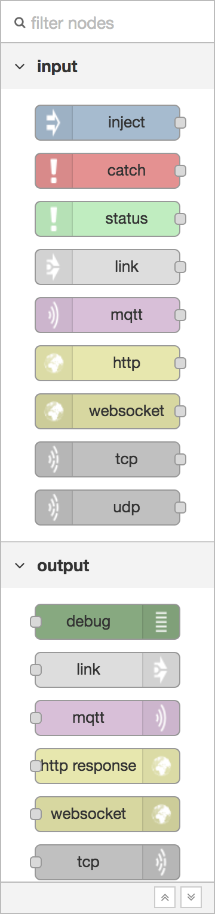

  
  
Palette

The palette contains all of the nodes that are installed and available to use.

They are organised into a number of categories, with inputs, outputs and functions
at the top. If there are any subflows, they appear in a category at the top of
the palette.

Categories can be expanded or collapsed by clicking its header.

The <i style="font-size: 0.8em; border-radius: 2px; display:inline-block;text-align:center; width: 20px; color: #777; border: 1px solid #777; padding: 3px;" class="fa fa-angle-double-up"></i> and
<i style="font-size: 0.8em; border-radius: 2px; display:inline-block;text-align:center; width: 20px; color: #777; border: 1px solid #777; padding: 3px;" class="fa fa-angle-double-down"></i>
buttons at the bottom of the palette can be used to collapse or expand all categories.

Above the palette is an input that can be used to filter the list of nodes.
