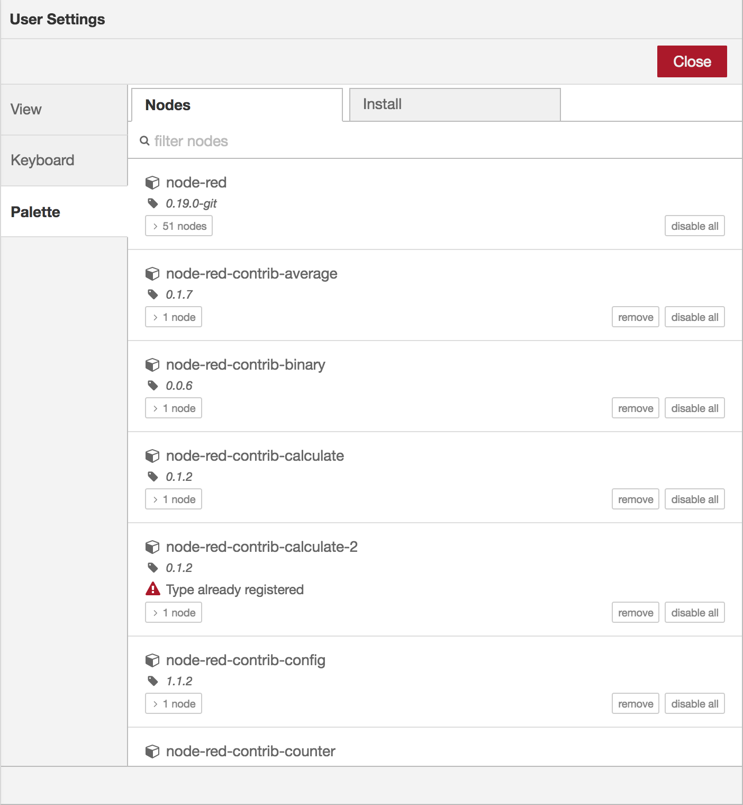
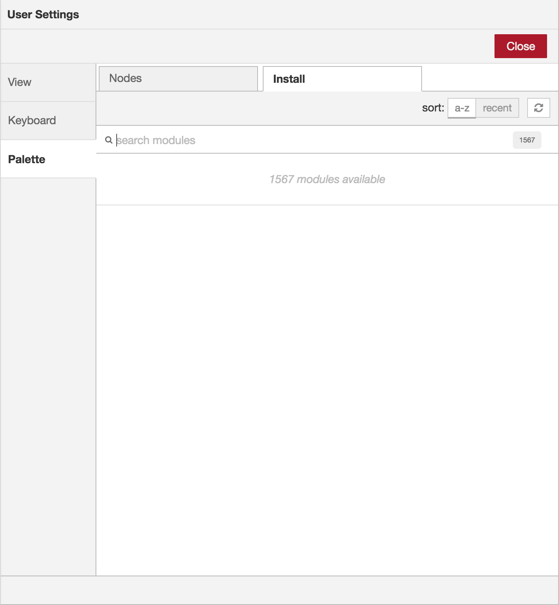
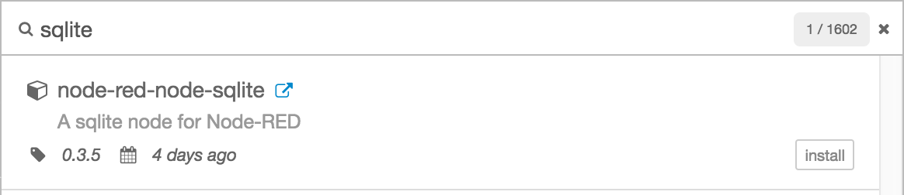

The Palette Manager can be used to install new nodes into the palette. It can be
accessed under the Palette tab of the User Settings dialog.

  
  
Palette Manager - Nodes tab

<table class="action-ref inline">
 <tr><th colspan="2">Reference</th></tr>
 <tr><td>Key shortcut</td><td><code>Ctrl/⌘-Shift-p</code></td></tr>
 <tr><td>Menu option</td><td><code>Manage palette</code></td></tr>
 <tr><td>Action</td><td><code>core:manage-palette</code></td></tr>
</table>

The Palette Manager has two tabs:

 - Nodes lists the modules that are currently installed in the runtime
 - Install lists the available modules that can be installed

### Managing nodes

Each entry in the Nodes list shows the name and version of the module along with
a list of the individual node types the module provides.

Options are provided to remove, disable or upgrade each module. If a node is currently
in use within the flow, it cannot be removed or disabled.

### Installing nodes

  
  
Palette Manager - Install tab

The Install tab can be used to search for available modules and install them.

To search for a module, enter its name in the search bar. The search results
show the details of the modules, including when it was last updated and a link
to its documentation. It can be installed by clicking the 'install' button.

  
  
Palette Manager - Install module details

