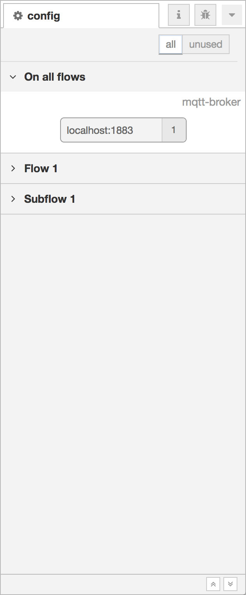

  
  
Configuration nodes Sidebar

The Configuration nodes sidebar provides a list of all config nodes, organised
by their scope.

Each node shows its type and label, along with a count of how many regular flow
nodes currently use that config node.

If the config node is unused, it is shown with a dotted outline. The view
can also be filtered to show just the unused nodes by selecting the 'unused' filter
in the header.

A config node's edit dialog can be opened by double clicking on the node.

<table class="action-ref inline">
 <tr><th colspan="2">Reference</th></tr>
 <tr><td>Action</td><td><code>core:show-config-tab</code></td></tr>
 <tr><td>Key shortcut</td><td><code>Ctrl/⌘-g c</code></td></tr>
</table>
