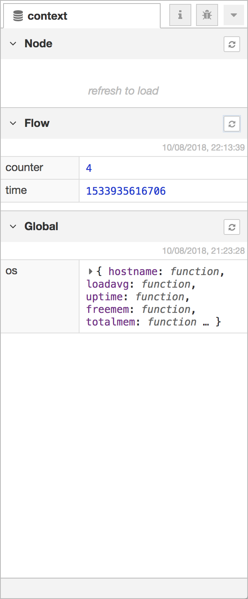

  
  
Context data Sidebar

The Context sidebar displays the contents of the context data store.

For more information about using context, read the [Working with context](/docs/user-guide/context) guide.

<table class="action-ref inline">
 <tr><th colspan="2">Reference</th></tr>
 <tr><td>Action</td><td><code>core:show-context-tab</code></td></tr>
 <tr><td>Key shortcut</td><td><code>Ctrl/⌘-g x</code></td></tr>
</table>

The panel is split into three sections, one for each context scope; node, flow and
global.

The refresh button, <i style="border-radius: 2px; display:inline-block;text-align:center; width: 30px; color: #777; border: 1px solid #777; padding: 6px;" class="fa fa-refresh"></i> must
be clicked to load the context contents.

The Node and Flow sections both have a checkbox next to their refresh button to turn
on automatic refreshing of the contents whenever the selected node or flow changes.

Hovering the mouse over any context property name will show a refresh button that
can be used to refresh just that one value.

Hovering over the value of a context property will show a button to copy its contents
to the system clipboard. The value will be converted to JSON, so not all values
can be copied.
