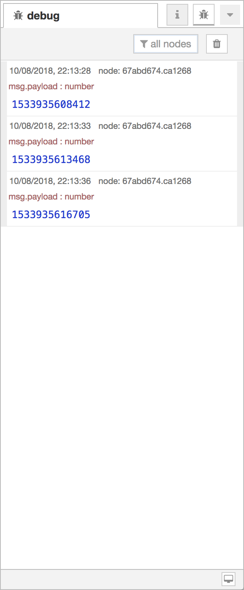
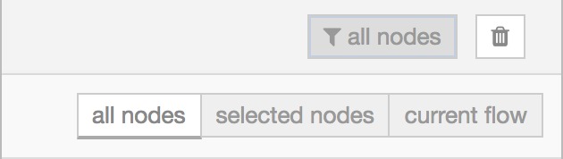

  
  
Debug messages Sidebar

The Debug sidebar displays messages passed to Debug nodes within the flow, as well
as certain log messages from the runtime.

For more information on how to use the Debug sidebar to understand the structure
of messages, read the [Working with messages](/docs/user-guide/messages) guide.

<table class="action-ref inline">
 <tr><th colspan="2">Reference</th></tr>
 <tr><td>Action</td><td><code>core:show-debug-tab</code></td></tr>
 <tr><td>Key shortcut</td><td><code>Ctrl/⌘-g d</code></td></tr>
</table>

By default, the Debug sidebar shows all messages passed to it. This can be filtered
by clicking the <i style="font-size: 0.8em; border-radius: 2px; display:inline-block;text-align:center; width: 20px; color: #777; border: 1px solid #777; padding: 3px;" class="fa fa-filter"></i> button to open the filter options panel.

  
  
Debug filter options

The panel provides three options:

 - *all nodes* - displays all messages
 - *selected nodes* - select particular Debug nodes from a list of all available nodes
 - *current flow* - only displays messages from nodes on the current flow in the workspace

**Note:** the Debug sidebar can only show the 100 most recent messages. If the sidebar
is currently showing a filtered list of messages, the hidden messages still count towards
the 100 limit. If a flow has noisy Debug nodes, rather than filter them from the sidebar
it can be better to disable them by clicking their button in the workspace.

The sidebar can be cleared at any time by clicking the <i style="font-size: 0.8em; border-radius: 2px; display:inline-block;text-align:center; width: 20px; color: #777; border: 1px solid #777; padding: 3px;" class="fa fa-trash"></i> button.

<table class="action-ref inline">
 <tr><th colspan="2">Reference</th></tr>
 <tr><td>Action</td><td><code>core:clear-debug-messages</code></td></tr>
 <tr><td>Key shortcut</td><td><code>Ctrl/⌘-Alt-l</code></td></tr>
</table>

The <i style="font-size: 0.8em; border-radius: 2px; display:inline-block;text-align:center; width: 20px; color: #777; border: 1px solid #777; padding: 3px;" class="fa fa-desktop"></i> button
in the sidebar footer can be used to open a separate browser window containing the Debug sidebar.

<table class="action-ref inline">
 <tr><th colspan="2">Reference</th></tr>
 <tr><td>Action</td><td><code>core:activate-selected-debug-nodes</code></td></tr>
</table>
<table class="action-ref inline">
 <tr><th colspan="2">Reference</th></tr>
 <tr><td>Action</td><td><code>core:activate-all-debug-nodes</code></td></tr>
</table>
<table class="action-ref inline">
 <tr><th colspan="2">Reference</th></tr>
 <tr><td>Action</td><td><code>core:activate-all-flow-debug-nodes</code></td></tr>
</table>
<table class="action-ref inline">
 <tr><th colspan="2">Reference</th></tr>
 <tr><td>Action</td><td><code>core:deactivate-selected-debug-nodes</code></td></tr>
</table>
<table class="action-ref inline">
 <tr><th colspan="2">Reference</th></tr>
 <tr><td>Action</td><td><code>core:deactivate-all-debug-nodes</code></td></tr>
</table>
<table class="action-ref inline">
 <tr><th colspan="2">Reference</th></tr>
 <tr><td>Action</td><td><code>core:deactivate-all-flow-debug-nodes</code></td></tr>
</table>