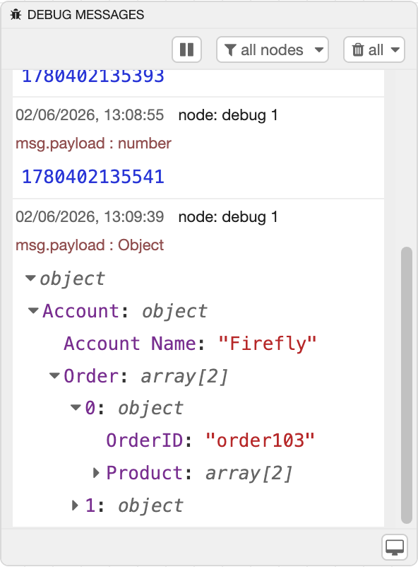
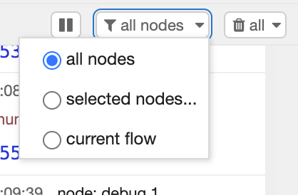
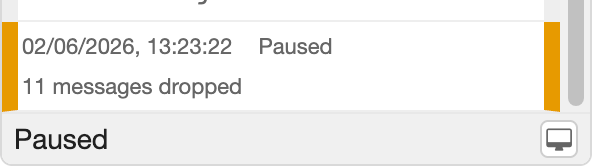

  
  
Debug messages Sidebar

The Debug sidebar displays messages passed to Debug nodes within the flow, as well
as certain log messages from the runtime.

For more information on how to use the Debug sidebar to understand the structure
of messages, read the [Working with messages](/docs/user-guide/messages) guide.

<table class="action-ref inline">
 <tr><th colspan="2">Reference</th></tr>
 <tr><td>Action</td><td><code>core:show-debug-tab</code></td></tr>
 <tr><td>Key shortcut</td><td><code>Ctrl/⌘-g d</code></td></tr>
</table>

### Filtering the messages

By default, the Debug sidebar shows all messages passed to it. This can be filtered
by clicking the <i style="font-size: 0.8em; border-radius: 4px; display:inline-block;text-align:center; width: 20px; color: #777; border: 1px solid #777; padding: 3px;" class="fa fa-filter"></i> button to open the filter options menu.

  
  
Debug filter options

The menu provides three options:

 - *all nodes* - displays all messages
 - *selected nodes* - select particular Debug nodes from a list of all available nodes
 - *current flow* - only displays messages from nodes on the current flow in the workspace

**Note:** the Debug sidebar can only show the 100 most recent messages. If the sidebar
is currently showing a filtered list of messages, the hidden messages still count towards
the 100 limit. If a flow has noisy Debug nodes, rather than filter them from the sidebar
it can be better to disable them by clicking their button in the workspace.

### Pausing messages

  
  
Debug paused

The <i style="font-size: 0.8em; border-radius: 4px; display:inline-block;text-align:center; width: 20px; color: #777; border: 1px solid #777; padding: 3px;" class="fa fa-pause"></i> button can be used to pause the debug output. Whilst paused, any new message will be dropped by the sidebar and the panel will report how many messages have been dropped.

<table class="action-ref inline">
 <tr><th colspan="2">Reference</th></tr>
 <tr><td>Action</td><td><code>core:toggle-debug-messages</code></td></tr>
</table>

### Clearing messages

The sidebar can be cleared at any time by clicking the <i style="font-size: 0.8em; border-radius: 4px; display:inline-block;text-align:center; width: 20px; color: #777; border: 1px solid #777; padding: 3px;" class="fa fa-trash"></i> button. The button also provides a menu to choose whether to clear all debug messages, or just those that are currently shown.

<table class="action-ref inline">
 <tr><th colspan="2">Reference</th></tr>
 <tr><td>Action</td><td><code>core:clear-debug-messages</code></td></tr>
 <tr><td>Key shortcut</td><td><code>Ctrl/⌘-Alt-l</code></td></tr>
</table>

### Opening a separate debug window

The <i style="font-size: 0.8em; border-radius: 4px; display:inline-block;text-align:center; width: 20px; color: #777; border: 1px solid #777; padding: 3px;" class="fa fa-desktop"></i> button
in the sidebar footer can be used to open a separate browser window containing the Debug sidebar.

### Additional actions

The debug sidebar registers the following actions that can be accessed from the [action menu](../workspace/actions) or have a [keyboard shortcut](../workspace/keyboard) assigned.

<table class="action-ref inline">
 <tr><th colspan="2">Reference</th></tr>
 <tr><td>Action</td><td><code>core:activate-selected-debug-nodes</code></td></tr>
</table>
<table class="action-ref inline">
 <tr><th colspan="2">Reference</th></tr>
 <tr><td>Action</td><td><code>core:activate-all-debug-nodes</code></td></tr>
</table>
<table class="action-ref inline">
 <tr><th colspan="2">Reference</th></tr>
 <tr><td>Action</td><td><code>core:activate-all-flow-debug-nodes</code></td></tr>
</table>
<table class="action-ref inline">
 <tr><th colspan="2">Reference</th></tr>
 <tr><td>Action</td><td><code>core:deactivate-selected-debug-nodes</code></td></tr>
</table>
<table class="action-ref inline">
 <tr><th colspan="2">Reference</th></tr>
 <tr><td>Action</td><td><code>core:deactivate-all-debug-nodes</code></td></tr>
</table>
<table class="action-ref inline">
 <tr><th colspan="2">Reference</th></tr>
 <tr><td>Action</td><td><code>core:deactivate-all-flow-debug-nodes</code></td></tr>
</table>