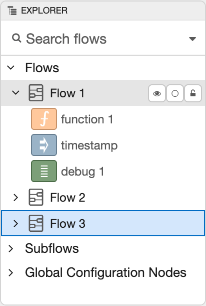
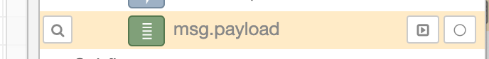

  
  
Explorer Sidebar

The Explorer sidebar shows an outline view of all flows and nodes, 

The outline view can be searched using the same syntax as the [main search dialog](../workspace/search).

Hovering over an entry in the outline reveals a set of options.

  
  
Outline entry options

The <i style="font-size: 0.8em; border-radius: 4px; display:inline-block;text-align:center; width: 20px; color: #777; border: 1px solid #777; padding: 3px;" class="fa fa-search"></i> button will reveal the node/flow in the main workspace.

If the node has a button, such as the Debug and Inject nodes, the <i style="font-size: 0.8em; border-radius: 4px; display:inline-block;text-align:center; width: 20px; color: #777; border: 1px solid #777; padding: 3px;" class="fa fa-toggle-right"></i> button can be used to trigger that button.

The <i style="font-size: 0.8em; border-radius: 4px; display:inline-block;text-align:center; width: 20px; color: #777; border: 1px solid #777; padding: 3px;" class="fa fa-circle-thin"></i> button can be used to enable or disable the node/flow.

<table class="action-ref inline">
 <tr><th colspan="2">Reference</th></tr>
 <tr><td>Action</td><td><code>core:show-explorer-tab</code></td></tr>
 <tr><td>Key shortcut</td><td><code>Ctrl/⌘-g e</code></td></tr>
</table>
