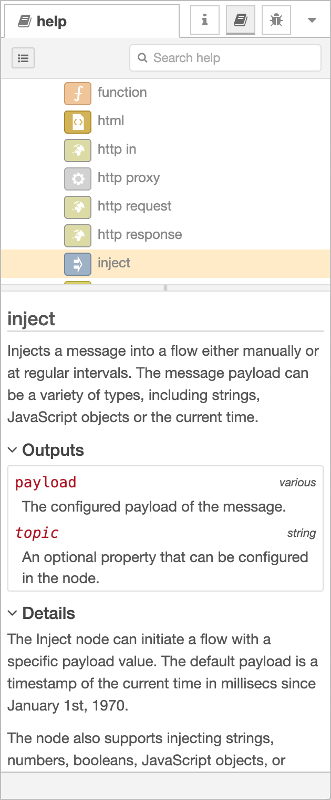

  
  
Help Sidebar

*Since Node-RED 1.1.0*

In previous versions of Node-RED, the help text for the currently selected node
was displayed in the Information sidebar.

Introduced in Node-RED 1.1.0, the Help sidebar provides access to the help content
for all nodes in the editor - not just the current selection.

The top section provides a full table of contents, that can be toggled using the
<i style="font-size: 0.8em; border-radius: 2px; display:inline-block;text-align:center; width: 20px; color: #777; border: 1px solid #777; padding: 3px;" class="fa fa-list-ul"></i> button.

<table class="action-ref inline">
 <tr><th colspan="2">Reference</th></tr>
 <tr><td>Action</td><td><code>core:show-help-tab</code></td></tr>
 <tr><td>Key shortcut</td><td><code>Ctrl/⌘-g h</code></td></tr>
</table>
