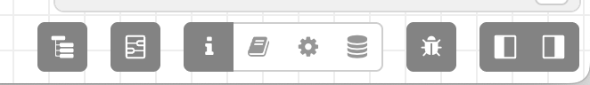
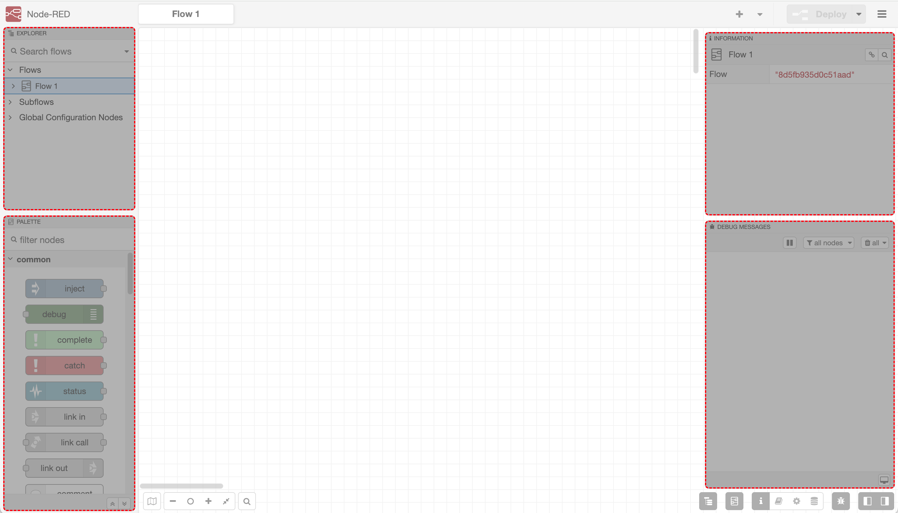

The sidebars contain panels that provide a number of useful tools within the editor. The sidebar panels can be
arranged on both sides of the workspace.

 - [Explorer](explorer) - navigate the flows
 - [Information](info) - view information about nodes and their help
 - [Debug](debug) - view messages passed to Debug nodes
 - [Help](help) - view Node help
 - [Configuration Nodes](config) - manage configuration nodes
 - [Context data](context) - view the contents of context

Some nodes and plugins can contribute their own sidebar panels, such as the [Node-RED Debugger](https://flows.nodered.org/node/node-red-debugger).

The sidebar panels can be accessed by the sidebar toolbar. The panel buttons are grouped according to which sidebar section the panel is in.

  
  
Editor Sidebar Toolbar

### Arranging sidebar panels

  
  
Editor Sidebar Panels

Each sidebar can be split to show two panels at the same time.

The panels can be arranged by dragging the panel by its header to the required sidebar section. If a section contains multiple panels, only one will be shown. The others can be shown by clicking its button in the sidebar toolbar.

The sidebar can be resized by dragging its edge across the workspace.

If the edge is dragged close to the window edge, the sidebar will be hidden.

It can be shown again by selecting the corresponding 'Show sidebar' option in the View menu, or using the toggle button in the sidebar toolbar.

<table class="action-ref inline">
 <tr><th colspan="2">Reference</th></tr>
 <tr><td>Key shortcut</td><td><code>Ctrl/⌘-Alt-Space</code></td></tr>
 <tr><td>Menu option</td><td><code>View -&gt; Show left sidebar</code></td></tr>
 <tr><td>Action</td><td><code>core:toggle-left-sidebar</code></td></tr>
</table>

<table class="action-ref inline">
 <tr><th colspan="2">Reference</th></tr>
 <tr><td>Key shortcut</td><td><code>Ctrl/⌘-Space</code></td></tr>
 <tr><td>Menu option</td><td><code>View -&gt; Show right sidebar</code></td></tr>
 <tr><td>Action</td><td><code>core:toggle-right-sidebar</code></td></tr>
</table>
