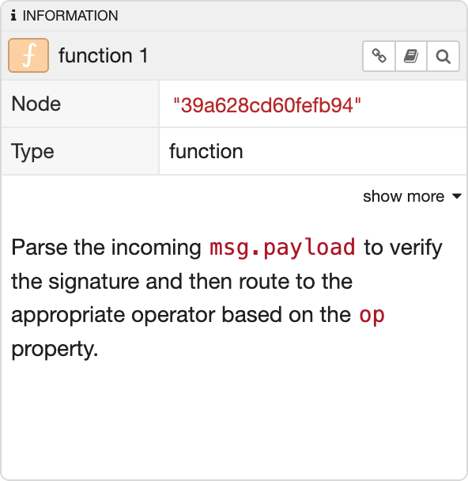

  
  
Information Sidebar

The Information sidebar shows information about the current selection.

This includes:

 - a summary of its properties - the 'show more' link expands the table to show all of the properties
 - the [user-provided description of node/flow](../workspace/nodes#editing-node-properties)

 The toolbar in the header provides the following options:
  - <i style="font-size: 0.8em; border-radius: 4px; display:inline-block;text-align:center; width: 20px; color: #777; border: 1px solid #777; padding: 3px;" class="fa fa-link"></i> Copy the url for the node to the clipboard
 - <i style="font-size: 0.8em; border-radius: 4px; display:inline-block;text-align:center; width: 20px; color: #777; border: 1px solid #777; padding: 3px;" class="fa fa-book"></i> Open the [node's help](./help)
 - <i style="font-size: 0.8em; border-radius: 4px; display:inline-block;text-align:center; width: 20px; color: #777; border: 1px solid #777; padding: 3px;" class="fa fa-search"></i> Reveal the node/flow in the main workspace and highlight it in the [explorer sidebar](./explorer)

If nothing is selected, it displays the description of the current flow - which
can be edited in the [Flow Properties edit dialog](../workspace/flows#editing-flow-properties).

<table class="action-ref inline">
 <tr><th colspan="2">Reference</th></tr>
 <tr><td>Action</td><td><code>core:show-info-tab</code></td></tr>
 <tr><td>Key shortcut</td><td><code>Ctrl/⌘-g i</code></td></tr>
</table>
