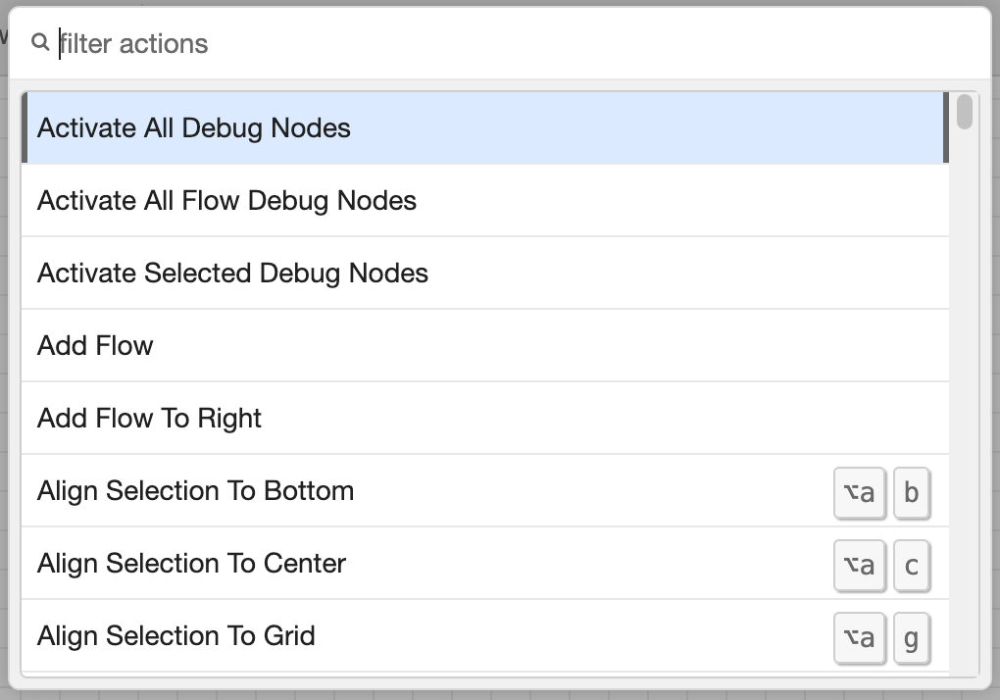

  
  
Actions list

Many of the tasks that can completed in the editor are exposed as Actions that can be assigned to keyboard shortcuts.

A full list of available actions can be found by opening the Action list. This is done via the `View -> Action list` menu
item, or the default `Ctrl/⌘-Shift-p` shortcut.

Throughout this user-guide, relevant actions are highlighted, along with any default keyboard shortcut that is preassigned.

<table class="action-ref inline">
 <tr><th colspan="2">Reference</th></tr>
 <tr><td>Key shortcut</td><td><code>Ctrl/⌘-Shift-p</code></td></tr>
 <tr><td>Menu option</td><td><code>View -&gt; Action list</code></td></tr>
 <tr><td>Action</td><td><code>core:show-action-list</code></td></tr>
</table>

