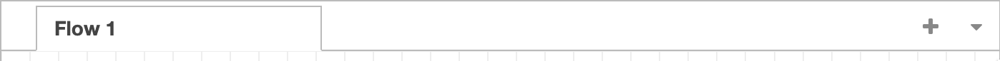
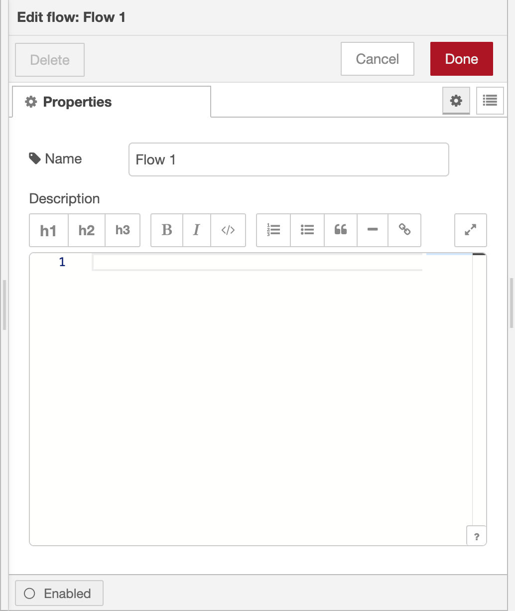
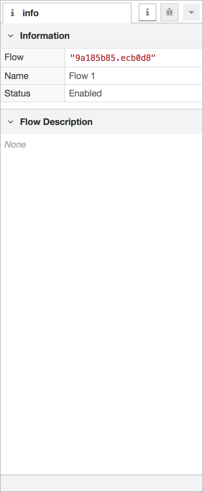
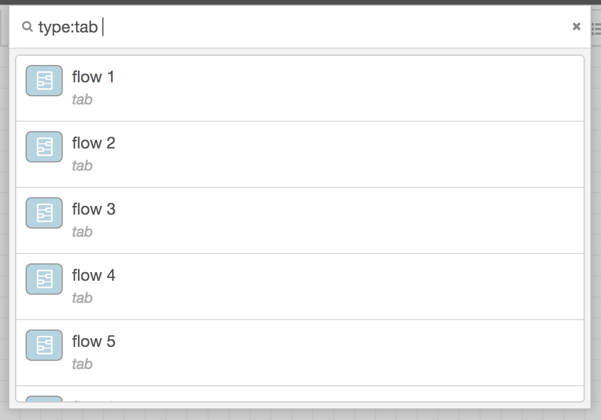

A flow is represented as a tab within the editor workspace and is the main way
to organise nodes.

  
  
Flow tabs

<em>Note</em> : The term "flow" is also used to informally describe a single set
of connected nodes. So a flow (tab) can contain multiple flows (sets of connected nodes).

Each flow can have a name, and description that is displayed in the [Information sidebar](../sidebar/info).

All of the nodes in a flow can access the same [flow-scoped context](/docs/user-guide/context).

#### Adding a flow

To add a new flow, either click the <i style="border-radius: 2px; display:inline-block;text-align:center; width: 30px; color: #777; border: 1px solid #777; padding: 6px;" class="fa fa-plus"></i> button
in the top bar, or double-click on free space in the tab bar.

<table class="action-ref inline">
 <tr><th colspan="2">Reference</th></tr>
 <tr><td>Key shortcut</td><td><i>none</i></td></tr>
 <tr><td>Menu option</td><td><code>Flows -&gt; Add</code></td></tr>
 <tr><td>Action</td><td><code>core:add-flow</code></td></tr>
</table>

#### Reordering flows

Flows can be reordered in the workspace by dragging their tabs around in the tab bar.

#### Editing flow properties

  
  
Flow properties editor

  
  
Information Sidebar

To edit a flow's properties, double-click on its tab in the top bar. This will
open the Flow Properties dialog.

<table class="action-ref inline">
 <tr><th colspan="2">Reference</th></tr>
 <tr><td>Key shortcut</td><td><i>none</i></td></tr>
 <tr><td>Menu option</td><td><code>Flows -&gt; Rename</code></td></tr>
 <tr><td>Action</td><td><code>core:edit-flow</code></td></tr>
</table>

Within the dialog, the flow's name and description can be set. The description
can use Markdown syntax for formatting and will appear in the [Information sidebar](../sidebar/info).

#### Enabling or disabling a flow

The flow can be enabled or disabled using the toggle button at the bottom of the
dialog. If a flow is disabled, none of the nodes it contains will be created when
the flow is deployed.

*Since Node-RED 1.1.0*
The <i style="font-size: 0.8em; border-radius: 2px; display:inline-block;text-align:center; width: 20px; color: #777; border: 1px solid #777; padding: 3px;" class="fa fa-circle-thin"></i> button in the [Information sidebar](../sidebar/info) can also be used to enable or disable the node/flow.

<table class="action-ref inline">
 <tr><th colspan="2">Reference</th></tr>
 <tr><td>Key shortcut</td><td><i>none</i></td></tr>
 <tr><td>Menu option</td><td><i>none</i></td></tr>
 <tr><td>Action</td><td><code>core:enable-flow</code></td></tr>
</table>

<table class="action-ref inline">
 <tr><th colspan="2">Reference</th></tr>
 <tr><td>Key shortcut</td><td><i>none</i></td></tr>
 <tr><td>Menu option</td><td><i>none</i></td></tr>
 <tr><td>Action</td><td><code>core:disable-flow</code></td></tr>
</table>

 

#### Deleting a flow

To delete a flow, click the 'Delete' button in the Flow Properties dialog.

<table class="action-ref inline">
 <tr><th colspan="2">Reference</th></tr>
 <tr><td>Key shortcut</td><td><i>none</i></td></tr>
 <tr><td>Menu option</td><td><code>Flows -&gt; Delete</code></td></tr>
 <tr><td>Action</td><td><code>core:remove-flow</code></td></tr>
</table>

  
  
Search flows

#### Switching between flows

To open a list of the available flows, click the <i style="border-radius: 2px; display:inline-block;text-align:center; width: 30px; color: #777; border: 1px solid #777; padding: 6px;" class="fa fa-list-ul"></i> button
in the top bar.

<table class="action-ref inline">
 <tr><th colspan="2">Reference</th></tr>
 <tr><td>Key shortcut</td><td><code>Ctrl/⌘-Shift-f</code></td></tr>
 <tr><td>Menu option</td><td><i>none</i></td></tr>
 <tr><td>Action</td><td><code>core:list-flows</code></td></tr>
</table>

<table class="action-ref inline">
 <tr><th colspan="2">Reference</th></tr>
 <tr><td>Key shortcut</td><td><code>Ctrl/⌘-Shift-j</code></td></tr>
 <tr><td>Menu option</td><td><i>none</i></td></tr>
 <tr><td>Action</td><td><code>core:show-previous-tab</code></td></tr>
</table>

<table class="action-ref inline">
 <tr><th colspan="2">Reference</th></tr>
 <tr><td>Key shortcut</td><td><code>Ctrl/⌘-Shift-k</code></td></tr>
 <tr><td>Menu option</td><td><i>none</i></td></tr>
 <tr><td>Action</td><td><code>core:show-next-tab</code></td></tr>
</table>
