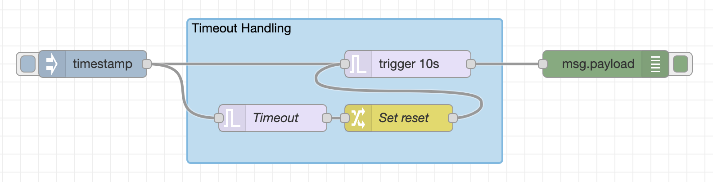
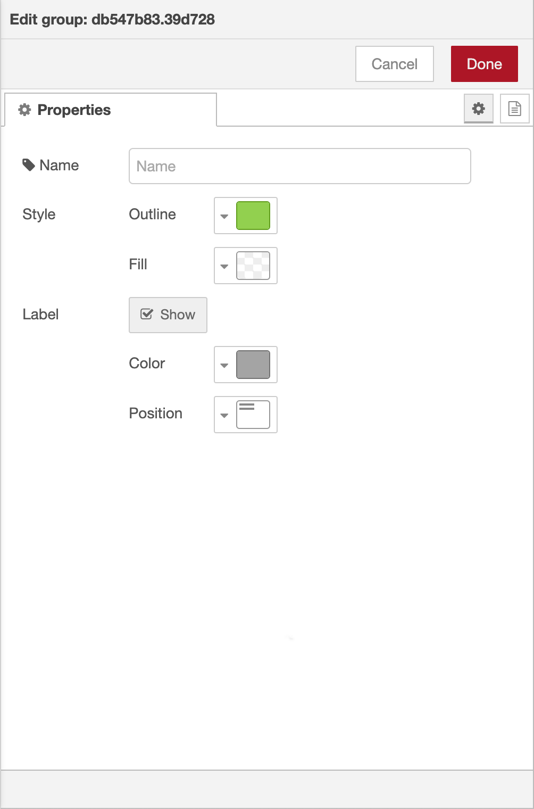
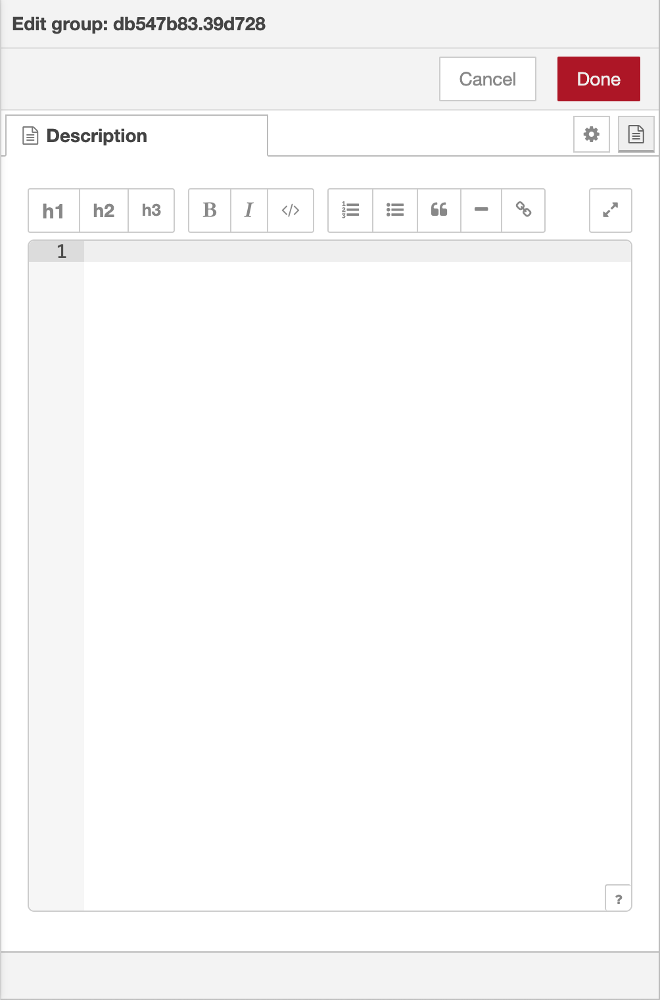

*Since Node-RED 1.1.0*

Nodes can be joined together to form a group. They can then be moved or copied
as a single object within the editor.

Groups can be given a border and background colour, as well as an optional label.

  
  
Groups

### Creating a group

To create a group, select the nodes and then select the 'Groups -> Group selection'
option in the menu.

<table class="action-ref inline">
 <tr><th colspan="2">Reference</th></tr>
 <tr><td>Key shortcut</td><td><code>Ctrl/⌘-Shift-g</code></td></tr>
 <tr><td>Menu option</td><td><code>Groups -&gt; Group selection</code></td></tr>
 <tr><td>Action</td><td><code>core:group-selection</code></td></tr>
</table>

### Editing group properties

A groups's properties can be edited by double clicking on the group, or pressing
`Enter` when the workspace has focus and the group is selected.

The edit dialog contains two tabs:

<ul>
    <li style="margin-bottom: 10px"><i style="border-radius: 2px; display:inline-block;text-align:center; width: 30px; color: #777; border: 1px solid #777; padding: 6px;" class="fa fa-cog"></i> : Properties - the groups properties to edit.</li>
    <li style="margin-bottom: 10px"><i style="border-radius: 2px; display:inline-block;text-align:center; width: 30px; color: #777; border: 1px solid #777; padding: 6px;" class="fa fa-file-text"></i> : Description - per-node documentation formatted using Markdown. This is displayed in the <a href="../sidebar/info">Information sidebar</a> when the group is selected.</li>
</ul>

  
  
  
Group edit dialog - properties and description tabs

The Group properties tab provides options to:

 - set the outline and fill colours of the group
 - select whether the name of the group should be shown as a label, and if so,
   what colour text to use and where the label should be placed.

### Reusing a group's style

<table class="action-ref inline">
 <tr><th colspan="2">Reference</th></tr>
 <tr><td>Key shortcut</td><td><code>Ctrl/⌘-Shift-c</code></td></tr>
 <tr><td>Action</td><td><code>core:copy-group-style</code></td></tr>
</table>

<table class="action-ref inline">
 <tr><th colspan="2">Reference</th></tr>
 <tr><td>Key shortcut</td><td><code>Ctrl/⌘-Shift-v</code></td></tr>
 <tr><td>Action</td><td><code>core:paste-group-style</code></td></tr>
</table>

To copy an existing group's style (outline, fill, color and label position), select
the group, then press `Ctrl/⌘-Shift-c`.

To apply that style to another group, select the group and press `Ctrl/⌘-Shift-v`.

### Adding nodes to a group

Nodes can be added to an existing group by dragging them into the group. This only
works for adding one node at a time.

### Merging nodes/groups

It is possible to merge the current selection to form a single group. Select all of the groups
and nodes to merge into a single group. Then select the 'Groups -> Merge selection'
option in the menu.

<table class="action-ref inline">
 <tr><th colspan="2">Reference</th></tr>
 <tr><td>Key shortcut</td><td><i>none</i></td></tr>
 <tr><td>Menu option</td><td><code>Groups -&gt; Merge selection</code></td></tr>
 <tr><td>Action</td><td><code>core:merge-selection-to-group</code></td></tr>
</table>

### Ungrouping

To ungroup nodes, select the group and then select the 'Groups -> Ungroup selection'
option in the menu.

<table class="action-ref inline">
 <tr><th colspan="2">Reference</th></tr>
 <tr><td>Key shortcut</td><td><code>Ctrl/⌘-Shift-u</code></td></tr>
 <tr><td>Menu option</td><td><code>Groups -&gt; Ungroup selection</code></td></tr>
 <tr><td>Action</td><td><code>core:ungroup-selection</code></td></tr>
</table>

### Removing from a group

To remove a node from a group, select the node then select the 'Groups -> Remove from group'
option in the menu.

<table class="action-ref inline">
 <tr><th colspan="2">Reference</th></tr>
 <tr><td>Key shortcut</td><td><i>none</i></td></tr>
 <tr><td>Menu option</td><td><code>Groups -&gt; Remove from group</code></td></tr>
 <tr><td>Action</td><td><code>core:remove-selection-from-group</code></td></tr>
</table>

