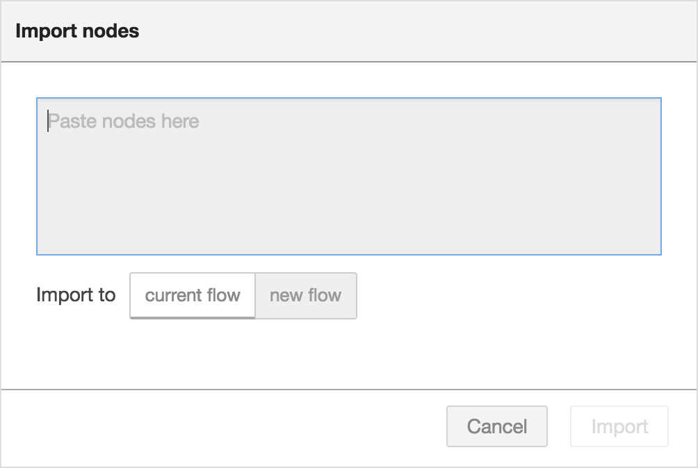
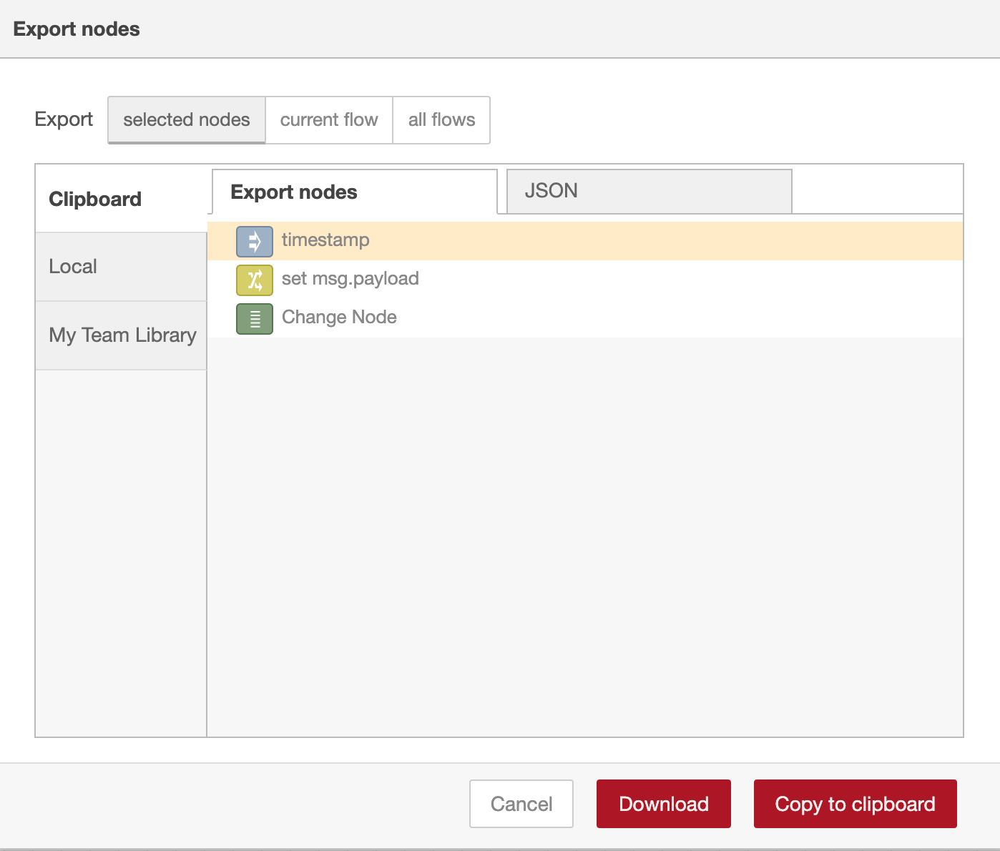

Flows can be imported and exported from the editor using their JSON format, making
it very easy to share flows with others.

### Importing flows

  
  
Import Flows dialog

To import a flow, open the Import dialog, paste in the flow json and click 'Import'.

The 'Import' button will only be active if valid JSON is pasted into the dialog.

The dialog also offers the option to import the nodes into the current flow, or
to create a new flow for them.

<table class="action-ref inline">
 <tr><th colspan="2">Reference</th></tr>
 <tr><td>Key shortcut</td><td><code>Ctrl/⌘-i</code></td></tr>
 <tr><td>Menu option</td><td><code>Import -&gt; Clipboard</code></td></tr>
 <tr><td>Action</td><td><code>core:show-import-dialog</code></td></tr>
</table>

 

### Exporting flows

  
  
Export Flows dialog

The Export dialog can be used to copy flow json out of the editor.

It can export either the selected nodes, the current flow (including its tab node)
or the complete flow configuration.

It offers the option to export compact or formatted JSON. The compact option generates
a single line of JSON with no whitespace. The formatted JSON option is formatted
over multiple lines with full indentation - which can be easier to read.

<table class="action-ref inline">
 <tr><th colspan="2">Reference</th></tr>
 <tr><td>Key shortcut</td><td><code>Ctrl/⌘-e</code></td></tr>
 <tr><td>Menu option</td><td><code>Export -&gt; Clipboard</code></td></tr>
 <tr><td>Action</td><td><code>core:show-export-dialog</code></td></tr>
</table>
