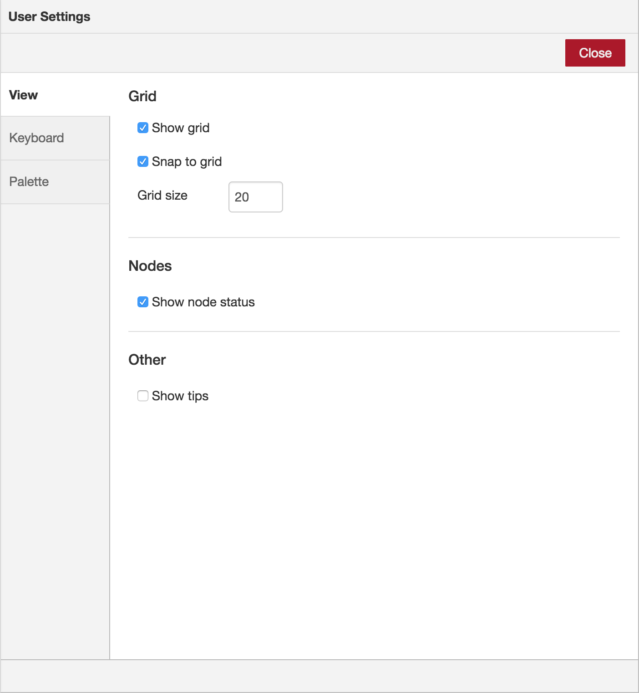

  
  
Editor window

The main workspace is where flows are developed by dragging nodes from the palette
and wiring them together.

The workspace has a row of tabs along the top; one for each flow and any subflows
that have been opened.

 

### View tools

 <table class="action-ref">
  <tr><th colspan="2">Reference</th></tr>
  <tr><td>Action</td><td><code>core:zoom-in</code></td></tr>
  <tr><td>Key shortcut</td><td><code>Ctrl/⌘-=</code></td></tr>
 </table>
 <table class="action-ref">
  <tr><th colspan="2">Reference</th></tr>
  <tr><td>Action</td><td><code>core:zoom-reset</code></td></tr>
  <tr><td>Key shortcut</td><td><code>Ctrl/⌘-0</code></td></tr>
 </table>
 <table class="action-ref">
  <tr><th colspan="2">Reference</th></tr>
  <tr><td>Action</td><td><code>core:zoom-out</code></td></tr>
  <tr><td>Key shortcut</td><td><code>Ctrl/⌘--</code></td></tr>
 </table>

The footer of the workspace contains buttons to zoom in and out as well as to
reset to the default zoom level.

It also contains a toggle button for the view navigator.

 

   
   
Workspace footer with view navigator active

 

 

<table class="action-ref">
 <tr><th colspan="2">Reference</th></tr>
 <tr><td>Action</td><td><code>core:toggle-navigator</code></td></tr>
 <tr><td>Key shortcut</td><td><i>none</i></td></tr>
</table>

The view navigator provides a scaled down view of the entire workspace, highlighting
the area currently visible. That area can be dragged around the navigator to quickly
jump to other parts of the workspace. It is also useful for finding nodes that have
been 'lost' to the further edges of the workspace.

### Customising the view

<table class="action-ref">
 <tr><th colspan="2">Reference</th></tr>
 <tr><td>Action</td><td><code>core:show-user-settings</code></td></tr>
 <tr><td>Key shortcut</td><td><code>Ctrl/⌘-,</code></td></tr>
</table>

The workspace view can be customised via the 'View' tab of the User Settings
dialog.

 

  
  
User Settings View tab

