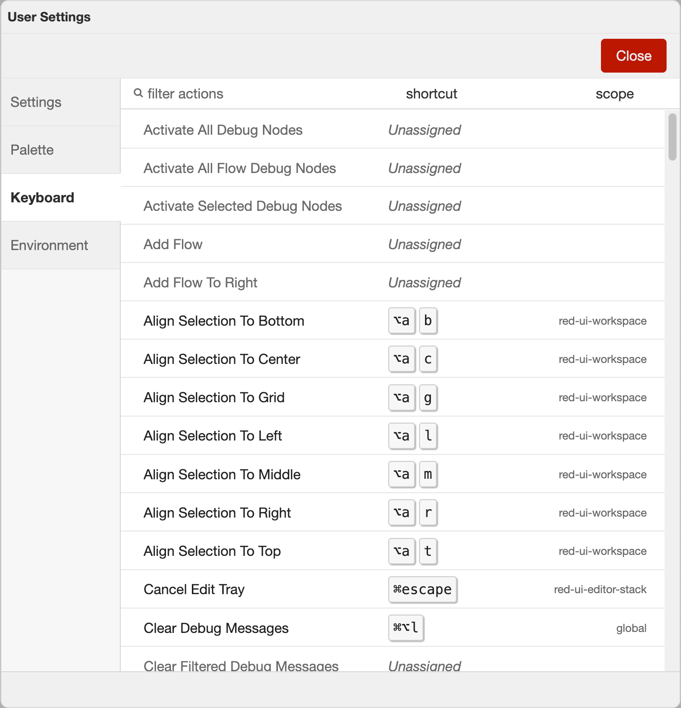
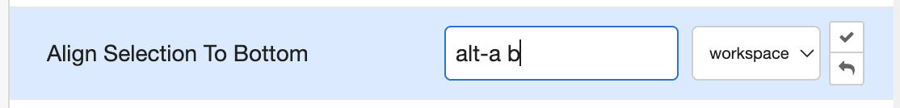

  
  
Keyboard settings

All of the [actions](./actions) in the editor can be assigned to keyboard shortcuts. Not all of the core actions have preassigned
shortcuts.

The shortcuts can be customised in the Keyboard settings via the `View -> Keyboard shortcuts` menu.

This lists all of the available actions and what shortcuts are currently assigned to them.

 

To customise any shortcut, click on the row, enter the desired shortcut, select the scope of the shortcut then click on the tick to save the change.
The reverse arrow can be used to revert the shortcut back to the default value.

  
  
Editing a shortcut

The scope of the shortcut determines what part of the editor should have focus for the shortcut to apply. There are three scope options:
 - `global` - the whole editor UI
 - `workspace` - the inner workspace area
 - `edit dialog` - any edit dialog

<table class="action-ref inline">
 <tr><th colspan="2">Reference</th></tr>
 <tr><td>Key shortcut</td><td><code>Shift-?</code></td></tr>
 <tr><td>Menu option</td><td><code>View -&gt; Keyboard shortcuts</code></td></tr>
 <tr><td>Action</td><td><code>core:show-keyboard-settings</code></td></tr>
</table>

