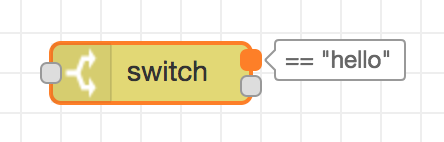
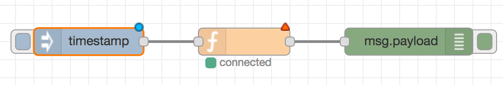
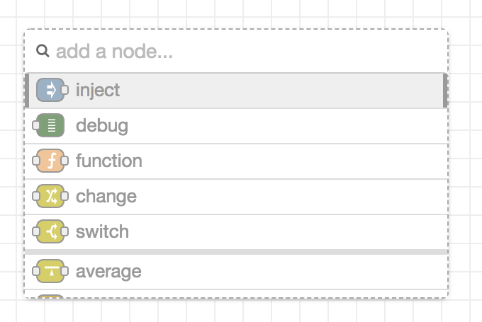
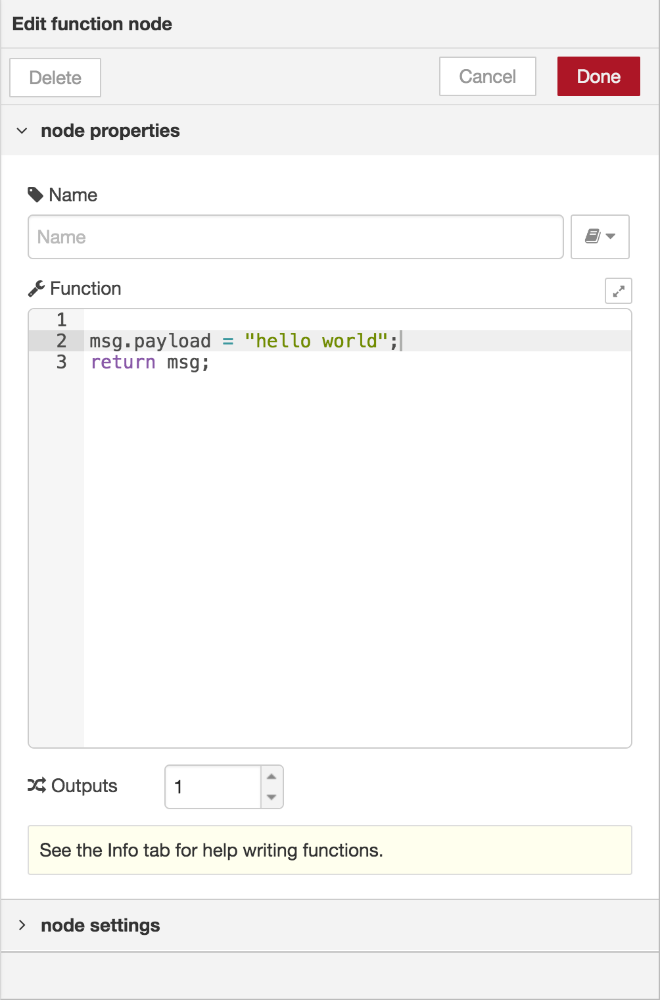
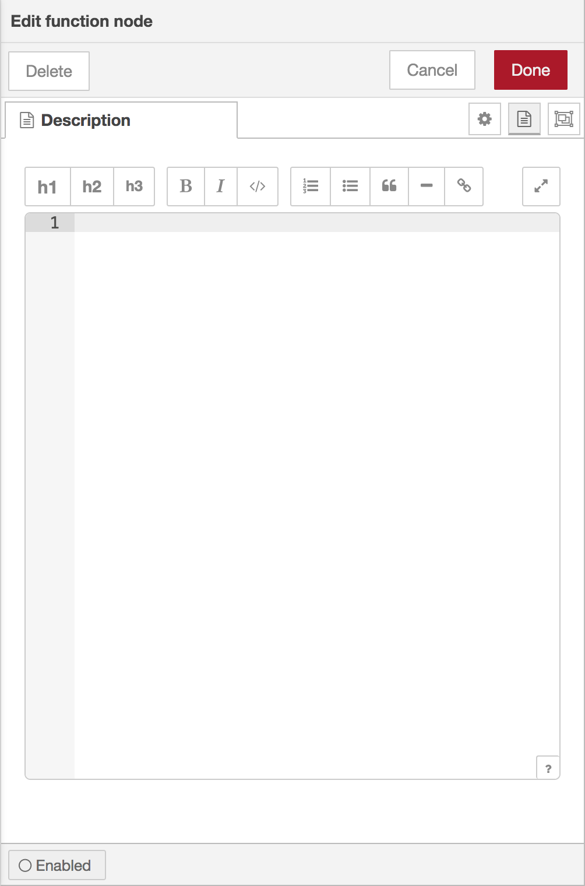
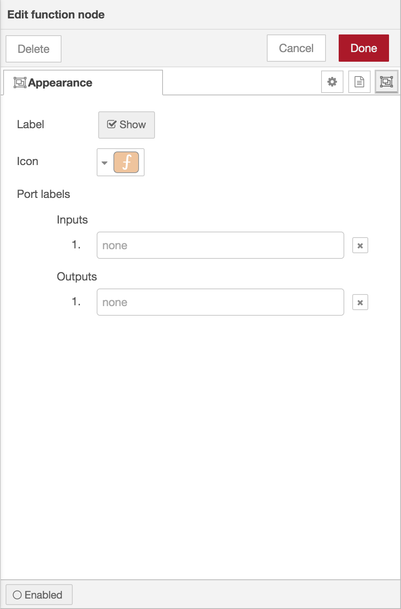
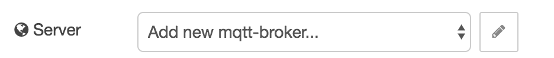
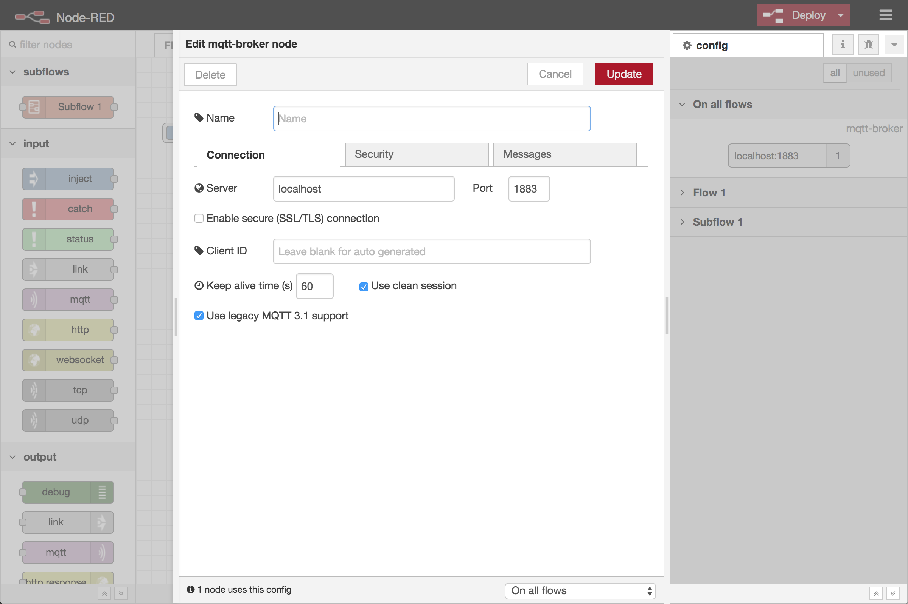

Nodes can be added to the workspace by either:

 - dragging them from the [palette](../palette),
 - using the [quick-add dialog](#quick-add-dialog),
 - or importing from the library or clipboard.

 

   
   
Node port labels

 

Nodes are joined together by wires via their ports. A node can have at most one
input port and many output ports. A port may have a label that is displayed
when the mouse hovers over it. A node may specify labels, for example, the Switch
node shows the rule that matches the port. The labels can also be customised
in the node edit dialog.

Some nodes display a status message and icon below the node. This is used to indicate
the runtime state of the node - for example, the MQTT nodes indicate if they are
currently connected or not.

  
  
Node elements

If a node has any undeployed changes, it displays a blue circle above it. If there
are errors with its configuration, it displays a red triangle.

Some nodes include a button on either its left or right edge. These allow some
interaction with the node from within the editor. The Inject and Debug nodes
are the only core nodes that have buttons.

#### Quick-Add dialog

The Quick-Add dialog provides an easy way to add a node to the workspace wherever
the mouse is, without having to drag it over from the palette.

  
  
Quick-Add dialog

The dialog is opened by holding the `Ctrl` or `Command` key when clicking on the
workspace.

The dialog contains a complete list of all nodes available to add. It shows the
five main core nodes at the top of the list, followed by any recently added nodes
and finally a complete, alphabetical, list of the remaining nodes.

As with the main palette, the dialog has an input at the top to filter the list
and quickly find a node.

If `Ctrl` or `Command` is kept held down when clicking on a node in the list,
the node will be added and the Quick-Add dialog kept open to add the next node
in the flow.

If a wire is clicked on when triggering the dialog, the added node will be spliced
into the wire.

#### Editing node properties

A node's configuration can be edited by double clicking on the node, or pressing
`Enter` when the workspace has focus. If multiple nodes are selected, the *first*
node in the selection will be edited.

The edit dialog contains three tabs:

<ul>
    <li style="margin-bottom: 10px"><i style="border-radius: 2px; display:inline-block;text-align:center; width: 30px; color: #777; border: 1px solid #777; padding: 6px;" class="fa fa-cog"></i> : Properties - the edit form specific to the node type being edited.</li>
    <li style="margin-bottom: 10px"><i style="border-radius: 2px; display:inline-block;text-align:center; width: 30px; color: #777; border: 1px solid #777; padding: 6px;" class="fa fa-file-text"></i> : Description - per-node documentation formatted using Markdown. This is displayed in the <a href="../sidebar/info">Information sidebar</a> when the node is selected.</li>
    <li style="margin-bottom: 10px"><i style="border-radius: 2px; display:inline-block;text-align:center; width: 30px; color: #777; border: 1px solid #777; padding: 6px;" class="fa fa-object-group"></i> : Appearance - options to customise the appearance of the node.</li>
</ul>

  
  
  
  
Node edit dialog - properties, description and appearance tabs

<table class="action-ref inline">
 <tr><th colspan="2">Reference</th></tr>
 <tr><td>Action</td><td><code>core:show-selected-node-labels</code></td></tr>
</table>

<table class="action-ref inline">
 <tr><th colspan="2">Reference</th></tr>
 <tr><td>Action</td><td><code>core:hide-selected-node-labels</code></td></tr>
</table>

The Appearance tab provides options to:

 - select whether the node's label is shown
 - change the icon of the node
 - provide custom port labels.

#### Enabling or disabling a node

<table class="action-ref inline">
 <tr><th colspan="2">Reference</th></tr>
 <tr><td>Action</td><td><code>core:enable-selected-nodes</code></td></tr>
</table>

<table class="action-ref inline">
 <tr><th colspan="2">Reference</th></tr>
 <tr><td>Action</td><td><code>core:disable-selected-nodes</code></td></tr>
</table>

An node can be enabled or disabled using the toggle button at the bottom of the
dialog. If a node is disabled it will not be created when the flow is deployed. If
a disabled node sits in the middle of a flow, no messages will pass through it.

#### Configuration nodes

A Configuration (config) Node is a special type of node that holds reusable configuration
that can be shared by regular nodes in a flow.

For example, the MQTT In and Out nodes use an MQTT Broker config node to
represent a shared connection to an MQTT broker.

Configuration nodes are added through the edit dialog of a node that requires
the config node. It will have a field to select from the available config nodes
of the required type or to add a new instance.

  
  
Adding a configuration node

Clicking the button next to the select box will open the edit dialog for the
selected node, or add a new instance.

  
  
Configuration node edit dialog

The config node edit dialog only has the node properties and description tabs -
as a config node has no icon or ports to set labels on.

In the footer of the dialog is an indication of how many nodes use this config node.
It also provides a select box to set the scope of the config node. The scope
determines which flows the config node is available on. By default it is available
on all flows, but the select box can be used to make it local to just one flow.

As with normal nodes, it can also be enabled or disabled using the toggle button
in the footer.

The [Configuration Nodes Sidebar](/docs/user-guide/editor/sidebar/config) can be used to manage all config nodes.
