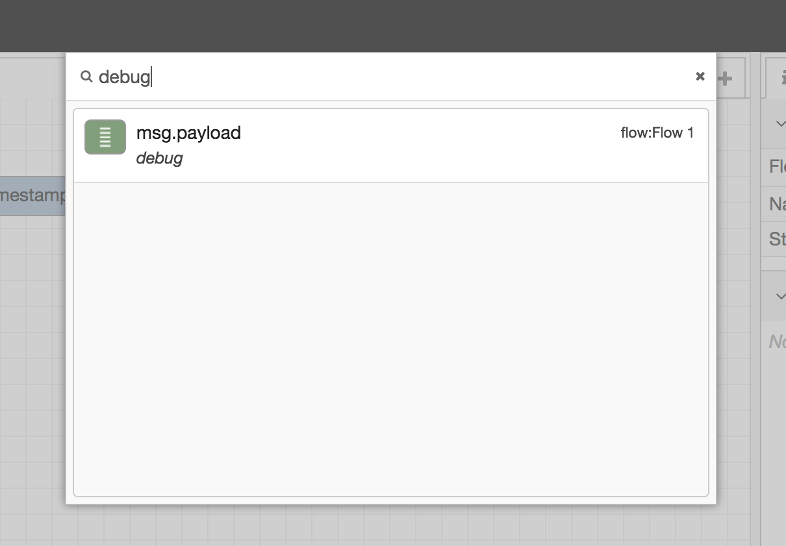

  
  
Search dialog

The Search dialog can be used to find nodes within the workspace, including
configuration nodes.

It indexes all properties of the nodes, so it can be used to search for a node
by its id, type, name or any other property.

Selecting a node in the result list will reveal that node within the editor.

<table class="action-ref inline">
 <tr><th colspan="2">Reference</th></tr>
 <tr><td>Key shortcut</td><td><code>Ctrl/⌘-f</code></td></tr>
 <tr><td>Menu option</td><td><code>Search flows</code></td></tr>
 <tr><td>Action</td><td><code>core:search</code></td></tr>
</table>

Clicking the <i style="border-radius: 2px; display:inline-block;text-align:center; width: 30px; color: #777; border: 1px solid #777; padding: 6px;" class="fa fa-caret-right"></i>
button will copy the current search over to the Information sidebar search.

### Search syntax

The search supports a number additional filters to help narrow down the results.

Filter                   | Description                                   |
-------------------------|-----------------------------------------------|
`is:config`              | Limits the results to Configuration nodes     |
`is:subflow`             | Limits the results to Subflows                |
`is:unused`              | Matches Configuration nodes or Subflows that are unused |
`is:invalid`             | Matches nodes that contain configuration errors |
`uses:<config-node-id>`  | Limits the results to nodes that depend on the specific configuration node |