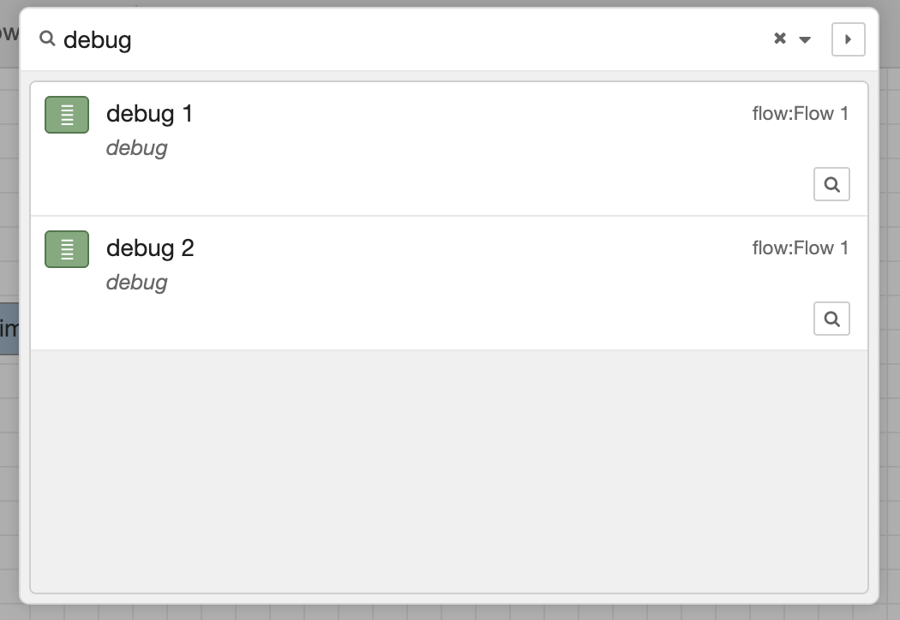
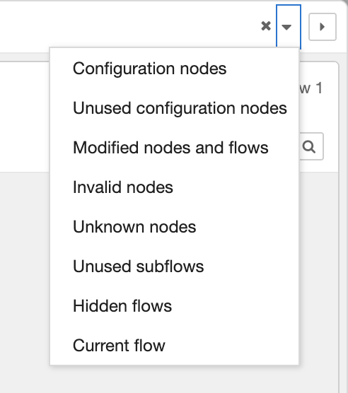
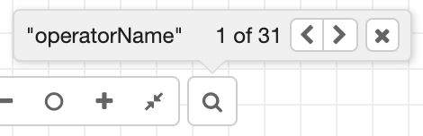

  
  
Search dialog

 

  
  
Search menu

The Search dialog can be used to find nodes within the workspace, including
configuration nodes.

It indexes all properties of the nodes, so it can be used to search for a node
by its id, type, name or any other property.

<table class="action-ref inline">
 <tr><th colspan="2">Reference</th></tr>
 <tr><td>Key shortcut</td><td><code>Ctrl/⌘-f</code></td></tr>
 <tr><td>Menu option</td><td><code>Search flows</code></td></tr>
 <tr><td>Action</td><td><code>core:search</code></td></tr>
</table>

Selecting a node in the result list will reveal that node within the editor.

The <i style="border-radius: 4px; display:inline-block;text-align:center; width: 30px; color: #777; border: 1px solid #777; padding: 6px;" class="fa fa-search"></i> button on each result will reveal that node without closing the search window.

The <i style="border-radius: 4px; display:inline-block;text-align:center; width: 30px; color: #777; border: 1px solid #777; padding: 6px;" class="fa fa-caret-right"></i>
button in the header will copy the current search over to the [Explorer sidebar](../sidebar/explorer) search.

A number of predefined searches are available under the search menu dropdown.

 

### Search toolbar

  
  
Search toolbar

When a search has multiple results and you select one, the search toolbar will appear to allow you to navigate between the search results without having to reopen the main search window.

### Search syntax

The search supports a number additional filters to help narrow down the results.

Filter                   | Description                                   |
-------------------------|-----------------------------------------------|
`is:config`              | Limits the results to Configuration nodes     |
`is:subflow`             | Limits the results to Subflows                |
`is:unused`              | Matches Configuration nodes or Subflows that are unused |
`is:invalid`             | Matches nodes that contain configuration errors |
`uses:<config-node-id>`  | Limits the results to nodes that depend on the specific configuration node |

