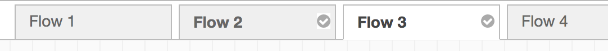

A node is selected when it is clicked on. This will deselect anything currently
selected. The Information Sidebar will update to show the node's properties and
help text for its type.

If the `Ctrl` or `Command` key is held when clicking on the node, the node will
be added to the current selection (or removed if it was already selected).

<table class="action-ref inline">
 <tr><th colspan="2">Reference</th></tr>
 <tr><td>Action</td><td><code>core:select-connected-nodes</code></td></tr>
 <tr><td>Key shortcut</td><td><code>Alt-s c</code></td></tr>
</table>
<table class="action-ref inline">
 <tr><th colspan="2">Reference</th></tr>
 <tr><td>Action</td><td><code>core:select-upstream-nodes</code></td></tr>
 <tr><td>Key shortcut</td><td><code>Alt-s u</code></td></tr>
</table>
<table class="action-ref inline">
 <tr><th colspan="2">Reference</th></tr>
 <tr><td>Action</td><td><code>core:select-downstream-nodes</code></td></tr>
 <tr><td>Key shortcut</td><td><code>Alt-s d</code></td></tr>
</table>

If the `Shift` key is held when clicking on the middle of the node, it will select that node
and all other nodes it is connected to. Clicking on the left-hand side of the node, it will select
that node and all nodes that come before it in the flow - "upstream" nodes. Clicking on the right-hand
side of the node, it will select that node and all nodes that come after it in the flow - "downstream" nodes.

A wire is selected when it is clicked on. Unlike nodes, it is only possible to
select one wire at a time.

### Lasso Tool

  
  
Selecting multiple nodes with the lasso tool

The lasso tool can be used to select multiple nodes. It is enabled by click-dragging
on the workspace.

It cannot be used to select a wire.

 

### Selecting all nodes

To select all nodes on the current flow, ensure the workspace has focus and then
press `Ctrl/Command-a`.

<table class="action-ref inline">
 <tr><th colspan="2">Reference</th></tr>
 <tr><td>Action</td><td><code>core:select-all-nodes</code></td></tr>
 <tr><td>Key shortcut</td><td><code>Ctrl/⌘-a</code></td></tr>
</table>

### Selecting flows

It is possible to select multiple flows in the editor by holding the `Ctrl/Command`
key when clicking on its tab.

Once selected, they can be deleted, copied or exported just like any selection.

  
  
Selecting flows

### Editor clipboard

<table class="action-ref inline">
 <tr><th colspan="2">Reference</th></tr>
 <tr><td>Action</td><td><code>core:copy-selection-to-internal-clipboard</code></td></tr>
 <tr><td>Key shortcut</td><td><code>Ctrl/⌘-c</code></td></tr>
</table>
<table class="action-ref inline">
 <tr><th colspan="2">Reference</th></tr>
 <tr><td>Action</td><td><code>core:cut-selection-to-internal-clipboard</code></td></tr>
 <tr><td>Key shortcut</td><td><code>Ctrl/⌘-x</code></td></tr>
</table>
<table class="action-ref inline">
 <tr><th colspan="2">Reference</th></tr>
 <tr><td>Action</td><td><code>core:paste-selection-from-internal-clipboard</code></td></tr>
 <tr><td>Key shortcut</td><td><code>Ctrl/⌘-v</code></td></tr>
</table>

The editor supports the standard copy/cut/paste actions. Note they use an internal
clipboard rather than the system clipboard.
