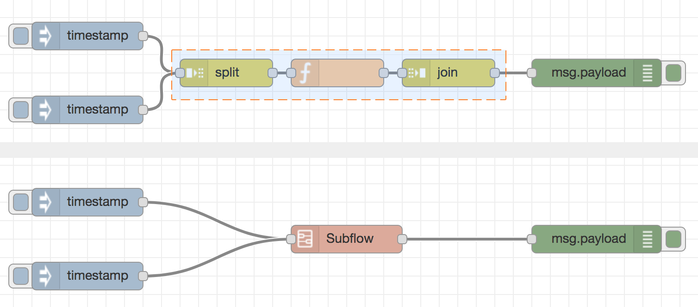
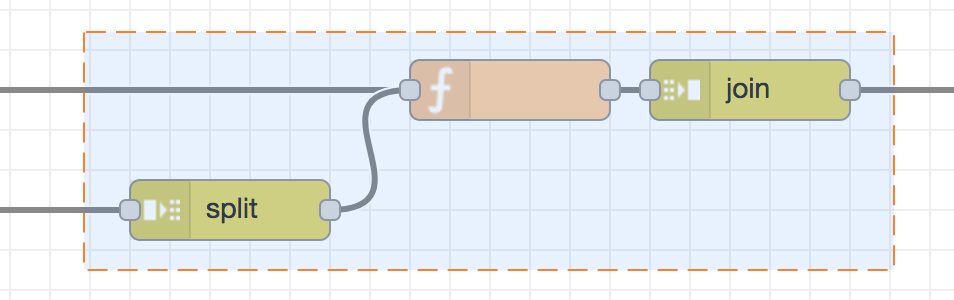
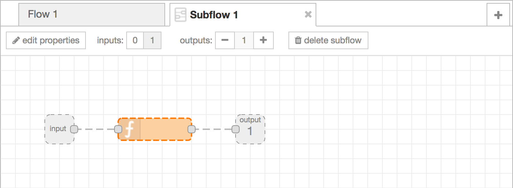
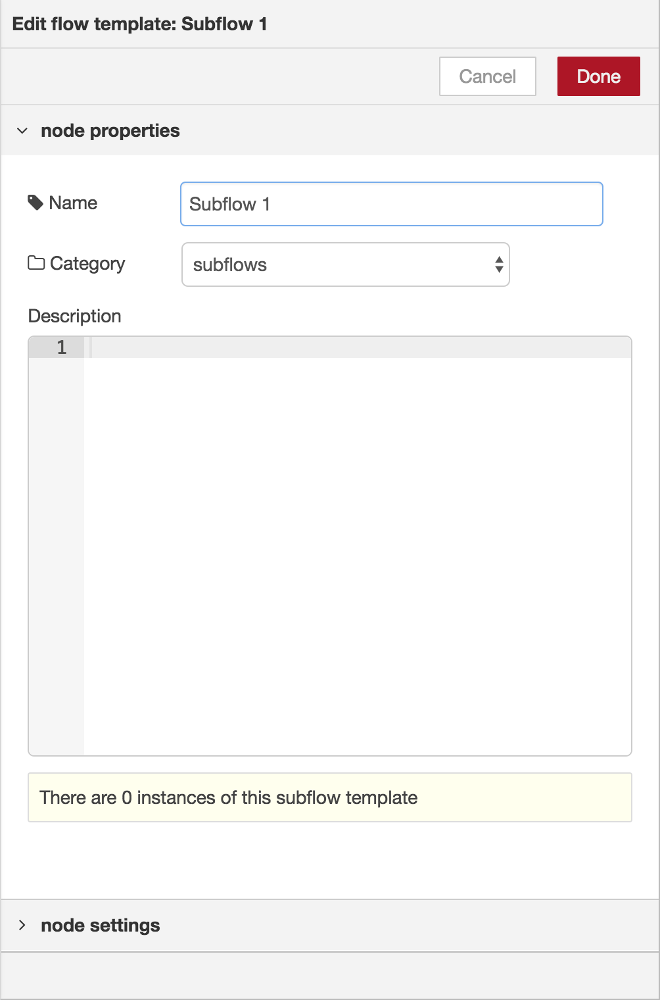
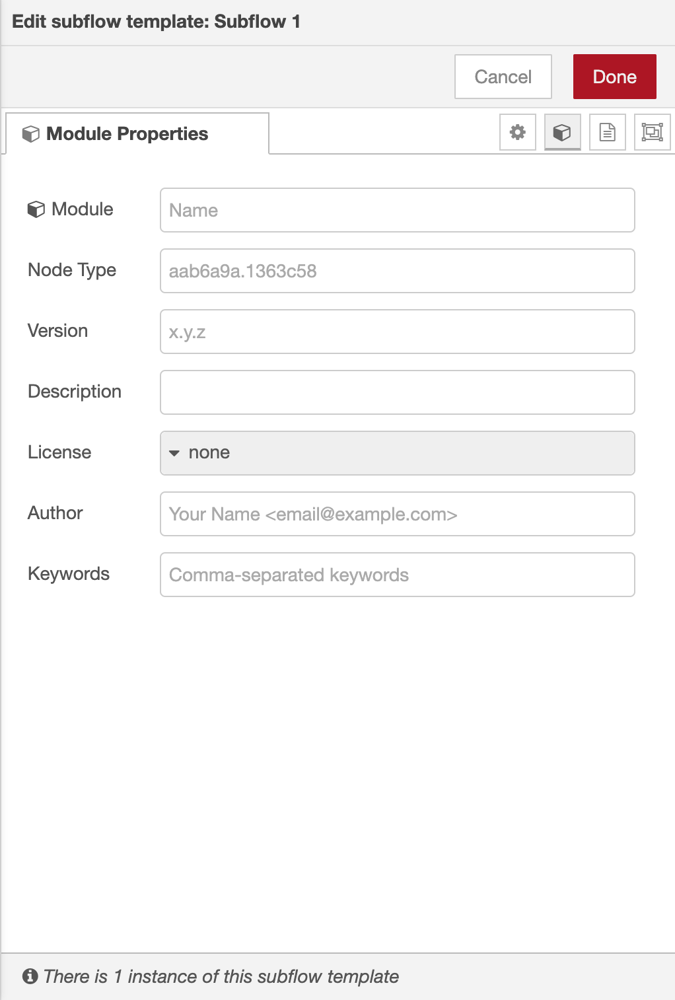
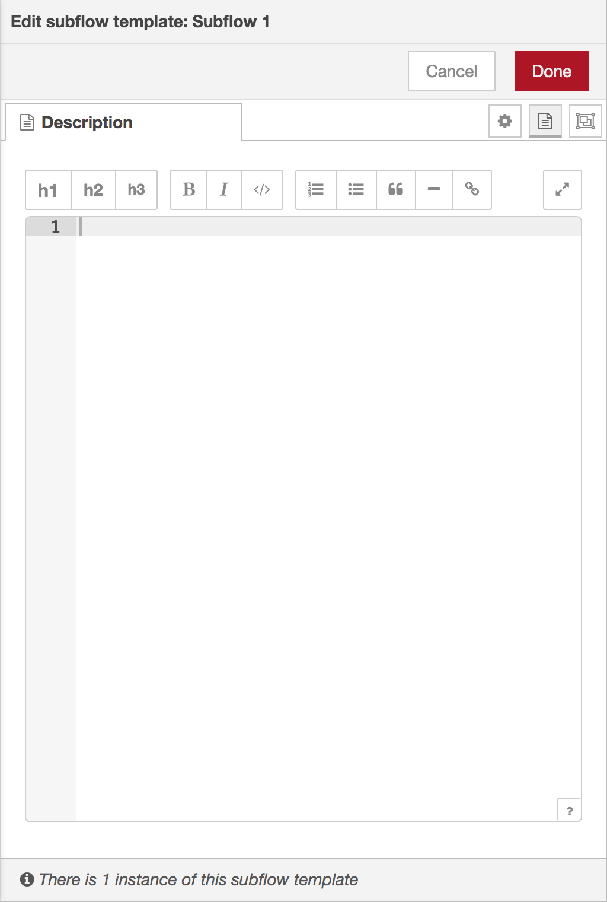
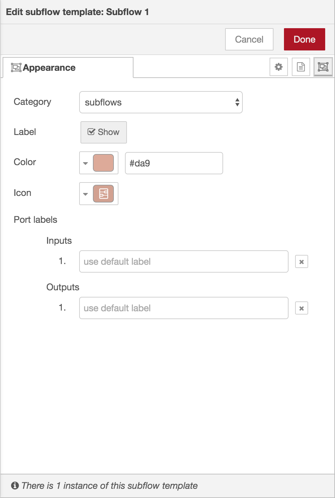
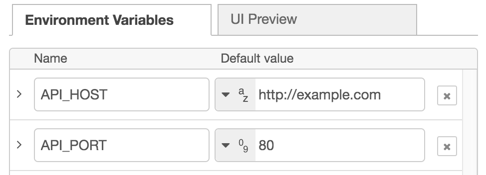
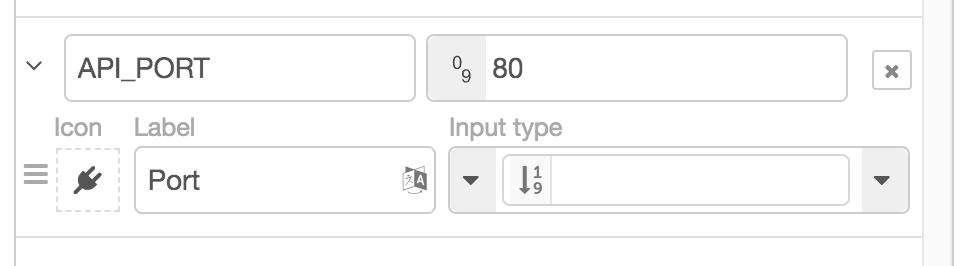

A subflow is a collection of nodes that are collapsed into a single node in the workspace.

They can be used to reduce some visual complexity of a flow, or to package up
a group of nodes as a reusable flow used in multiple places.

Once created, the subflow is added to the palette of available nodes. Individual
instances of the subflow can then be added to the workspace just like any other node.

*Note:* a subflow cannot contain an instance of itself - either directly or indirectly.

### Creating an empty subflow

A subflow can be created by selecting the 'Subflow -> Create subflow' option in
the menu. This will create a blank subflow and open it in the workspace.

<table class="action-ref inline">
 <tr><th colspan="2">Reference</th></tr>
 <tr><td>Key shortcut</td><td><i>none</i></td></tr>
 <tr><td>Menu option</td><td><code>Subflows -&gt; Create subflow</code></td></tr>
 <tr><td>Action</td><td><code>core:create-subflow</code></td></tr>
</table>

### Converting nodes to a subflow

It is also possible to convert the current selection of nodes to a subflow by
selecting the 'Subflow -> Selection to Subflow' option in the menu. The nodes
will be moved to a new subflow and replaced by a subflow instance node within the
flow.

  
  
Creating a subflow

  
  
Invalid subflow selection

This is only possible if any wires coming into the selection are connected to one
node - as the resulting subflow node can itself only have at most one input.

 

<table class="action-ref inline">
 <tr><th colspan="2">Reference</th></tr>
 <tr><td>Key shortcut</td><td><i>none</i></td></tr>
 <tr><td>Menu option</td><td><code>Subflows -&gt; Selection to Subflow</code></td></tr>
 <tr><td>Action</td><td><code>core:convert-to-subflow</code></td></tr>
</table>

### Editing a subflow

There are two ways to open a subflow to edit its contents. Either double click
its node in the palette, or click the 'Edit flow template' button in the edit
dialog of a subflow instance node.

The subflow is opened in the workspace as a new tab. Unlike regular flow tabs,
subflow tabs can be closed to hide them.

  
  
Editing a subflow

#### Inputs & Outputs

The inputs and outputs of the subflow are represented by the grey square nodes that
can be wired into the flow as normal.

The toolbar provides options to add and remove these nodes. As with normal
flows nodes, there can be at most one input and as many outputs as needed.

#### Status node

The toolbar provides an option to add a 'status' output to a subflow. This can
be used to update the Status of subflow instance nodes.
The node uses the input of `msg.payload` which can either be a simple string or a
<a href="/docs/creating-nodes/status#status-object">Status Object</a>

#### Editing subflow properties

The 'edit properties' button opens the subflow properties dialog. As with the Flow
properties dialog, the name and description of the subflow can be set.

<ul>
    <li style="margin-bottom: 10px"><i style="border-radius: 2px; display:inline-block;text-align:center; width: 30px; color: #777; border: 1px solid #777; padding: 6px;" class="fa fa-cog"></i> : Properties - per-instance properties that are exposed as environment variables within the subflow.</li>
    <li style="margin-bottom: 10px"><i style="border-radius: 2px; display:inline-block;text-align:center; width: 30px; color: #777; border: 1px solid #777; padding: 6px;" class="fa fa-cube"></i> : Module Properties - metadata about the subflow. <i>Since Node-RED 1.3</i></li>
    <li style="margin-bottom: 10px"><i style="border-radius: 2px; display:inline-block;text-align:center; width: 30px; color: #777; border: 1px solid #777; padding: 6px;" class="fa fa-file-text"></i> : Description - per-node documentation formatted using Markdown. This is displayed in the <a href="../sidebar/info">Information sidebar</a> when the node is selected.</li>
    <li style="margin-bottom: 10px"><i style="border-radius: 2px; display:inline-block;text-align:center; width: 30px; color: #777; border: 1px solid #777; padding: 6px;" class="fa fa-object-group"></i> : Appearance - options to customise the appearance of the node.</li>
</ul>

  
  
  
  
  
Subflow edit dialog - properties, module properties, description and appearance tabs

##### Properties

  
  
Editing subflow properties

  
  
Editing subflow property UI

The 'Properties' tab of the edit dialog can be used to define a set of properties
that can then be customised for each instance of the subflow. The properties are
then exposed as environment variables within the subflow.

Each entry in the properties table can be expanded to customise how it is displayed
when an instance of the subflow is edited. The 'UI Preview' tab provides a preview
of how they will appear.

 

##### Module Properties

The Module Properties tab can be used to set additional meta-data about the Subflow,
including version, license and module name. These can be used when
[packaging the Subflow as an npm module](/docs/creating-nodes/subflow-modules).

##### Appearance

The Appearance tab provides options to:

 - change the palette category the node appears in
 - select whether the node's label is shown
 - change the colour of the node
 - change the icon of the node
 - provide custom port labels.

#### Deleting a subflow

The 'delete subflow' button in the subflow toolbar can be used to remove the subflow
and *all* instances of it.
