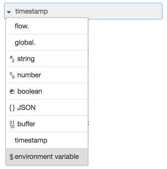

### Setting a node property

Any node property can be set with an environment variable by setting its value
to a string of the form `${ENV_VAR}`. When the runtime loads the flows, it will
substitute the value of that environment variable before passing it to the node.

This only works if it replaces the entire property - it cannot be used to substitute
just part of the value. For example, it is *not* possible to use `CLIENT-${HOST}`.

As nodes provide their own edit dialog, not all properties will provide a text
input that can be used to enter the env-var string. In that case, you may consider
hand-editing the flow file to set the property.


### Using the TypedInput widget

<div style="width: 222px" class="figure align-right">
  
  <p class="caption">TypedInput Environment Variable type</p>
</div>


Within the editor, the TypedInput widget can offer 'environment variable' as a type.
When this type is selected, its value will be evaluated as follows:

 - if there is no `${}` present, uses the whole value as the name of the environment
   variable.
   For example, `"FOO"` will be replaced with the value of `process.env.FOO`


 - if `${}` is present, it will substitute the corresponding environment
   variable into the result:
   For example, given the value `"Hello ${FOO}"` and the env var `FOO` is set to `World`,
   this results in the value `"Hello World"`


### JSONata Expressions

Environment variables can be accessed in JSONata expressions, such as in the Change
node, using the `$env` function:

```javascript
$env('ENV_VAR')
```

### Function node

Within a Function node, environment variables get be accessed using the `env.get`
function:

```javascript
let foo = env.get("FOO");
```


### Subflow Instance properties

Since 0.20, Subflows can be configured with instance properties. These appear as
environment variables within the Subflow and can be customised for individual instances
of the subflow.

For example, given a REST API that provides access to different types of record,
a subflow could be created to access the API and handle the response, using an
environment variable to identify which type of record should be accessed. Individual
instances of the Subflow can then be customised for those particular types.
