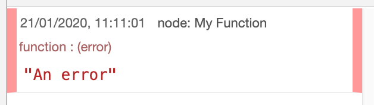
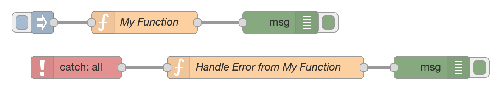

Node-RED provides two ways for a node to report an error. It can either just
write a message to the log or it can notify the runtime of the error and cause
a flow to be triggered.

If the error is only written to the log, you will see the message in the Debug
sidebar and log output, but you will not be able to create a flow to handle it.
These are [uncatchable errors](#uncatchable-errors).

If it does notify the runtime properly, then it is a [catchable error](#catchable-errors)
that can be used to trigger an error-handling flow.

There is a third sort of error that can cause the Node-RED runtime to shutdown. These
[`uncaughtException` errors](#uncaughtexception-errors) cannot be handled in the flow and are caused by bugs
in nodes.

This guide describes each of these error types in more detail and shows what can
be done to handle them.


### Logging errors

When a node logs an error, it will appear in the Debug sidebar.

<div  style="width: 314px"  class="figure">
  
  <p class="caption">Error message in the Debug sidebar</p>
</div>

This shows the error message, the date/time of the error, and the node that logged
the error. As with other Debug messages, hovering over it will highlight the node
in the workspace. If it isn't in the current view, then clicking on the node's
name in the top corner will reveal it in the workspace.


### Catchable errors

If a node notifies the runtime of an error then the Catch node can be used to
create a flow to handle it.

<div  style="width: 660px"  class="figure">
  
  <p class="caption">Catch node</p>
</div>

If an error is caught by a Catch node, it *will not* be logged to the Debug sidebar.

The message sent by the Catch will be the message provided by the node reporting
the error. This message will have an `error` property set that provides information
about the error:


```
{
    "topic": ...,
    "payload": ...,
    "error": {
        "message": "An error",
        "source": {
            "id": "2e25823d.fa3f7e",
            "type": "function",
            "name": "My Function",
            "count": 1
        }
    }
}
```

The properties of `msg.error` are:

 - `msg.error`:
   - `message` - the error message
   - `source` - information about the node logging the error:
     - `id` - the source node id
     - `type` - the type of the source node
     - `name` - the name, if set, of the source node
     - `count` - how many times *this* message has been thrown by *this* node.
        This property is used by the runtime to detect messages stuck in a loop - where
        they are passed back to the source node which then logs the error again, and so on.
        The runtime will allow a message to loop 9 times before logging another,
        uncatchable, error to break the loop. Deleting this property will disable the check.

If the message already had a `msg.error` property when the node reported the error,
that property will be moved to `msg._error`.

By default, the Catch node is configured to be triggered by all nodes on the same
tab in the editor, but it can also be configured to target specific nodes on the tab.

If you have two Catch nodes on the same tab and they both target the same node,
then they will both be triggered by any errors reported by that node.

If a Catch node is configured to be triggered by all nodes, it can also be configured
to only trigger on errors that have not already been caught by another Catch node.
This allows you to create error handling flows that target specific nodes and also
have an error handler that will catch "everything else".


### Uncatchable errors

These are the errors a node writes to the log without notifying the runtime properly.
They cannot be handled using the Catch node.

The node *might* provide alternative ways for handling the error. For example, by updating
its status property (which can be monitored with the Status node). It may send a message
as normal but with some additional property set to indicate the error.

You may want to contact the node's author to see if it can be updated to log the error
properly.


### `uncaughtException` errors

These are a particular type of node.js error that can occur when a Node fails to
properly handle an internal error. They cause the entire Node-RED runtime to
shutdown as that is the only safe thing to do.

It may sound extreme, but here is what the [node.js documentation](https://nodejs.org/api/process.html#process_warning_using_uncaughtexception_correctly) says about it:

> Attempting to resume normally after an uncaught exception can be similar to pulling out the power cord when upgrading a computer. Nine out of ten times, nothing happens. But the tenth time, the system becomes corrupted.


The typical cause will be that a node has kicked off an asynchronous task and
that task has hit an error. A well-written node will have registered an error
handler for that task, but if there isn't one, the error will go uncaught.

If you encounter this type of error then you should attempt to identify which node
caused the error and raise an issue against it. This is not always easy due to the asynchronous nature of the error.

The stack trace provided in the Node-RED log will provide some clues as to the
nature of the asynchronous task that hit the error, which in turn may help you
to identify the node at fault.
