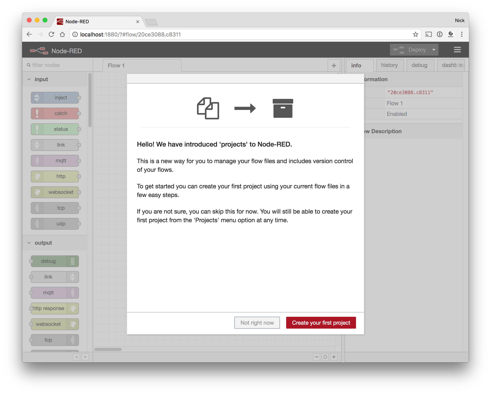
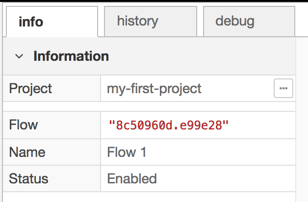
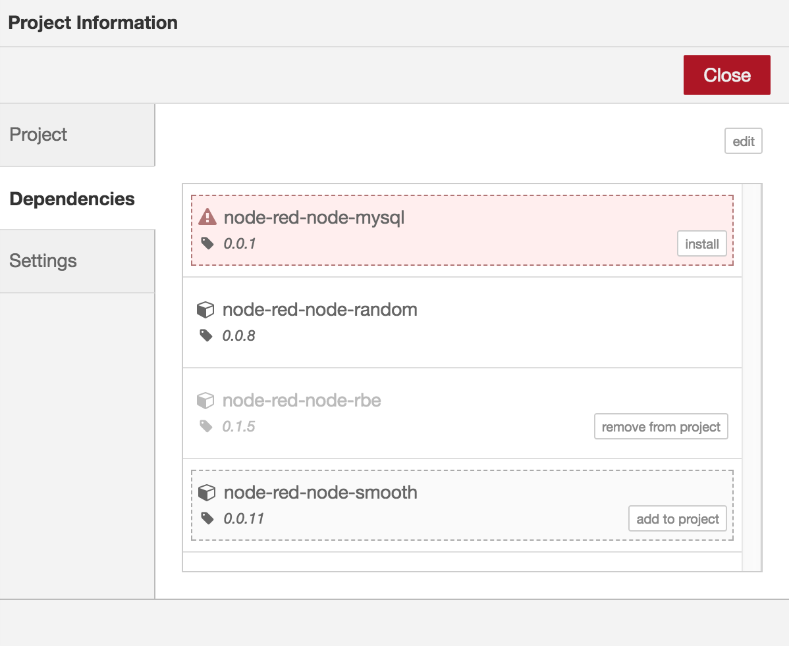
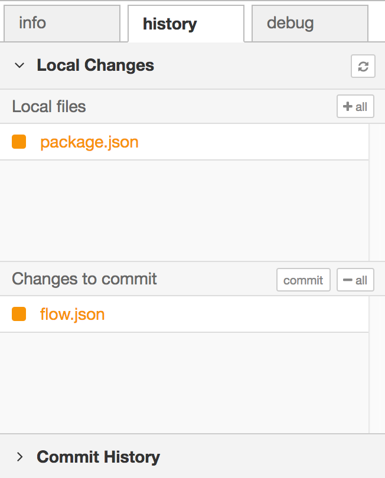
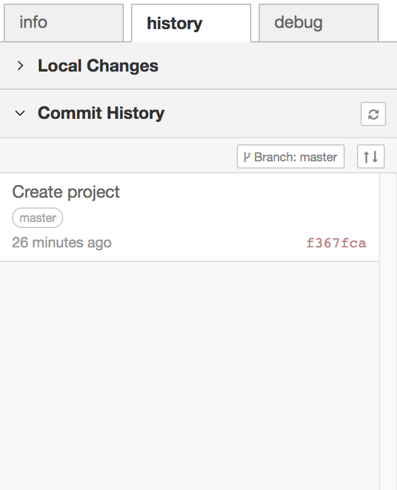

 - [Introducing projects](#introducing-projects)
 - [Enabling projects](#enabling-projects)
 - [Creating your first project](#creating-your-first-project)
 - [Working with projects](#working-with-projects)
   - [Accessing Project Settings](#accessing-project-settings)
     - [Project Dependencies](#project-dependencies)
     - [Project Settings](#project-settings)
   - [Version Control](#version-control)
     - [Local Changes](#local-changes)
     - [Commit History](#commit-history)
   - [Creating new projects](#creating-new-projects)
     - [Open an existing project](#open-an-existing-project)
     - [Create a new project](#create-a-new-project)
     - [Clone a project repository](#clone-a-project-repository)

### Introducing projects

Projects are a new way to manage your flow files. Rather than treat your flows as
a simple pair of files, they represent everything you need to create a redistributable
Node-RED application.

They are backed by a Git repository, meaning all of the files are fully version
controlled and allow developers to use familiar workflows to collaborate with others.

In the 0.18 release, the projects feature is in preview mode. That means it must be
enabled in the settings file.

*The feature is not currently available in the IBM Cloud environment.*

### Enabling projects

To enable the projects feature, edit your `settings.js` file and add the following
option within the `module.exports` block and restart Node-RED.

<div class="doc-callout">
<em>Note</em> :  The <code>settings.js</code> file exports a <em>JavaScript object</em>.
To configure Node-RED you should understand how to modify a JavaScript object by adding
new or modifying existing key/value pairs like the <code>editorTheme</code> below.
</div>

```
   editorTheme: {
       projects: {
           enabled: true
       }
   },
```

The feature relies on having the `git` and `ssh-keygen` command line tools available.
Node-RED will check for them on start-up and let you know if they are missing.

### Creating your first project

When you open the editor you'll be greeted by a welcome screen that invites you
to create your first project using your existing flow files.



It will take you through the following steps:

1. **Setup your version control client**

    Node-RED uses the open source tool Git for version control. It tracks changes
    to your project files and lets you push them to remote repositories.

    When you commit a set of changes, Git records who made the changes with a
    username and email address. The Username can be anything you want - it does
    not need to be your real name.

    You may already have your Git client configured - in which Node-RED will reuse
    those settings.

    You can change these settings at any time via the main Node-RED settings dialog.

    - [More information on configuring your git client](https://help.github.com/articles/set-up-git/#setting-up-git) (GitHub)

2. **Create your project**

    The next step lets you name your project and given it a description.

3. **Create your project files**

    Node-RED will automatically migrate your existing flow files into your project.
    You can choose to rename them here if you want.

4. **Setup encryption of your credentials file**

    As you may choose to share your project on public sites such as GitHub, it is
    *strongly* recommended that you encrypt your credentials file.

    To encrypt it, you need to choose a key that will be used to secure the file.
    This key is not stored within the project. If someone else clones your project,
    you will need to provide them the key to decrypt the credentials file.
    Otherwise they will need to edit the flow to provide their own credentials.

The project is then created in the directory: `~/.node-red/projects/<project-name>`.

### Working with projects

Once you have created your project, you can continue to use the Node-RED editor
just as you always have. There are some new parts of the editor that have been
added to work with your project.

#### Accessing Project Settings

The Info sidebar now shows what project you are working on at the top. Next to
the project name is a button that opens up the Project Settings dialog.



You can also access this from the `Projects -> Project Settings` option in the
main menu.

The dialog has three tabs:

 - Project - lets you edit the project's README.md file.
 - [Dependencies](#project-dependencies) - manage the list of node modules your project depends on
 - [Settings](#project-settings) - manage the project settings, including the git remotes

##### Project Dependencies

Each project has its own `package.json` file that includes a list of node modules
the project depends on. The Node-RED editor tracks what nodes you are using in a
flow and helps you to keep that list of dependencies up to date.

 

In the screenshot above, the current project has three modules listed in its
`package.json` file, each in a different state:

 - `node-red-node-mysql` is not currently installed
 - `node-red-node-random` is used by the current flow
 - `node-red-node-rbe` is listed, but is unused by the current flow

Finally `node-red-node-smooth` provides a node that is used by the current flow,
but that module is not listed as a dependency.

Keeping the dependency list up to date is important if you want to share the project
with others - as it will help users to install the necessary modules.

##### Project Settings

The project settings tab lets you manage your flow files, the encryption configuration
of your credentials and configure your local git branches and remote repositories.

#### Version Control

A new `history` tab has been added to the sidebar. This is where you manage the
version control of your project. The tab has two sections:


 - Local Changes - shows project files that have changed, allowing you to stage
   and commit them.
 - Commit History - a list of all commits in the repository, with tools to push
   commits to remote repositories.

##### Local Changes



Whenever you change a project file, such as by deploying a new flow configuration,
it will be listed in the 'Local files' section. You can click on the file name
to see a diff of what has changed. When you hover over the file, you'll see a
**+** button - clicking that will stage the file - moving it down to the 'Changes
to commit' list.

When you have staged the files you want to commit, click the `commit` button, enter
a message and confirm.

<br style="clear:both">

##### Commit History



The Commit History section lists all of the commits in the current branch of the
repository. When you create a project, Node-RED automatically commits the initial
set of default files for the project.

At the top of the list is the 'Branch' button. That allows you to checkout/create
branches within the repository.

If your repository has a remote repository configured, there is also a button that
shows how many commits ahead and/or behind your local repository is compared with the
remote. It allows you to pick the remote/branch to track, and push/pull your changes
to the remote.

This is one area that the Node-RED editor tries to simplify the user experience,
and doesn't expose all of the various options git provides. This is an area we
welcome feedback on. For example, it does not provide options to rebase your local
commits, or force push your changes to the remote. You can still do those things
by falling back to the command line.

<br style="clear:both">

#### Creating new projects

After you have created your first project by migrating your existing flow files
you can create additional projects.

Selecting `Projects -> New` from the menu opens the Projects dialog.

This provides three options:

 - open an existing project
 - create a new project
 - clone a project repository

##### Open an existing project

Node-RED only runs one project at any time. By opening another project you
change what flows are running.

The 'open project' view also allows you to delete projects by hovering over them
in the list and clicking the delete button. You cannot delete the active project.

##### Create a new project

This lets you create a new project. It provides the same options as the
'create your first project' set of screens, but collapsed into one.

##### Clone a project repository

This lets you clone an existing remote repository. You can use either an `http(s)`
or `git/ssh` url for the repository. If the repository requires authentication
you must provide it here.

*Note:* for `http` urls, do not include your username and/or password in the url
itself. You can should provide those separately when prompted.

*Node-RED does not currently make use of any credential helper you git client may be
configured with. This is an area we look for feedback on from the community.*

For `git/ssh`, Node-RED will offer a list of available ssh public keys. This list
is generated by scanning `~/.ssh` for files ending `.pub` that have corresponding
private key files. It also allows you to generate a new public/private key pairs
via the 'Git config' tab of the main settings dialog. These files are stored under
`~/.node-red/projects/.sshkeys/`. If you have `adminAuth` enabled, the files are
scoped to the current logged in user so they do not need to share credentials for
the remote.
